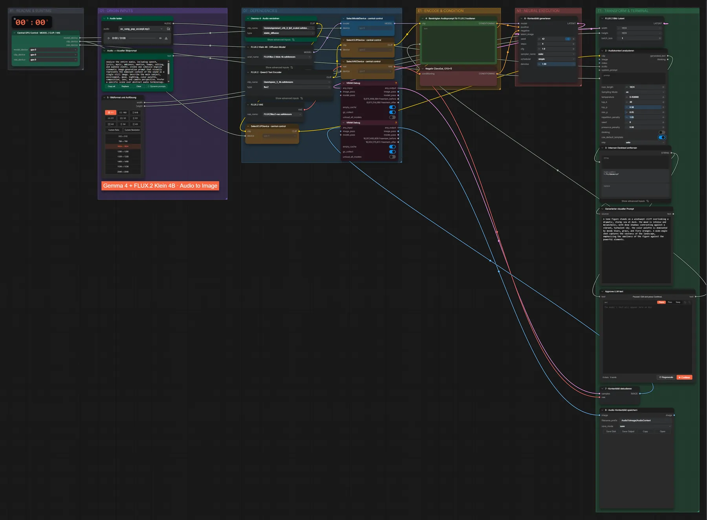
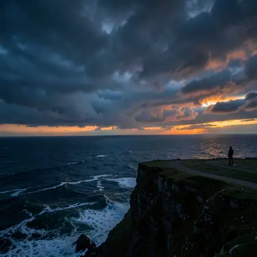

# FLUX.2 Klein 4B + Gemma 4 · Audio → Bild

**Workflow-Datei:** [`workflows/Audio to Image/FLUX2_Klein_4B_BF16+Gemma4_E4B-Audio-to-Image.json`](../../../workflows/Audio%20to%20Image/FLUX2_Klein_4B_BF16%2BGemma4_E4B-Audio-to-Image.json)  
**Kategorie:** Audio to Image · **Eingabe → Ausgabe:** Audio → Prompt + Bild · **Quant:** BF16

Bis v1.3.0 hieß der Workflow `FLUX2_Klein_4B_Gemma4-Audio-Context-to-Image.json`.

Gemma 4 hört Musik, Sprache oder Geräusche und schreibt einen Bildprompt (Pause zum Prüfen), Klein 4B malt das Bild.

Interaktiv mit Zoom, Vergleichen und Kopier-Buttons: <https://dawasteh.github.io/DaWastehs-ComfyUI-Bundle/#/w/flux2-klein-4b-bf16-gemma4-e4b-audio-to-image>

## Modelle

| Rolle | Datei | Quant | Größe |
|---|---|---|---:|
| Text-Encoder / LLM | `gemma4_e4b_it_fp8_scaled.safetensors` | FP8 | 8,4 GiB |
| Diffusionsmodell | `flux-2-klein-4b.safetensors` | BF16 | 7,2 GiB |
| Text-Encoder / LLM | `qwen_3_4b.safetensors` | BF16 | 7,5 GiB |
| VAE | `flux2-vae.safetensors` | FP32 | 0,3 GiB |

## Workflow in ComfyUI

Screenshot nach dem Hauptbeispiel (Eingaben und Ergebnis im Workflow, Erklärungstafeln ausgeblendet):

[](workflow.webp)

## Beispiele

### Musik → passendes Bild

| Einstellung | Wert |
|---|---|
| seed | 42 |
| steps | 4 |
| cfg | 1 |
| sampler_name | euler |
| scheduler | simple |
| denoise | 1 |
| Dauer (Ausführung) | 32 s |
| VRAM R9700 (belegt / PyTorch-Spitze) | 28,4 GiB / 23,7 GiB |
| RAM (ComfyUI-Prozess) | 24,8 GiB |

Der von Gemma geschriebene Bildprompt wird am Pause-Knoten unverändert übernommen („Continue“).

Eingabe · ex_song_pop_excerpt.mp3: [input_ex_song_pop_excerpt.mp3](input_ex_song_pop_excerpt.mp3)  
Ausgabe · 8 · Audio-Kontextbild speichern: [](song.webp) · [Volle Auflösung (1024×1024, WebP mit Workflow – per Drag & Drop in ComfyUI ladbar)](song.webp)  

Generierter visueller Prompt:

```text
A lone figure stands on a windswept cliff overlooking a dramatic, stormy sea at dusk. The mood is intense and melancholic, with deep shadows contrasting against a vibrant, turbulent sky. The color palette is dominated by moody blues, grays, and fiery oranges. A wide-angle shot captures the vastness of the landscape, emphasizing the smallness of the figure against the powerful elements.
```
