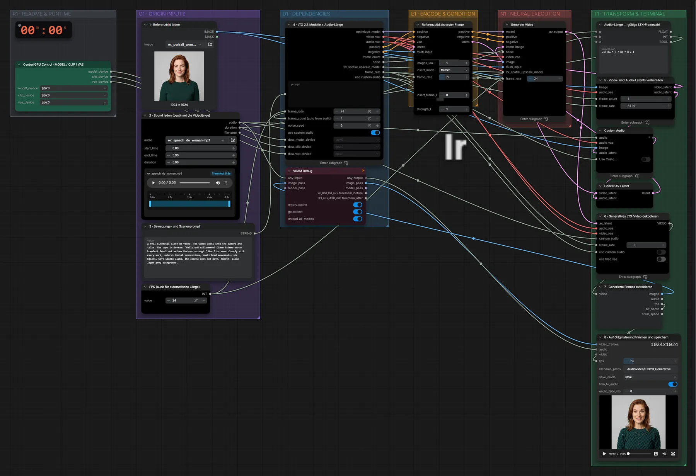

# LTX-2.3 22B (FP8) · Bild + Audio → Video in Audiolänge

**Workflow-Datei:** [`workflows/Audio to Video/LTX23_22B_FP8-Image+Audio-to-Video.json`](../../../workflows/Audio%20to%20Video/LTX23_22B_FP8-Image%2BAudio-to-Video.json)  
**Kategorie:** Audio to Video · **Eingabe → Ausgabe:** Bild + Audio + Text → Video · **Quant:** FP8

Bis v1.3.0 hieß der Workflow `LTX23-Image+Audio-to-Generative-Matching-Length-Video.json`.

LTX-2.3 generiert ein echtes Video zum Startbild, synchron zur eingelesenen Tonspur (Sprache oder Musik).

Interaktiv mit Zoom, Vergleichen und Kopier-Buttons: <https://dawasteh.github.io/DaWastehs-ComfyUI-Bundle/#/w/ltx23-22b-fp8-image-audio-to-video>

## Modelle

| Rolle | Datei | Quant | Größe |
|---|---|---|---:|
| Modell | `ltx-2.3-22b-dev-fp8.safetensors` | FP8 | 27,1 GiB |
| Latent-Upscaler | `ltx-2.3-spatial-upscaler-x2-1.1.safetensors` | BF16 | 0,9 GiB |
| LoRA | `ltx_2.3_22b_distilled_1.1_lora_dynamic_fro09_avg_rank_111_bf16.safetensors` | BF16 | 2,5 GiB |
| VAE | `taeltx2_3.safetensors` | FP16 | 0,0 GiB |
| VAE | `LTX23_video_vae_bf16.safetensors` | BF16 | 1,4 GiB |
| VAE | `LTX23_audio_vae_bf16.safetensors` | BF16 | 0,3 GiB |
| Text-Encoder | `gemma_3_12B_it_fp4_mixed.safetensors` | FP4 mixed | 8,8 GiB |

## Workflow in ComfyUI

Screenshot nach dem Hauptbeispiel (Eingaben und Ergebnis im Workflow, Erklärungstafeln ausgeblendet):

[](workflow.webp)

## Beispiele

### Bild + Sprache → Video in Audiolänge

Prompt:

```text
A real cinematic close-up video. The woman looks into the camera and talks. She says in German: "Hallo und willkommen! Diese Stimme wurde komplett lokal auf meinem Rechner erzeugt." Her lips move clearly with every word, natural facial expressions, small head movements, she blinks. Soft studio light, the camera does not move. Smooth, plain light-grey background.
```

| Einstellung | Wert |
|---|---|
| duration | Länge der Aufnahme (5 s) |
| Dauer (Ausführung) | 2 min 59 s |
| VRAM R9700 (belegt / PyTorch-Spitze) | 30,2 GiB / 26,0 GiB |
| RAM (ComfyUI-Prozess) | 34,0 GiB |

Eingabe · ex_portrait_woman.png:  ([Datei](input_ex_portrait_woman.webp))  
Eingabe · ex_speech_de_woman.mp3: [input_ex_speech_de_woman.mp3](input_ex_speech_de_woman.mp3)  
Ausgabe · 8 · Auf Originalsound trimmen und speichern: [speech.mp4](speech.mp4)
