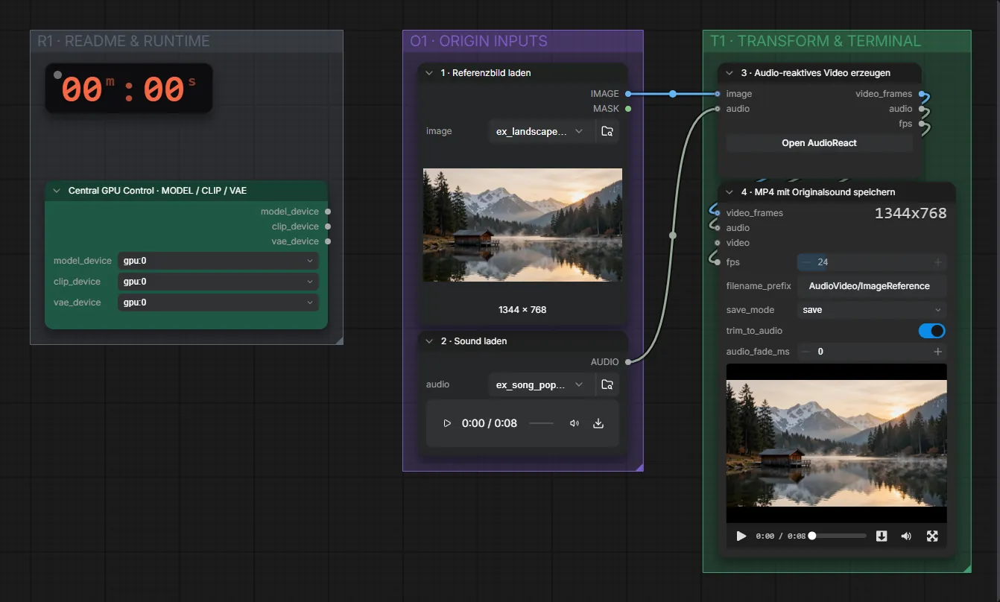

# Pixaroma · Bild + Audio → Audio-React-Video

**Workflow-Datei:** [`workflows/Audio to Video/Pixaroma-Image+Audio-to-AudioReact-Video.json`](../../../workflows/Audio%20to%20Video/Pixaroma-Image%2BAudio-to-AudioReact-Video.json)  
**Kategorie:** Audio to Video · **Eingabe → Ausgabe:** Bild + Audio → Video

Ohne KI-Modell: das Bild pulsiert, zoomt und leuchtet im Takt der Musik.

Interaktiv mit Zoom, Vergleichen und Kopier-Buttons: <https://dawasteh.github.io/DaWastehs-ComfyUI-Bundle/#/w/pixaroma-image-audio-to-audioreact-video>

## Workflow in ComfyUI

Screenshot nach dem Hauptbeispiel (Eingaben und Ergebnis im Workflow, Erklärungstafeln ausgeblendet):

## Beispiele

### Bild pulsiert zur Musik

| Einstellung | Wert |
|---|---|
| Dauer (Ausführung) | 3 s |
| VRAM R9700 (belegt / PyTorch-Spitze) | 5,1 GiB / 0,2 GiB |
| RAM (ComfyUI-Prozess) | 3,8 GiB |

Eingabe · ex_landscape_lake.png:  ([Datei](input_ex_landscape_lake.webp))  
Eingabe · ex_song_pop_excerpt.mp3: [input_ex_song_pop_excerpt.mp3](input_ex_song_pop_excerpt.mp3)  
Ausgabe · 4 · MP4 mit Originalsound speichern: [lake-song.mp4](lake-song.mp4)
