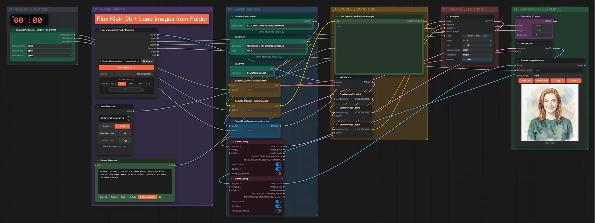

# FLUX.2 Klein 9B · Ordner stapelweise bearbeiten

**Workflow-Datei:** [`workflows/Batch Processing/FLUX2_Klein_9B_KV_FP8-Folder-to-Images-Batch-Edit.json`](../../../workflows/Batch%20Processing/FLUX2_Klein_9B_KV_FP8-Folder-to-Images-Batch-Edit.json)  
**Kategorie:** Batch Processing · **Eingabe → Ausgabe:** Ordner + Text → Bilder · **Quant:** FP8

Bis v1.3.0 hieß der Workflow `FLUX2_Klein_9B-Batch-Image-Edit.json`.

Alle Bilder eines Ordners nacheinander mit derselben Anweisung bearbeiten (Pixaroma Load Images Folder).

Interaktiv mit Zoom, Vergleichen und Kopier-Buttons: <https://dawasteh.github.io/DaWastehs-ComfyUI-Bundle/#/w/flux2-klein-9b-kv-fp8-folder-to-images-batch-edit>

## Modelle

| Rolle | Datei | Quant | Größe |
|---|---|---|---:|
| VAE | `flux2-vae.safetensors` | FP32 | 0,3 GiB |
| Text-Encoder / LLM | `qwen_3_8b_fp8mixed.safetensors` | FP8 mixed | 8,1 GiB |
| Diffusionsmodell | `flux-2-klein-9b-kv-fp8.safetensors` | FP8 | 9,1 GiB |

## Workflow in ComfyUI

Screenshot nach dem Hauptbeispiel (Eingaben und Ergebnis im Workflow, Erklärungstafeln ausgeblendet):

[](workflow.webp)

## Beispiele

### Ein Prompt für einen ganzen Ordner

Prompt:

```text
Replace the background with a snowy winter landscape with soft falling snow, keep the main subject identical and keep the same framing
```

| Einstellung | Wert |
|---|---|
| steps | 4 |
| cfg | 1 |
| sampler_name | euler |
| scheduler | simple |
| denoise | 1 |
| Dauer (Ausführung) | 49 s |
| VRAM R9700 (belegt / PyTorch-Spitze) | 26,6 GiB / 20,9 GiB |
| RAM (ComfyUI-Prozess) | 10,1 GiB |

Ordner mit drei Beispielbildern (Porträt, Hund, Teekanne); jedes Bild wird nacheinander bearbeitet.

Eingabe · batch_demo/01_portrait.png:  ([Datei](input_01_portrait.webp))  
Eingabe · batch_demo/02_dog.png:  ([Datei](input_02_dog.webp))  
Eingabe · batch_demo/03_teapot.png:  ([Datei](input_03_teapot.webp))  
Ausgabe · Bild 1: [](winter__n226-1.webp) · [Volle Auflösung (1024×1024, WebP mit Workflow – per Drag & Drop in ComfyUI ladbar)](winter__n226-1.webp)  
Ausgabe · Bild 2: [](winter__n226-2.webp)  
Ausgabe · Bild 3: [](winter__n226-3.webp)
