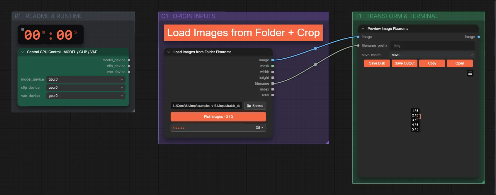

# Ordner laden und zuschneiden

**Workflow-Datei:** [`workflows/Batch Processing/Folder-to-Cropped-Images.json`](../../../workflows/Batch%20Processing/Folder-to-Cropped-Images.json)  
**Kategorie:** Batch Processing · **Eingabe → Ausgabe:** Ordner → Bilder

Bis v1.3.0 hieß der Workflow `Load-Images-From-Folder-and-Crop.json`.

Alle Bilder eines Ordners laden und einheitlich zuschneiden oder skalieren – ohne KI.

Interaktiv mit Zoom, Vergleichen und Kopier-Buttons: <https://dawasteh.github.io/DaWastehs-ComfyUI-Bundle/#/w/folder-to-cropped-images>

## Workflow in ComfyUI

Screenshot nach dem Hauptbeispiel (Eingaben und Ergebnis im Workflow, Erklärungstafeln ausgeblendet):

## Beispiele

### Ordner laden und auf 16:9 zuschneiden

| Einstellung | Wert |
|---|---|
| Dauer (Ausführung) | 0 s |
| VRAM R9700 (belegt / PyTorch-Spitze) | 12,8 GiB / 0,1 GiB |
| RAM (ComfyUI-Prozess) | 1,0 GiB |

Ordner mit drei Beispielbildern, Zuschnitt 16:9 aus der Mitte.

Eingabe · batch_demo/01_portrait.png:  ([Datei](input_01_portrait.webp))  
Eingabe · batch_demo/02_dog.png:  ([Datei](input_02_dog.webp))  
Eingabe · batch_demo/03_teapot.png:  ([Datei](input_03_teapot.webp))  
Ausgabe · Bild 1:  · [Volle Auflösung (1024×1024, WebP mit Workflow – per Drag & Drop in ComfyUI ladbar)](crop__n226-1.webp)  
Ausgabe · Bild 2:   
Ausgabe · Bild 3: 
