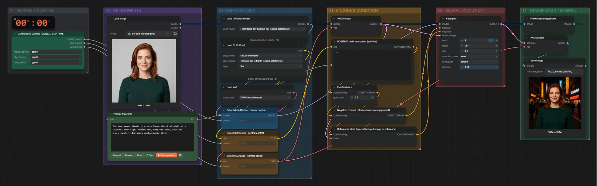

# FLUX.1 Kontext · Person beibehalten, neue Szene

**Workflow-Datei:** [`workflows/Character & Consistency/FLUX1_Kontext_Dev_FP8-Image+Text-to-Image-Character-Keep.json`](../../../workflows/Character%20%26%20Consistency/FLUX1_Kontext_Dev_FP8-Image%2BText-to-Image-Character-Keep.json)  
**Kategorie:** Character & Consistency · **Eingabe → Ausgabe:** Bild + Text → Bild · **Quant:** FP8

Bis v1.3.0 hieß der Workflow `FLUX1_Kontext-Character-Keep.json`.

Kontext dev (FP8) setzt dieselbe Person in eine neue Umgebung, Gesicht und Kleidung bleiben erhalten.

Interaktiv mit Zoom, Vergleichen und Kopier-Buttons: <https://dawasteh.github.io/DaWastehs-ComfyUI-Bundle/#/w/flux1-kontext-dev-fp8-image-text-to-image-character-keep>

## Modelle

| Rolle | Datei | Quant | Größe |
|---|---|---|---:|
| Diffusionsmodell | `flux1-dev-kontext_fp8_scaled.safetensors` | FP8 | 11,1 GiB |
| Text-Encoder | `clip_l.safetensors` | FP16 | 0,2 GiB |
| Text-Encoder | `t5xxl_fp8_e4m3fn_scaled.safetensors` | FP8 | 4,8 GiB |
| VAE | `ae.safetensors` | FP32 | 0,3 GiB |

## Workflow in ComfyUI

Screenshot nach dem Hauptbeispiel (Eingaben und Ergebnis im Workflow, Erklärungstafeln ausgeblendet):

[](workflow.webp)

## Beispiele

### Gleiche Person, neue Szene

Prompt:

```text
The same woman stands in a busy Tokyo street at night with colorful neon signs behind her, keep her face, hair and green sweater identical, photographic style
```

| Einstellung | Wert |
|---|---|
| seed | 7 |
| guidance | 2.5 |
| steps | 20 |
| cfg | 1 |
| sampler_name | euler |
| scheduler | simple |
| denoise | 1 |
| Dauer (Ausführung) | 1 min 1 s |
| VRAM R9700 (belegt / PyTorch-Spitze) | 25,1 GiB / 21,1 GiB |
| RAM (ComfyUI-Prozess) | 20,6 GiB |

Eingabe · ex_portrait_woman.png:  ([Datei](input_ex_portrait_woman.webp))  
Ausgabe · Ausgabe: [](tokyo.webp) · [Volle Auflösung (1024×1024, WebP mit Workflow – per Drag & Drop in ComfyUI ladbar)](tokyo.webp)
