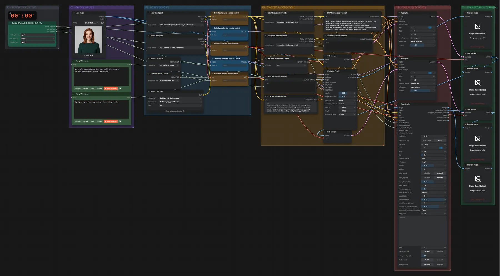

# SDXL + IP-Adapter FaceID · Referenzgesicht

**Workflow-Datei:** [`workflows/Character & Consistency/SDXL_FP16+IPAdapter_FaceID-Image+Text-to-Image-Character-Keep.json`](../../../workflows/Character%20%26%20Consistency/SDXL_FP16%2BIPAdapter_FaceID-Image%2BText-to-Image-Character-Keep.json)  
**Kategorie:** Character & Consistency · **Eingabe → Ausgabe:** Bild + Text → Bild · **Quant:** FP16

Bis v1.3.0 hieß der Workflow `SDXL_IPAdapter_FaceID-Character-Keep.json`.

FaceID-Variante mit Illustrious- und RealVisXL-Durchgang und Gesichts-Detailer.

Interaktiv mit Zoom, Vergleichen und Kopier-Buttons: <https://dawasteh.github.io/DaWastehs-ComfyUI-Bundle/#/w/sdxl-fp16-ipadapter-faceid-image-text-to-image-character-keep>

> Braucht das Python-Paket insightface (ab v1.3.1 setzt der Updater insightface 1.0.1 mit protobuf 5.29.6).

## Modelle

| Rolle | Datei | Quant | Größe |
|---|---|---|---:|
| Text-Encoder | `Illustrious_clip_l.safetensors` | FP16 | 0,2 GiB |
| Text-Encoder | `Illustrious_clip_g.safetensors` | FP16 | 1,3 GiB |
| Modell | `EclecticEuphoria_Illustrious_v2.safetensors` | FP16 | 6,5 GiB |
| Detektor | `face_yolov8n-seg2_60.pt` | – | 0,0 GiB |
| Detektor | `skin_yolov8n-seg_800.pt` | – | 0,0 GiB |
| Vision-Encoder | `clip_vision_vit_h.safetensors` | FP32 | 2,4 GiB |
| IP-Adapter | `ip-adapter-faceid-plusv2_sd15.bin` | – | 0,1 GiB |
| Modell | `RealVisXL_V4.0.safetensors` | FP16 | 6,5 GiB |

## Workflow in ComfyUI

Screenshot nach dem Hauptbeispiel (Eingaben und Ergebnis im Workflow, Erklärungstafeln ausgeblendet):

[](workflow.webp)

## Beispiele

### FaceID, neue Szene

Prompt:

```text
photo of a woman sitting in a cozy café with a cup of coffee, auburn hair, smiling, warm light
```

| Einstellung | Wert |
|---|---|
| seed | 7 |
| steps | 21 |
| sampler_name | dpmpp_2m |
| Dauer (Ausführung) | 40 s |
| VRAM R9700 (belegt / PyTorch-Spitze) | 26,1 GiB / 21,1 GiB |
| RAM (ComfyUI-Prozess) | 13,2 GiB |

Eingabe · ex_portrait_woman.png:  ([Datei](input_ex_portrait_woman.webp))  
Ausgabe · Final: [](cafe__n13.webp) · [Volle Auflösung (1024×1024, WebP mit Workflow – per Drag & Drop in ComfyUI ladbar)](cafe__n13.webp)  
Ausgabe · Pass 2: [](cafe__n55.webp)  
Ausgabe · Pass 1: [](cafe__n10.webp)  
Ausgabe · Gesichtsausschnitt (FaceID-Eingang): [](cafe__n67.webp)
