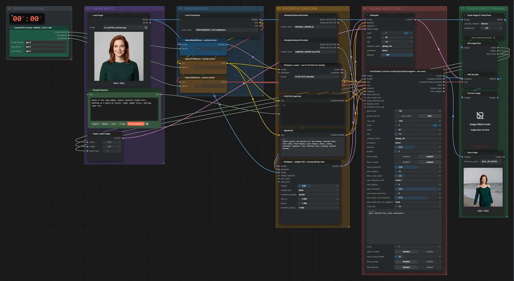

# SDXL RealVisXL + IP-Adapter · Referenzgesicht

**Workflow-Datei:** [`workflows/Character & Consistency/SDXL_RealVisXL_V4_FP16+IPAdapter-Image+Text-to-Image-Character-Keep.json`](../../../workflows/Character%20%26%20Consistency/SDXL_RealVisXL_V4_FP16%2BIPAdapter-Image%2BText-to-Image-Character-Keep.json)  
**Kategorie:** Character & Consistency · **Eingabe → Ausgabe:** Bild + Text → Bild · **Quant:** FP16

Bis v1.3.0 hieß der Workflow `SDXL_IPAdapter-Character-Keep.json`.

Ein Referenzbild steuert über IP-Adapter das Aussehen, der Prompt die neue Szene; danach Gesichts-Detailer.

Interaktiv mit Zoom, Vergleichen und Kopier-Buttons: <https://dawasteh.github.io/DaWastehs-ComfyUI-Bundle/#/w/sdxl-realvisxl-v4-fp16-ipadapter-image-text-to-image-character-keep>

## Modelle

| Rolle | Datei | Quant | Größe |
|---|---|---|---:|
| Modell | `RealVisXL_V4.0.safetensors` | FP16 | 6,5 GiB |
| Detektor | `face_yolov8m.pt` | – | 0,1 GiB |
| Detektor | `hair_yolov8n-seg_60.pt` | – | 0,0 GiB |

## Workflow in ComfyUI

Screenshot nach dem Hauptbeispiel (Eingaben und Ergebnis im Workflow, Erklärungstafeln ausgeblendet):

[](workflow.webp)

## Beispiele

### Referenzgesicht, neue Szene

Prompt:

```text
photo of the same woman, auburn shoulder-length hair, walking on a beach at sunset, light summer dress, smiling, same face
```

Negativ:

```text
(worst quality, low quality:1.4), bad anatomy, deformed hands, extra limbs, fused fingers, extra fingers, blurry, lowres, watermark, signature, text, different face, clothing, multiple persons,
```

| Einstellung | Wert |
|---|---|
| seed | 7 |
| steps | 80 |
| cfg | 6.5 |
| sampler_name | dpmpp_2m |
| scheduler | karras |
| denoise | 1 |
| Dauer (Ausführung) | 57 s |
| VRAM R9700 (belegt / PyTorch-Spitze) | 21,9 GiB / 14,3 GiB |
| RAM (ComfyUI-Prozess) | 12,4 GiB |

Eingabe · ex_portrait_woman.png:  ([Datei](input_ex_portrait_woman.webp))  
Ausgabe · Ausgabe: [](beach.webp) · [Volle Auflösung (1024×1024, WebP mit Workflow – per Drag & Drop in ComfyUI ladbar)](beach.webp)
