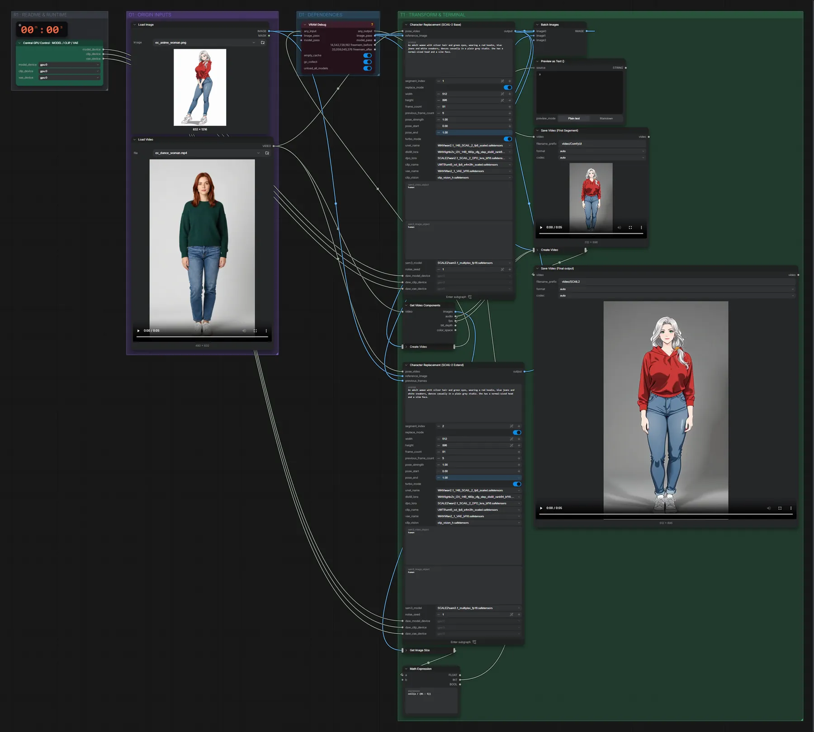
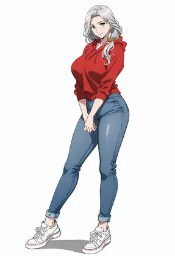

# WAN 2.1 SCAIL-2 14B (FP8) + DPO · Person ersetzen, lange Videos

**Workflow-Datei:** [`workflows/Character Animation/WAN21_SCAIL2_14B_FP8+DPO-Image+Video-to-Long-Video-Character-Replacement.json`](../../../workflows/Character%20Animation/WAN21_SCAIL2_14B_FP8%2BDPO-Image%2BVideo-to-Long-Video-Character-Replacement.json)  
**Kategorie:** Character Animation · **Eingabe → Ausgabe:** Bild + Video + Text → Video · **Quant:** FP8

Bis v1.3.0 hieß der Workflow `WAN21_SCAIL2-Character-Replacement.json`.

Segmentweise Ersetzung für längere Videos (Basis + Verlängerung) mit DPO-LoRA.

Interaktiv mit Zoom, Vergleichen und Kopier-Buttons: <https://dawasteh.github.io/DaWastehs-ComfyUI-Bundle/#/w/wan21-scail2-14b-fp8-dpo-image-video-to-long-video-character-replacement>

## Modelle

| Rolle | Datei | Quant | Größe |
|---|---|---|---:|
| Modell | `wan2.1_14B_SCAIL_2_fp8_scaled.safetensors` | FP8 | 16,5 GiB |
| Modell | `lightx2v_I2V_14B_480p_cfg_step_distill_rank64_bf16.safetensors` | BF16 | 0,7 GiB |
| Modell | `wan2.1_SCAIL_2_DPO_lora_bf16.safetensors` | BF16 | 1,1 GiB |
| Modell | `umt5_xxl_fp8_e4m3fn_scaled.safetensors` | FP8 | 6,3 GiB |
| Modell | `Wan2_1_VAE_bf16.safetensors` | BF16 | 0,2 GiB |
| Modell | `clip_vision_h.safetensors` | FP16 | 1,2 GiB |
| Modell | `sam3.1_multiplex_fp16.safetensors` | FP16 | 1,6 GiB |

## Workflow in ComfyUI

Screenshot nach dem Hauptbeispiel (Eingaben und Ergebnis im Workflow, Erklärungstafeln ausgeblendet):

[](workflow.webp)

## Beispiele

### Person ersetzen (lange Videos, segmentweise)

Prompt:

```text
An adult woman with silver hair and green eyes, wearing a red hoodie, blue jeans and white sneakers, dances casually in a plain grey studio. She has a normal-sized head and a slim face.
```

| Einstellung | Wert |
|---|---|
| size | 512 × 896 (hochkant wie das Tanzvideo) |
| Dauer (Ausführung) | 5 min 43 s |
| VRAM R9700 (belegt / PyTorch-Spitze) | 29,1 GiB / 24,3 GiB |
| RAM (ComfyUI-Prozess) | 31,5 GiB |

Breite/Höhe in beiden Segmenten auf 512×896 gestellt: das Tanzvideo ist hochkant, der Workflow rendert standardmäßig quer (896×512) und schneidet ein Hochkant-Video sonst auf die Bildmitte zu.

Eingabe · ex_anime_woman.png:  ([Datei](input_ex_anime_woman.webp))  
Eingabe · ex_dance_woman.mp4: [input_ex_dance_woman.mp4](input_ex_dance_woman.mp4)  
Ausgabe · Save Video (First Segement): [anime-replace__n202.mp4](anime-replace__n202.mp4)  
Ausgabe · Save Video (Final output): [anime-replace__n271.mp4](anime-replace__n271.mp4)  

Preview as Text ():

```text
2
```
