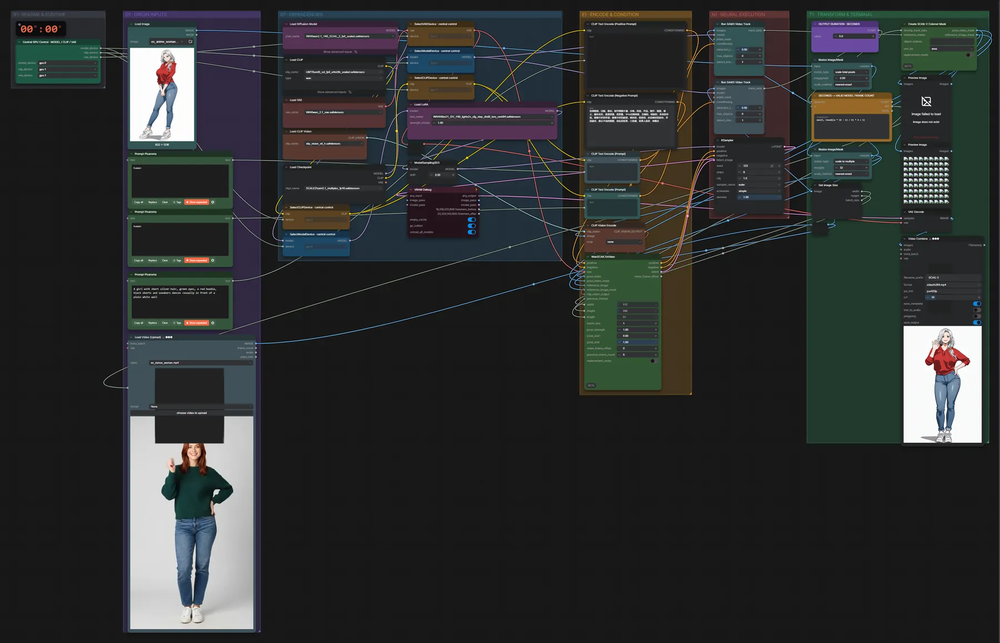

# WAN 2.1 SCAIL-2 14B (FP8) · Figur tanzt wie im Video

**Workflow-Datei:** [`workflows/Character Animation/WAN21_SCAIL2_14B_FP8-Image+Video-to-Video-Character-Animation.json`](../../../workflows/Character%20Animation/WAN21_SCAIL2_14B_FP8-Image%2BVideo-to-Video-Character-Animation.json)  
**Kategorie:** Character Animation · **Eingabe → Ausgabe:** Bild + Video + Text → Video · **Quant:** FP8

Bis v1.3.0 hieß der Workflow `SCAIL2-Character-Animation.json`.

Die Figur aus dem Bild übernimmt die Bewegung aus einem Tanz- oder Bewegungsvideo (SAM 3.1 findet die Person).

Interaktiv mit Zoom, Vergleichen und Kopier-Buttons: <https://dawasteh.github.io/DaWastehs-ComfyUI-Bundle/#/w/wan21-scail2-14b-fp8-image-video-to-video-character-animation>

## Modelle

| Rolle | Datei | Quant | Größe |
|---|---|---|---:|
| Vision-Encoder | `clip_vision_vit_h.safetensors` | FP32 | 2,4 GiB |
| Text-Encoder / LLM | `umt5_xxl_fp8_e4m3fn_scaled.safetensors` | FP8 | 6,3 GiB |
| Diffusionsmodell | `wan2.1_14B_SCAIL_2_fp8_scaled.safetensors` | FP8 | 16,5 GiB |
| LoRA | `Wan21_I2V_14B_lightx2v_cfg_step_distill_lora_rank64.safetensors` | BF16 | 0,7 GiB |
| VAE | `wan_2.1_vae.safetensors` | BF16 | 0,2 GiB |
| Modell | `sam3.1_multiplex_fp16.safetensors` | FP16 | 1,6 GiB |

## Workflow in ComfyUI

Screenshot nach dem Hauptbeispiel (Eingaben und Ergebnis im Workflow, Erklärungstafeln ausgeblendet):

[](workflow.webp)

## Beispiele

### Figur tanzt wie im Video

Prompt:

```text
A girl with short silver hair, green eyes, a red hoodie, black shorts and sneakers dances casually in front of a plain white wall
```

Negativ:

```text
色调艳丽，过曝，静态，细节模糊不清，字幕，风格，作品，画作，画面，静止，整体发灰，最差质量，低质量，JPEG压缩残留，丑陋的，残缺的，多余的手指，画得不好的手部，画得不好的脸部，畸形的，毁容的，形态畸形的肢体，手指融合，静止不动的画面，杂乱的背景，三条腿，背景人很多，倒着走
```

| Einstellung | Wert |
|---|---|
| duration | 5 s |
| seed | 123 |
| shift | 5 |
| steps | 6 |
| cfg | 1 |
| sampler_name | euler |
| scheduler | simple |
| denoise | 1 |
| Dauer (Ausführung) | 6 min 31 s |
| VRAM R9700 (belegt / PyTorch-Spitze) | 22,4 GiB / 18,3 GiB |
| VRAM RX 9070 XT (belegt / PyTorch-Spitze) | 11,2 GiB / 9,0 GiB |
| RAM (ComfyUI-Prozess) | 33,9 GiB |

Eingabe · ex_anime_woman.png:  ([Datei](input_ex_anime_woman.webp))  
Eingabe · ex_dance_woman.mp4: [input_ex_dance_woman.mp4](input_ex_dance_woman.mp4)  
Ausgabe · Ausgabe: [anime-dance.mp4](anime-dance.mp4)
