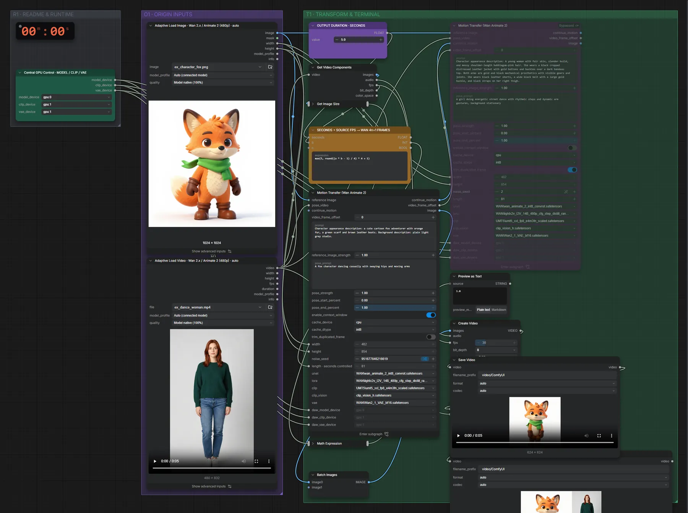

# Wan Animate 2 14B (INT8) · Bewegung auf Figur übertragen

**Workflow-Datei:** [`workflows/Character Animation/WanAnimate2_14B_INT8-Image+Video-to-Video-Motion-Transfer.json`](../../../workflows/Character%20Animation/WanAnimate2_14B_INT8-Image%2BVideo-to-Video-Motion-Transfer.json)  
**Kategorie:** Character Animation · **Eingabe → Ausgabe:** Bild + Video + Text → Video · **Quant:** INT8

Bis v1.3.0 hieß der Workflow `WanAnimate2_INT8_ConvRot-Motion-Transfer.json`.

Bewegung und Mimik aus einem Video steuern die Figur aus dem Bild; Ergebnis neben dem Original.

Interaktiv mit Zoom, Vergleichen und Kopier-Buttons: <https://dawasteh.github.io/DaWastehs-ComfyUI-Bundle/#/w/wananimate2-14b-int8-image-video-to-video-motion-transfer>

## Modelle

| Rolle | Datei | Quant | Größe |
|---|---|---|---:|
| Modell | `wan_animate_2_int8_convrot.safetensors` | INT8 | 15,5 GiB |
| Modell | `lightx2v_I2V_14B_480p_cfg_step_distill_rank64_bf16.safetensors` | BF16 | 0,7 GiB |
| Modell | `umt5_xxl_fp8_e4m3fn_scaled.safetensors` | FP8 | 6,3 GiB |
| Modell | `clip_vision_h.safetensors` | FP16 | 1,2 GiB |
| Modell | `Wan2_1_VAE_bf16.safetensors` | BF16 | 0,2 GiB |

## Workflow in ComfyUI

Screenshot nach dem Hauptbeispiel (Eingaben und Ergebnis im Workflow, Erklärungstafeln ausgeblendet):

[](workflow.webp)

## Beispiele

### Bewegung auf Figur übertragen

Prompt:

```text
a cute cartoon fox adventurer with orange fur, a green scarf and brown leather boots
```

| Einstellung | Wert |
|---|---|
| duration | 5 s |
| Dauer (Ausführung) | 13 min 9 s |
| VRAM R9700 (belegt / PyTorch-Spitze) | 28,8 GiB / 21,0 GiB |
| VRAM RX 9070 XT (belegt / PyTorch-Spitze) | 12,4 GiB / 11,8 GiB |
| RAM (ComfyUI-Prozess) | 33,4 GiB |

Eingabe · ex_character_fox.png:  ([Datei](input_ex_character_fox.webp))  
Eingabe · ex_dance_woman.mp4: [input_ex_dance_woman.mp4](input_ex_dance_woman.mp4)  
Ausgabe · Video 1: [fox-dance__n246.mp4](fox-dance__n246.mp4)  
Ausgabe · Video 2: [fox-dance__n292.mp4](fox-dance__n292.mp4)  

PreviewAny:

```text
1.0
```
