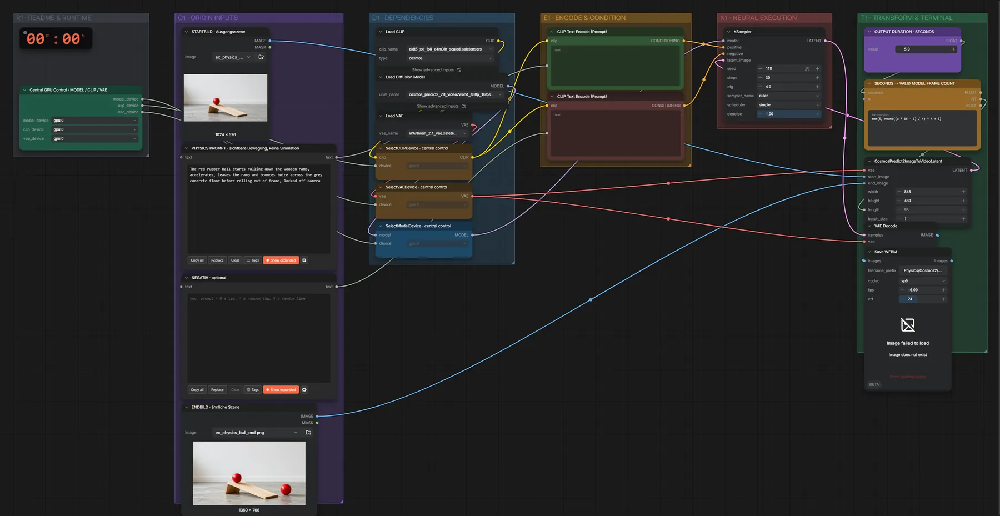

# Cosmos Predict2 2B · Start- + Endbild → Video

**Workflow-Datei:** [`workflows/Controlled Video/Cosmos_Predict2_2B_BF16-First+Last-Frame-to-Video.json`](../../../workflows/Controlled%20Video/Cosmos_Predict2_2B_BF16-First%2BLast-Frame-to-Video.json)  
**Kategorie:** Controlled Video · **Eingabe → Ausgabe:** Bild + Text → Video · **Quant:** BF16

Bis v1.3.0 hieß der Workflow `Cosmos_Predict2_2B-First-Last-Frame.json`.

Anfang und Ende vorgeben, Cosmos erzeugt die Bewegung dazwischen.

Interaktiv mit Zoom, Vergleichen und Kopier-Buttons: <https://dawasteh.github.io/DaWastehs-ComfyUI-Bundle/#/w/cosmos-predict2-2b-bf16-first-last-frame-to-video>

## Modelle

| Rolle | Datei | Quant | Größe |
|---|---|---|---:|
| Text-Encoder / LLM | `oldt5_xxl_fp8_e4m3fn_scaled.safetensors` | FP8 | 4,6 GiB |
| VAE | `wan_2.1_vae.safetensors` | BF16 | 0,2 GiB |
| Diffusionsmodell | `cosmos_predict2_2B_video2world_480p_16fps.safetensors` | BF16 | 3,6 GiB |

## Workflow in ComfyUI

Screenshot nach dem Hauptbeispiel (Eingaben und Ergebnis im Workflow, Erklärungstafeln ausgeblendet):

[](workflow.webp)

## Beispiele

### Start- und Endbild vorgeben

Prompt:

```text
The red rubber ball starts rolling down the wooden ramp, accelerates, leaves the ramp and bounces twice across the grey concrete floor before rolling out of frame, locked-off camera
```

| Einstellung | Wert |
|---|---|
| duration | 5 s |
| seed | 118 |
| steps | 30 |
| cfg | 4 |
| sampler_name | euler |
| scheduler | simple |
| denoise | 1 |
| Dauer (Ausführung) | 5 min 37 s |
| VRAM R9700 (belegt / PyTorch-Spitze) | 21,3 GiB / 15,2 GiB |
| RAM (ComfyUI-Prozess) | 7,7 GiB |

Eingabe · ex_physics_ball_start.png:  ([Datei](input_ex_physics_ball_start.webp))  
Eingabe · ex_physics_ball_end.png:  ([Datei](input_ex_physics_ball_end.webp))  
Ausgabe · Ausgabe: [ball.mp4](ball.mp4)
