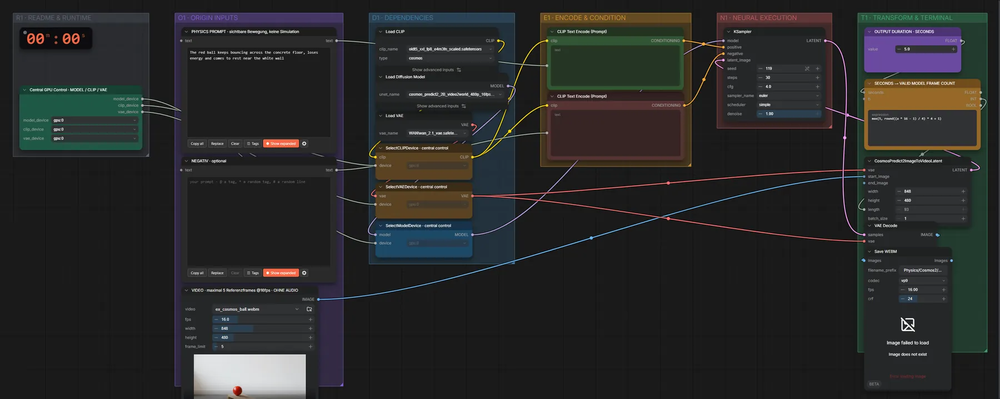

# Cosmos Predict2 2B · Video fortsetzen

**Workflow-Datei:** [`workflows/Controlled Video/Cosmos_Predict2_2B_BF16-Video-to-Video-Continuation.json`](../../../workflows/Controlled%20Video/Cosmos_Predict2_2B_BF16-Video-to-Video-Continuation.json)  
**Kategorie:** Controlled Video · **Eingabe → Ausgabe:** Video + Text → Video · **Quant:** BF16

Bis v1.3.0 hieß der Workflow `Cosmos_Predict2_2B-Video-Continuation.json`.

Die letzten Frames eines Videos (max. 5 Referenzframes) werden physikalisch weitergeführt.

Interaktiv mit Zoom, Vergleichen und Kopier-Buttons: <https://dawasteh.github.io/DaWastehs-ComfyUI-Bundle/#/w/cosmos-predict2-2b-bf16-video-to-video-continuation>

## Modelle

| Rolle | Datei | Quant | Größe |
|---|---|---|---:|
| Text-Encoder / LLM | `oldt5_xxl_fp8_e4m3fn_scaled.safetensors` | FP8 | 4,6 GiB |
| VAE | `wan_2.1_vae.safetensors` | BF16 | 0,2 GiB |
| Diffusionsmodell | `cosmos_predict2_2B_video2world_480p_16fps.safetensors` | BF16 | 3,6 GiB |

## Workflow in ComfyUI

Screenshot nach dem Hauptbeispiel (Eingaben und Ergebnis im Workflow, Erklärungstafeln ausgeblendet):

[](workflow.webp)

## Beispiele

### Video fortsetzen

Prompt:

```text
The red ball keeps bouncing across the concrete floor, loses energy and comes to rest near the white wall
```

| Einstellung | Wert |
|---|---|
| duration | 5 s |
| seed | 119 |
| steps | 30 |
| cfg | 4 |
| sampler_name | euler |
| scheduler | simple |
| denoise | 1 |
| Dauer (Ausführung) | 5 min 31 s |
| VRAM R9700 (belegt / PyTorch-Spitze) | 20,1 GiB / 15,2 GiB |
| RAM (ComfyUI-Prozess) | 9,2 GiB |

Eingabe · ex_cosmos_ball.webm: [input_ex_cosmos_ball.mp4](input_ex_cosmos_ball.mp4)  
Ausgabe · Ausgabe: [ball.mp4](ball.mp4)
