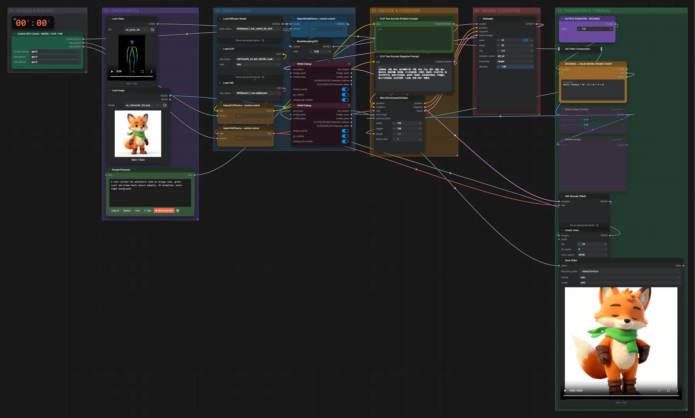

# WAN 2.2 Fun Control 5B (BF16) · Referenzbild + Steuervideo → Video

**Workflow-Datei:** [`workflows/Controlled Video/WAN22_Fun_Control_5B_BF16-Image+Control-Video-to-Video.json`](../../../workflows/Controlled%20Video/WAN22_Fun_Control_5B_BF16-Image%2BControl-Video-to-Video.json)  
**Kategorie:** Controlled Video · **Eingabe → Ausgabe:** Bild + Video + Text → Video · **Quant:** BF16

Bis v1.3.0 hieß der Workflow `WAN22_5B_Fun-Control-to-Video.json`.

Ein Pose-, Tiefen- oder Kanten-Video steuert die Bewegung, das Referenzbild das Aussehen.

Interaktiv mit Zoom, Vergleichen und Kopier-Buttons: <https://dawasteh.github.io/DaWastehs-ComfyUI-Bundle/#/w/wan22-fun-control-5b-bf16-image-control-video-to-video>

## Modelle

| Rolle | Datei | Quant | Größe |
|---|---|---|---:|
| Text-Encoder / LLM | `umt5_xxl_fp8_e4m3fn_scaled.safetensors` | FP8 | 6,3 GiB |
| VAE | `wan2.2_vae.safetensors` | FP16 | 1,3 GiB |
| Diffusionsmodell | `wan2.2_fun_control_5B_bf16.safetensors` | BF16 | 9,3 GiB |

## Workflow in ComfyUI

Screenshot nach dem Hauptbeispiel (Eingaben und Ergebnis im Workflow, Erklärungstafeln ausgeblendet):

[](workflow.webp)

## Beispiele

### Pose-Video steuert die Figur

Prompt:

```text
A cute cartoon fox adventurer with an orange coat, green scarf and brown boots dances happily, 3D animation, plain light background
```

Negativ:

```text
色调艳丽，过曝，静态，细节模糊不清，字幕，风格，作品，画作，画面，静止，整体发灰，最差质量，低质量，JPEG压缩残留，丑陋的，残缺的，多余的手指，画得不好的手部，画得不好的脸部，畸形的，毁容的，形态畸形的肢体，手指融合，静止不动的画面，杂乱的背景，三条腿，背景人很多，倒着走，
```

| Einstellung | Wert |
|---|---|
| duration | 5 s |
| seed | 42 |
| shift | 8 |
| steps | 20 |
| cfg | 5 |
| sampler_name | uni_pc |
| scheduler | simple |
| denoise | 1 |
| Dauer (Ausführung) | 3 min 12 s |
| VRAM R9700 (belegt / PyTorch-Spitze) | 21,8 GiB / 19,8 GiB |
| RAM (ComfyUI-Prozess) | 20,9 GiB |

Eingabe · Referenzbild:  ([Datei](input_ex_character_fox.webp))  
Eingabe · Steuervideo (Pose aus dem SDPose-Beispiel): [input_ex_pose_dance.mp4](input_ex_pose_dance.mp4)  
Ausgabe · Ausgabe: [fox-dance.mp4](fox-dance.mp4)
