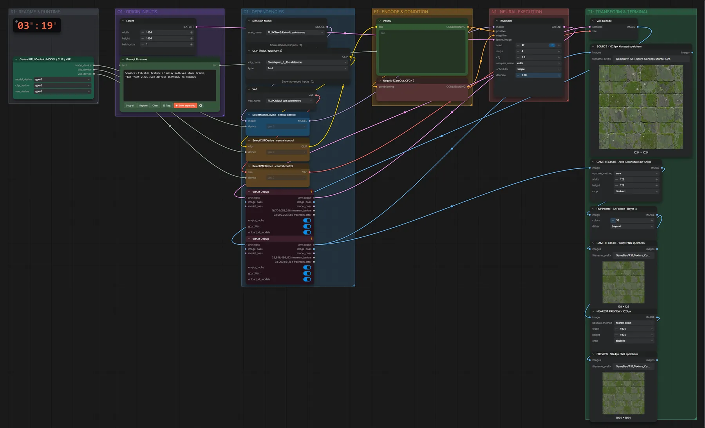
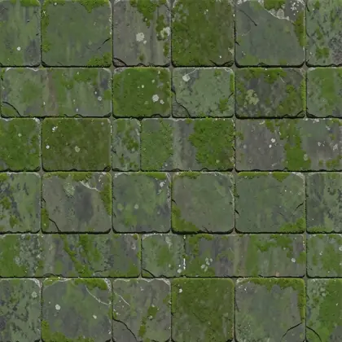
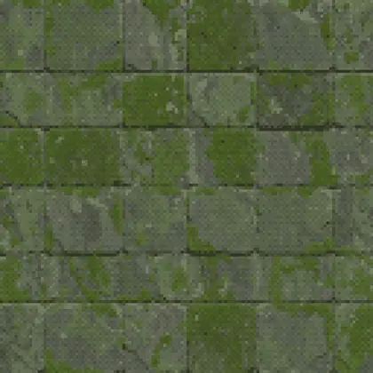
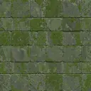
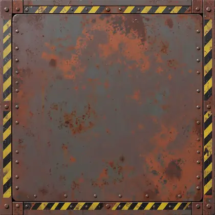
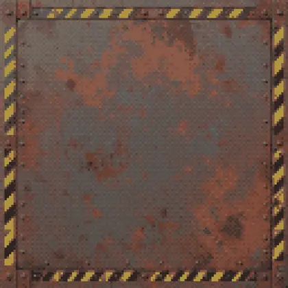
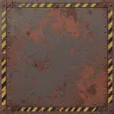

# FLUX.2 Klein 4B · Text → PS1-Textur

**Workflow-Datei:** [`workflows/Game Development/FLUX2_Klein_4B_BF16-Text-to-PS1-Texture.json`](../../../workflows/Game%20Development/FLUX2_Klein_4B_BF16-Text-to-PS1-Texture.json)  
**Kategorie:** Game Development · **Eingabe → Ausgabe:** Text → Bild · **Quant:** BF16

Bis v1.3.0 hieß der Workflow `FLUX2_Klein_4B-PS1-Texture-Concept.json`.

Textur-Konzept in 1024 px, dann Flächen-Verkleinerung auf 128 px und Nearest-Vorschau im Retro-Look.

Interaktiv mit Zoom, Vergleichen und Kopier-Buttons: <https://dawasteh.github.io/DaWastehs-ComfyUI-Bundle/#/w/flux2-klein-4b-bf16-text-to-ps1-texture>

## Modelle

| Rolle | Datei | Quant | Größe |
|---|---|---|---:|
| Diffusionsmodell | `flux-2-klein-4b.safetensors` | BF16 | 7,2 GiB |
| Text-Encoder / LLM | `qwen_3_4b.safetensors` | BF16 | 7,5 GiB |
| VAE | `flux2-vae.safetensors` | FP32 | 0,3 GiB |

## Workflow in ComfyUI

Screenshot nach dem Hauptbeispiel (Eingaben und Ergebnis im Workflow, Erklärungstafeln ausgeblendet):

[](workflow.webp)

## Beispiele

### Textur · Mauerwerk

Prompt:

```text
Seamless tileable texture of mossy medieval stone bricks, flat front view, even diffuse lighting, no shadows
```

| Einstellung | Wert |
|---|---|
| seed | 42 |
| steps | 4 |
| cfg | 1 |
| sampler_name | euler |
| scheduler | simple |
| denoise | 1 |
| Dauer (Ausführung) | 28 s |
| VRAM R9700 (belegt / PyTorch-Spitze) | 19,1 GiB / 15,4 GiB |
| RAM (ComfyUI-Prozess) | 20,3 GiB |

Ausgabe · SOURCE · 1024px Konzept speichern: [](bricks__n9.webp) · [Volle Auflösung (1024×1024, WebP mit Workflow – per Drag & Drop in ComfyUI ladbar)](bricks__n9.webp)  
Ausgabe · PREVIEW · 1024px PNG speichern: [](bricks__n39.webp)  
Ausgabe · GAME TEXTURE · 128px PNG speichern: [](bricks__n37.webp)  

### Textur · Sci-Fi-Metall

Prompt:

```text
Seamless tileable texture of a rusty sci-fi metal panel with rivets and warning stripes, flat front view, even diffuse lighting
```

| Einstellung | Wert |
|---|---|
| seed | 43 |
| steps | 4 |
| cfg | 1 |
| sampler_name | euler |
| scheduler | simple |
| denoise | 1 |
| Dauer (Ausführung) | 13 s |
| VRAM R9700 (belegt / PyTorch-Spitze) | 20,0 GiB / 15,4 GiB |
| RAM (ComfyUI-Prozess) | 20,3 GiB |

Ausgabe · SOURCE · 1024px Konzept speichern: [](metal__n9.webp)  
Ausgabe · PREVIEW · 1024px PNG speichern: [](metal__n39.webp)  
Ausgabe · GAME TEXTURE · 128px PNG speichern: [](metal__n37.webp)
