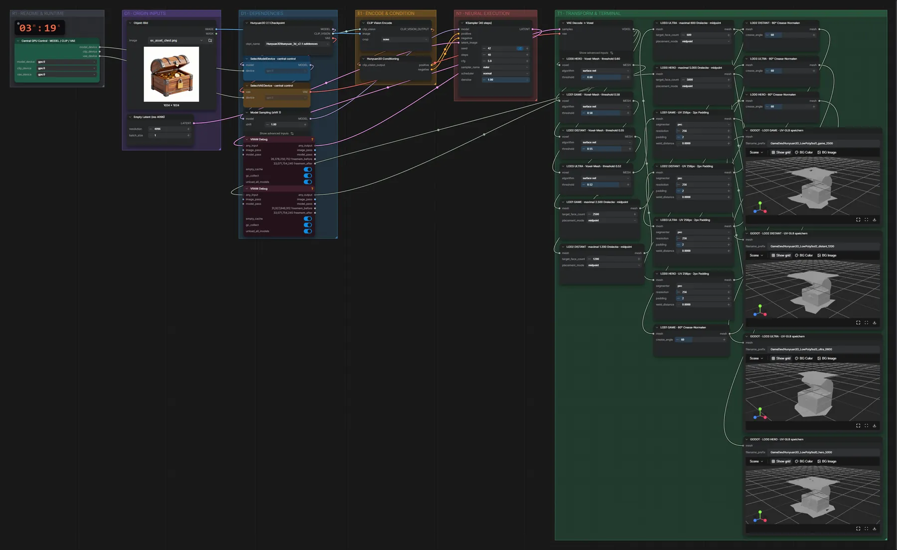

# Hunyuan3D 2.1 (FP16) · Bild → Low-Poly-Meshes für Godot

**Workflow-Datei:** [`workflows/Game Development/Hunyuan3D_2_1_FP16-Image-to-LowPoly-Mesh-Godot.json`](../../../workflows/Game%20Development/Hunyuan3D_2_1_FP16-Image-to-LowPoly-Mesh-Godot.json)  
**Kategorie:** Game Development · **Eingabe → Ausgabe:** Bild → 3D-Modell · **Quant:** FP16

Bis v1.3.0 hieß der Workflow `Hunyuan3D_v2_1-Low-Poly-Static-Mesh-for-Godot.json`.

Ein Mesh in vier Detailstufen (5000 bis 600 Dreiecke) mit UV-Abwicklung, fertig für Godot.

Interaktiv mit Zoom, Vergleichen und Kopier-Buttons: <https://dawasteh.github.io/DaWastehs-ComfyUI-Bundle/#/w/hunyuan3d-2-1-fp16-image-to-lowpoly-mesh-godot>

## Modelle

| Rolle | Datei | Quant | Größe |
|---|---|---|---:|
| Modell | `hunyuan_3d_v2.1.safetensors` | FP16 | 6,9 GiB |

## Workflow in ComfyUI

Screenshot nach dem Hauptbeispiel (Eingaben und Ergebnis im Workflow, Erklärungstafeln ausgeblendet):

## Beispiele

### Bild → vier LOD-Stufen für Godot

| Einstellung | Wert |
|---|---|
| seed | 42 |
| shift | 1 |
| steps | 40 |
| cfg | 5 |
| sampler_name | euler |
| scheduler | normal |
| denoise | 1 |
| Dauer (Ausführung) | 1 min 56 s |
| VRAM R9700 (belegt / PyTorch-Spitze) | 11,7 GiB / 7,2 GiB |
| RAM (ComfyUI-Prozess) | 17,8 GiB |

Eingabe · ex_asset_chest.png:  ([Datei](input_ex_asset_chest.webp))  
Ausgabe · GODOT · LOD0 HERO · UV-GLB speichern: [chest__n10.glb](chest__n10.glb)  
Ausgabe · GODOT · LOD1 GAME · UV-GLB speichern: [chest__n41.glb](chest__n41.glb)  
Ausgabe · GODOT · LOD2 DISTANT · UV-GLB speichern: [chest__n46.glb](chest__n46.glb)  
Ausgabe · GODOT · LOD3 ULTRA · UV-GLB speichern: [chest__n51.glb](chest__n51.glb)
