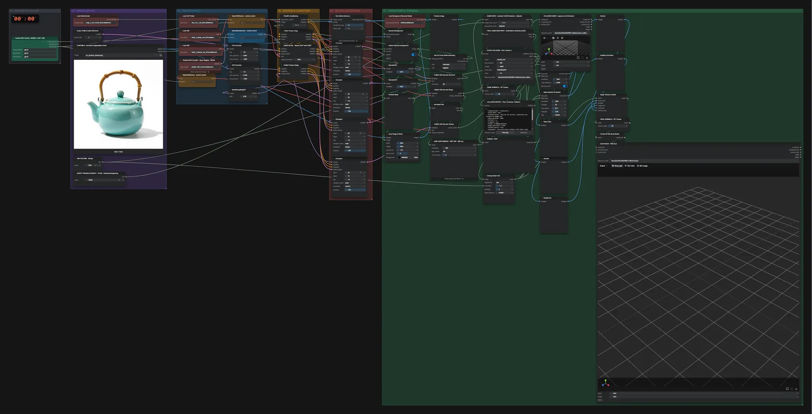

# Pixal3D (INT8) · Bild → PBR-Mesh + Kollision

**Workflow-Datei:** [`workflows/Game Development/Pixal3D_INT8-Image-to-PBR-Mesh+Collision.json`](../../../workflows/Game%20Development/Pixal3D_INT8-Image-to-PBR-Mesh%2BCollision.json)  
**Kategorie:** Game Development · **Eingabe → Ausgabe:** Bild → 3D-Modell · **Quant:** INT8

Bis v1.3.0 hieß der Workflow `Pixal3D_INT8-PBR-Collision.json`.

Sichtmesh mit PBR-Textur und ein vereinfachtes Kollisions-Mesh (CPU) für Godot 4.

Interaktiv mit Zoom, Vergleichen und Kopier-Buttons: <https://dawasteh.github.io/DaWastehs-ComfyUI-Bundle/#/w/pixal3d-int8-image-to-pbr-mesh-collision>

## Modelle

| Rolle | Datei | Quant | Größe |
|---|---|---|---:|
| VAE | `trellis_2_texture_vae_bf16.safetensors` | BF16 | 0,9 GiB |
| Vision-Encoder | `dino_v3_L_naf_fp32.safetensors` | FP32 | 1,1 GiB |
| VAE | `trellis_2_shape_vae_bf16.safetensors` | BF16 | 1,0 GiB |
| Tiefenschätzung | `moge_2_vitl_normal_fp16.safetensors` | FP16 | 0,6 GiB |
| Freisteller | `birefnet.safetensors` | FP16 | 0,4 GiB |
| Diffusionsmodell | `pixal3d_int8_convrot.safetensors` | INT8 | 5,2 GiB |

## Workflow in ComfyUI

Screenshot nach dem Hauptbeispiel (Eingaben und Ergebnis im Workflow, Erklärungstafeln ausgeblendet):

[](workflow.webp)

## Beispiele

### Objekt → PBR-Mesh + Kollision

| Einstellung | Wert |
|---|---|
| sampler_name | euler |
| denoise | 1 |
| shift | 5 |
| Dauer (Ausführung) | 3 min 35 s |
| VRAM R9700 (belegt / PyTorch-Spitze) | 14,1 GiB / 11,2 GiB |
| RAM (ComfyUI-Prozess) | 12,5 GiB |

Eingabe · ex_product_teapot.png:  ([Datei](input_ex_product_teapot.webp))  
Ausgabe · SICHTMESH · PBR-GLB: [teapot__n322.glb](teapot__n322.glb)  
Ausgabe · COLLISION-MESH · separat vom Sichtmesh: [teapot__n329.glb](teapot__n329.glb)  

GetMeshInfo:

```text
Vertices:   2,718,540 (2.72M)
Faces:      5,525,234 (5.53M)
Attributes: none
```

COLLISION REPORT · Pfad / Dreiecke / Fallback:

```text
{
  "requested_mode": "convex_hull",
  "actual_mode": "box",
  "fallback_reason": "Hull has 716 vertices; conservative box fallback for budget 128",
  "source_vertices": 6018,
  "vertices": 8,
  "triangles": 12,
  "volume": 0.5085664183873541,
  "margin_mesh_units": 0.002,
  "contains_source": true,
  "limitation": "One solid convex collider; fills holes, doors and concavities. No rig, joints or decomposition.",
  "godot_scene": "GameDev/Pixal3D/PBR-Collision/asset_collision_hxorn35n.tscn",
  "body_type": "StaticBody3D",
  "mass_kg": null,
  "axes_units": "Input coordinates preserved; align with the exported visual mesh and set scale before production."
}
```

FINAL GAME MESH INFO · tatsächliche Dreiecke prüfen:

```text
Vertices:   6,018
Faces:      11,988 (12.0K)
Attributes: none
```
