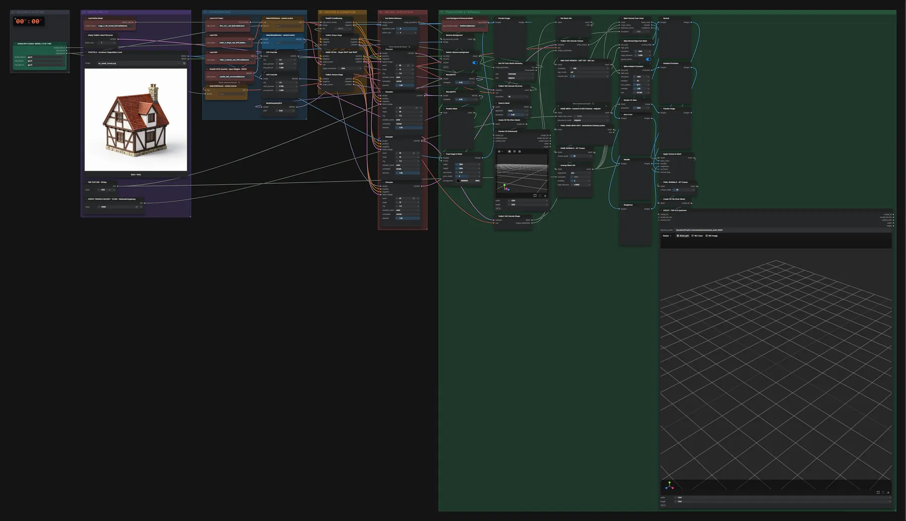
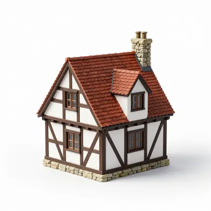

# Pixal3D (INT8) · Gebäude → PBR-Mesh für Godot

**Workflow-Datei:** [`workflows/Game Development/Pixal3D_INT8-Image-to-PBR-Mesh-Buildings-Godot.json`](../../../workflows/Game%20Development/Pixal3D_INT8-Image-to-PBR-Mesh-Buildings-Godot.json)  
**Kategorie:** Game Development · **Eingabe → Ausgabe:** Bild → 3D-Modell · **Quant:** INT8

Bis v1.3.0 hieß der Workflow `Pixal3D_INT8-Buildings-and-Environment-PBR-for-Godot.json`.

Pixal3D mit TRELLIS.2-VAEs: Form, PBR-Texturen (Farbe, Metall, Rauheit, Normal, AO) und 12.000-Dreiecke-Budget.

Interaktiv mit Zoom, Vergleichen und Kopier-Buttons: <https://dawasteh.github.io/DaWastehs-ComfyUI-Bundle/#/w/pixal3d-int8-image-to-pbr-mesh-buildings-godot>

## Modelle

| Rolle | Datei | Quant | Größe |
|---|---|---|---:|
| VAE | `trellis_2_texture_vae_bf16.safetensors` | BF16 | 0,9 GiB |
| Vision-Encoder | `dino_v3_L_naf_fp32.safetensors` | FP32 | 1,1 GiB |
| VAE | `trellis_2_shape_vae_bf16.safetensors` | BF16 | 1,0 GiB |
| Tiefenschätzung | `moge_2_vitl_normal_fp16.safetensors` | FP16 | 0,6 GiB |
| Freisteller | `birefnet.safetensors` | FP16 | 0,4 GiB |
| Diffusionsmodell | `pixal3d_int8_convrot.safetensors` | INT8 | 5,2 GiB |

## Workflow in ComfyUI

Screenshot nach dem Hauptbeispiel (Eingaben und Ergebnis im Workflow, Erklärungstafeln ausgeblendet):

[](workflow.webp)

## Beispiele

### Gebäude → PBR-Mesh

| Einstellung | Wert |
|---|---|
| sampler_name | euler |
| denoise | 1 |
| shift | 5 |
| Dauer (Ausführung) | 5 min 21 s |
| VRAM R9700 (belegt / PyTorch-Spitze) | 22,8 GiB / 16,4 GiB |
| RAM (ComfyUI-Prozess) | 16,1 GiB |

Eingabe · ex_asset_house.png:  ([Datei](input_ex_asset_house.webp))  
Ausgabe · GODOT · PBR-GLB speichern: [house.glb](house.glb)  

GetMeshInfo:

```text
Vertices:   12,346,286 (12.35M)
Faces:      25,778,168 (25.78M)
Attributes: none
```

FINAL GAME MESH INFO · tatsächliche Dreiecke prüfen:

```text
Vertices:   6,109
Faces:      11,799 (11.8K)
Attributes: none
```
