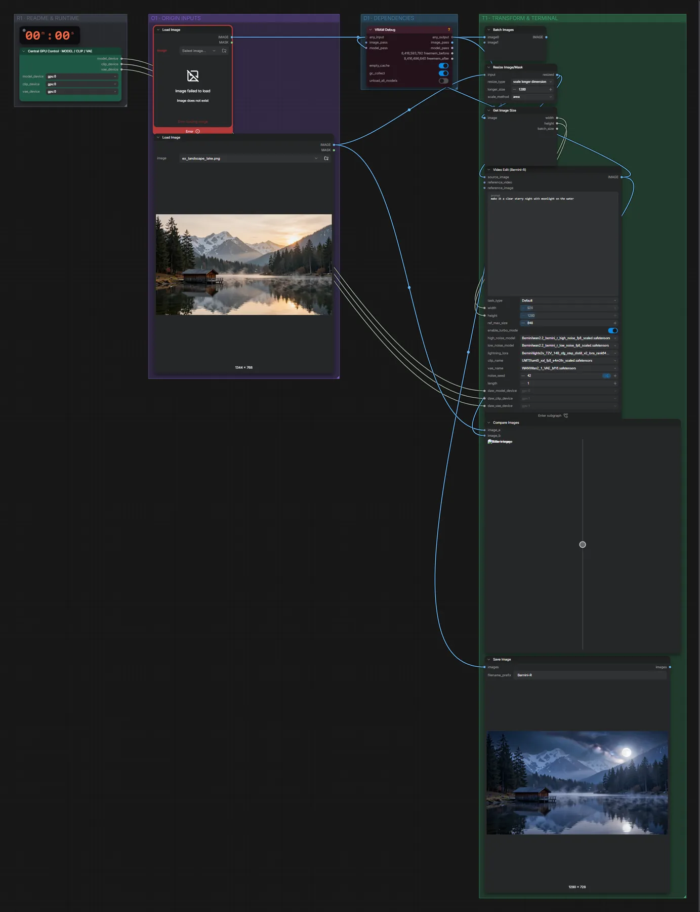

# Bernini-R · Bild bearbeiten

**Workflow-Datei:** [`workflows/Image Editing/Bernini_R_14B_FP8-Image-Edit.json`](../../../workflows/Image%20Editing/Bernini_R_14B_FP8-Image-Edit.json)  
**Kategorie:** Image Editing · **Eingabe → Ausgabe:** Bild + Text → Bild · **Quant:** FP8

Bis v1.3.0 hieß der Workflow `Bernini_R-Image-Edit.json`.

Bernini-R (WAN-2.2-Basis, 14B, FP8) bearbeitet ein einzelnes Bild per Anweisung – eigentlich ein Video-Editor, hier mit einem Frame. Turbo-LoRA, 6 Schritte.

Interaktiv mit Zoom, Vergleichen und Kopier-Buttons: <https://dawasteh.github.io/DaWastehs-ComfyUI-Bundle/#/w/bernini-r-14b-fp8-image-edit>

## Modelle

| Rolle | Datei | Quant | Größe |
|---|---|---|---:|
| Modell | `wan2.2_bernini_r_high_noise_fp8_scaled.safetensors` | FP8 | 14,5 GiB |
| Modell | `wan2.2_bernini_r_low_noise_fp8_scaled.safetensors` | FP8 | 14,5 GiB |
| Modell | `lightx2v_T2V_14B_cfg_step_distill_v2_lora_rank64_bf16.safetensors` | BF16 | 0,6 GiB |
| Modell | `umt5_xxl_fp8_e4m3fn_scaled.safetensors` | FP8 | 6,3 GiB |
| Modell | `Wan2_1_VAE_bf16.safetensors` | BF16 | 0,2 GiB |

## Workflow in ComfyUI

Screenshot nach dem Hauptbeispiel (Eingaben und Ergebnis im Workflow, Erklärungstafeln ausgeblendet):

[](workflow.webp)

## Beispiele

### Tag → Nacht

Prompt:

```text
make it a clear starry night with moonlight on the water
```

| Einstellung | Wert |
|---|---|
| seed | 42 |
| Dauer (Ausführung) | 1 min 10 s |
| VRAM R9700 (belegt / PyTorch-Spitze) | 28,4 GiB / 26,5 GiB |
| RAM (ComfyUI-Prozess) | 33,9 GiB |

Eingabe · ex_landscape_lake.png:  ([Datei](input_ex_landscape_lake.webp))  
Ausgabe · Ausgabe: [](night.webp) · [Volle Auflösung (1280×728, WebP mit Workflow – per Drag & Drop in ComfyUI ladbar)](night.webp)  

PreviewAny:

```text
0
```
