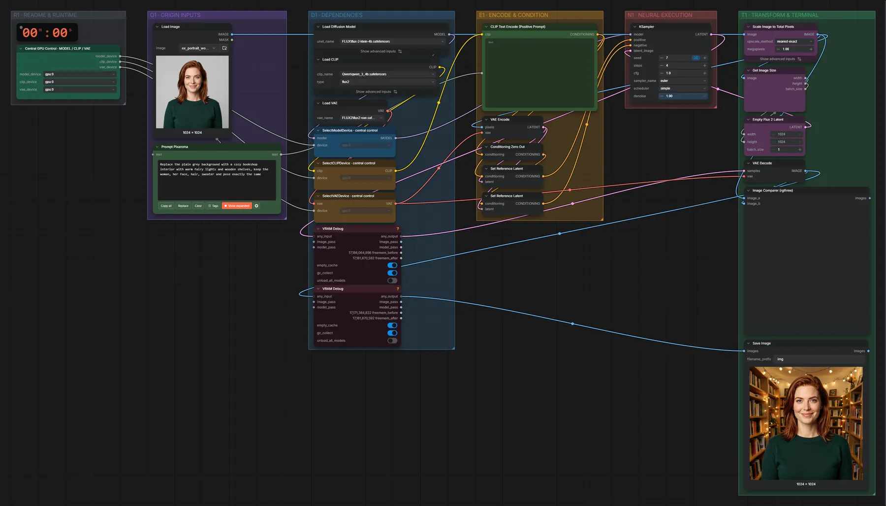
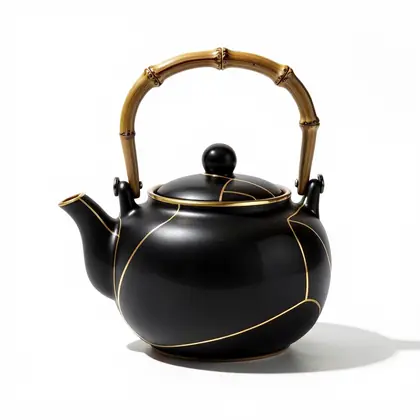

# FLUX.2 Klein 4B · Bild bearbeiten

**Workflow-Datei:** [`workflows/Image Editing/FLUX2_Klein_4B_BF16-Image-Edit.json`](../../../workflows/Image%20Editing/FLUX2_Klein_4B_BF16-Image-Edit.json)  
**Kategorie:** Image Editing · **Eingabe → Ausgabe:** Bild + Text → Bild · **Quant:** BF16

Bis v1.3.0 hieß der Workflow `FLUX2_Klein_4B-One-Image-Edit.json`.

Ein Bild plus Anweisung (Hintergrund tauschen, Stil ändern, Objekt umfärben). 4 Schritte, das Ausgabeformat folgt dem Eingabebild.

Interaktiv mit Zoom, Vergleichen und Kopier-Buttons: <https://dawasteh.github.io/DaWastehs-ComfyUI-Bundle/#/w/flux2-klein-4b-bf16-image-edit>

## Modelle

| Rolle | Datei | Quant | Größe |
|---|---|---|---:|
| Diffusionsmodell | `flux-2-klein-4b.safetensors` | BF16 | 7,2 GiB |
| Text-Encoder / LLM | `qwen_3_4b.safetensors` | BF16 | 7,5 GiB |
| VAE | `flux2-vae.safetensors` | FP32 | 0,3 GiB |

## Workflow in ComfyUI

Screenshot nach dem Hauptbeispiel (Eingaben und Ergebnis im Workflow, Erklärungstafeln ausgeblendet):

[](workflow.webp)

## Beispiele

### Hintergrund tauschen

Prompt:

```text
Replace the plain grey background with a cozy bookshop interior with warm fairy lights and wooden shelves, keep the woman, her face, hair, sweater and pose exactly the same
```

| Einstellung | Wert |
|---|---|
| seed | 7 |
| steps | 4 |
| cfg | 1 |
| sampler_name | euler |
| scheduler | simple |
| denoise | 1 |
| Dauer (Ausführung) | 26 s |
| VRAM R9700 (belegt / PyTorch-Spitze) | 21,4 GiB / 20,8 GiB |
| RAM (ComfyUI-Prozess) | 14,7 GiB |

Eingabe · ex_portrait_woman.png:  ([Datei](input_ex_portrait_woman.webp))  
Ausgabe · Ausgabe: [](bookshop.webp) · [Volle Auflösung (1024×1024, WebP mit Workflow – per Drag & Drop in ComfyUI ladbar)](bookshop.webp)  

### Stil ändern · Aquarell

Prompt:

```text
Turn this photo into a loose watercolor painting with soft washes and visible paper texture, keep the composition and the woman's likeness
```

| Einstellung | Wert |
|---|---|
| seed | 7 |
| steps | 4 |
| cfg | 1 |
| sampler_name | euler |
| scheduler | simple |
| denoise | 1 |
| Dauer (Ausführung) | 7 s |
| VRAM R9700 (belegt / PyTorch-Spitze) | 24,5 GiB / 20,8 GiB |
| RAM (ComfyUI-Prozess) | 1,2 GiB |

Eingabe · ex_portrait_woman.png:  ([Datei](input_ex_portrait_woman.webp))  
Ausgabe · Ausgabe: [](watercolor.webp)  

### Objekt umfärben

Prompt:

```text
Change the teapot to matte black ceramic with thin gold accents, keep the shape, the bamboo handle and the white background
```

| Einstellung | Wert |
|---|---|
| seed | 7 |
| steps | 4 |
| cfg | 1 |
| sampler_name | euler |
| scheduler | simple |
| denoise | 1 |
| Dauer (Ausführung) | 7 s |
| VRAM R9700 (belegt / PyTorch-Spitze) | 25,2 GiB / 20,8 GiB |
| RAM (ComfyUI-Prozess) | 1,2 GiB |

Eingabe · ex_product_teapot.png:  ([Datei](input_ex_product_teapot.webp))  
Ausgabe · Ausgabe: [](teapot-black.webp)
