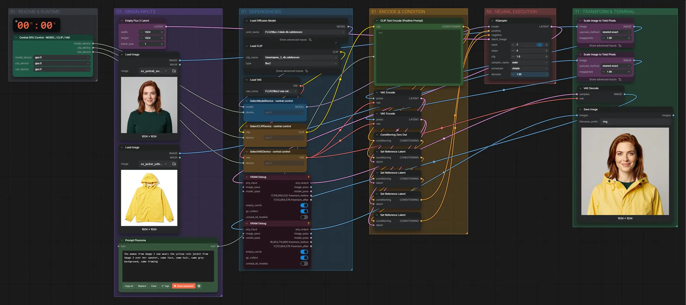

# FLUX.2 Klein 4B · zwei Bilder kombinieren

**Workflow-Datei:** [`workflows/Image Editing/FLUX2_Klein_4B_BF16-Two-Image-Edit.json`](../../../workflows/Image%20Editing/FLUX2_Klein_4B_BF16-Two-Image-Edit.json)  
**Kategorie:** Image Editing · **Eingabe → Ausgabe:** Bild + Text → Bild · **Quant:** BF16

Bis v1.3.0 hieß der Workflow `FLUX2_Klein_4B-Two-Image-Edit.json`.

Zwei Referenzbilder und eine Anweisung, z. B. Kleidung aus Bild 2 auf die Person in Bild 1.

Interaktiv mit Zoom, Vergleichen und Kopier-Buttons: <https://dawasteh.github.io/DaWastehs-ComfyUI-Bundle/#/w/flux2-klein-4b-bf16-two-image-edit>

## Modelle

| Rolle | Datei | Quant | Größe |
|---|---|---|---:|
| Diffusionsmodell | `flux-2-klein-4b.safetensors` | BF16 | 7,2 GiB |
| Text-Encoder / LLM | `qwen_3_4b.safetensors` | BF16 | 7,5 GiB |
| VAE | `flux2-vae.safetensors` | FP32 | 0,3 GiB |

## Workflow in ComfyUI

Screenshot nach dem Hauptbeispiel (Eingaben und Ergebnis im Workflow, Erklärungstafeln ausgeblendet):

[](workflow.webp)

## Beispiele

### Kleidung aus Bild 2 anziehen

Prompt:

```text
The woman from image 1 now wears the yellow rain jacket from image 2 over her sweater, same face, same hair, same grey background, same framing
```

| Einstellung | Wert |
|---|---|
| seed | 7 |
| steps | 4 |
| cfg | 1 |
| sampler_name | euler |
| scheduler | simple |
| denoise | 1 |
| Dauer (Ausführung) | 22 s |
| VRAM R9700 (belegt / PyTorch-Spitze) | 24,0 GiB / 20,8 GiB |
| RAM (ComfyUI-Prozess) | 13,2 GiB |

Eingabe · Bild 1:  ([Datei](input_ex_portrait_woman.webp))  
Eingabe · Bild 2:  ([Datei](input_ex_jacket_yellow.webp))  
Ausgabe · Ausgabe: [](jacket.webp) · [Volle Auflösung (1024×1024, WebP mit Workflow – per Drag & Drop in ComfyUI ladbar)](jacket.webp)
