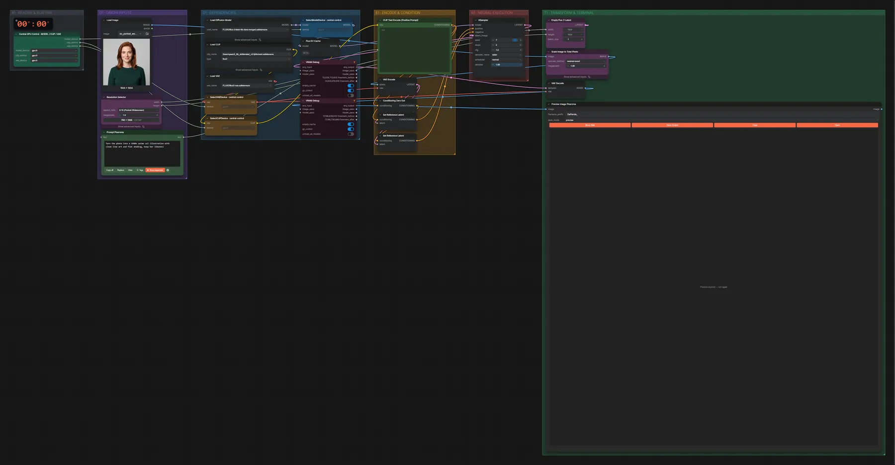
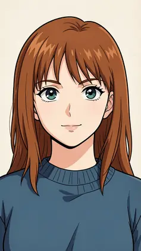

# FLUX.2 Klein 9B DARE (BF16) · Bild bearbeiten, freies Format

**Workflow-Datei:** [`workflows/Image Editing/FLUX2_Klein_9B_Dare_BF16-Image-Edit-Custom-Ratio.json`](../../../workflows/Image%20Editing/FLUX2_Klein_9B_Dare_BF16-Image-Edit-Custom-Ratio.json)  
**Kategorie:** Image Editing · **Eingabe → Ausgabe:** Bild + Text → Bild · **Quant:** BF16

Bis v1.3.0 hieß der Workflow `FLUX2_Klein_9B_KV-One-Image-Edit-Custom-Ratio.json`.

Bearbeitung mit dem DARE-Merge und abliterated Text-Encoder; das Ausgabeformat wählst du frei im Resolution-Selector.

Interaktiv mit Zoom, Vergleichen und Kopier-Buttons: <https://dawasteh.github.io/DaWastehs-ComfyUI-Bundle/#/w/flux2-klein-9b-dare-bf16-image-edit-custom-ratio>

## Modelle

| Rolle | Datei | Quant | Größe |
|---|---|---|---:|
| VAE | `flux2-vae.safetensors` | FP32 | 0,3 GiB |
| Text-Encoder / LLM | `qwen3_8b_abliterated_v2-fp8mixed.safetensors` | FP8 mixed | 7,6 GiB |
| Diffusionsmodell | `flux-2-klein-9b-dare-merged.safetensors` | BF16 | 16,9 GiB |

## Workflow in ComfyUI

Screenshot nach dem Hauptbeispiel (Eingaben und Ergebnis im Workflow, Erklärungstafeln ausgeblendet):

[](workflow.webp)

## Beispiele

### Stil ändern · freies Seitenverhältnis

Prompt:

```text
Turn the photo into a 1990s anime cel illustration with clean line art and flat shading, keep her likeness
```

| Einstellung | Wert |
|---|---|
| seed | 7 |
| steps | 4 |
| cfg | 1 |
| sampler_name | euler |
| scheduler | normal |
| denoise | 1 |
| Dauer (Ausführung) | 46 s |
| VRAM R9700 (belegt / PyTorch-Spitze) | 25,8 GiB / 21,9 GiB |
| RAM (ComfyUI-Prozess) | 33,0 GiB |

Eingabe · ex_portrait_woman.png:  ([Datei](input_ex_portrait_woman.webp))  
Ausgabe · Ausgabe: [](anime-style.webp) · [Volle Auflösung (768×1360, WebP mit Workflow – per Drag & Drop in ComfyUI ladbar)](anime-style.webp)
