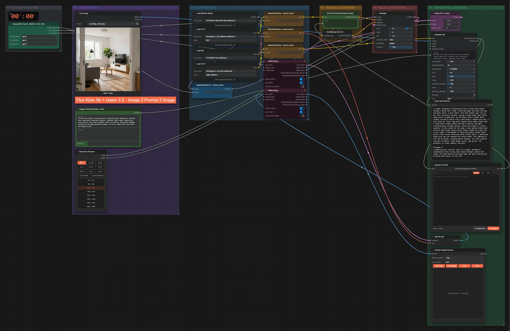
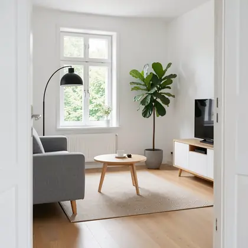

# FLUX.2 Klein 9B + Qwen3.5 · Bild → Prompt → neues Bild

**Workflow-Datei:** [`workflows/Image Editing/FLUX2_Klein_9B_KV_FP8+Qwen3_5_4B-Image-to-Prompt-to-Image.json`](../../../workflows/Image%20Editing/FLUX2_Klein_9B_KV_FP8%2BQwen3_5_4B-Image-to-Prompt-to-Image.json)  
**Kategorie:** Image Editing · **Eingabe → Ausgabe:** Bild → Prompt + Bild · **Quant:** FP8

Bis v1.3.0 hieß der Workflow `FLUX2_Klein_9B_Qwen3_5-Image-to-Prompt-to-Image.json`.

Qwen3.5 4B beschreibt das Eingabebild ausführlich, du prüfst den Text am Pause-Knoten, dann malt Klein 9B daraus ein neues Bild.

Interaktiv mit Zoom, Vergleichen und Kopier-Buttons: <https://dawasteh.github.io/DaWastehs-ComfyUI-Bundle/#/w/flux2-klein-9b-kv-fp8-qwen3-5-4b-image-to-prompt-to-image>

## Modelle

| Rolle | Datei | Quant | Größe |
|---|---|---|---:|
| Diffusionsmodell | `flux-2-klein-9b-kv-fp8.safetensors` | FP8 | 9,1 GiB |
| Text-Encoder / LLM | `qwen_3_8b_fp8mixed.safetensors` | FP8 mixed | 8,1 GiB |
| VAE | `flux2-vae.safetensors` | FP32 | 0,3 GiB |
| Text-Encoder / LLM | `qwen3.5_4b_bf16.safetensors` | BF16 | 8,7 GiB |

## Workflow in ComfyUI

Screenshot nach dem Hauptbeispiel (Eingaben und Ergebnis im Workflow, Erklärungstafeln ausgeblendet):

[](workflow.webp)

## Beispiele

### Bild → Prompt (Pause) → neues Bild

| Einstellung | Wert |
|---|---|
| seed | 42 |
| steps | 4 |
| cfg | 1 |
| sampler_name | euler |
| scheduler | simple |
| denoise | 1 |
| Dauer (Ausführung) | 58 s |
| VRAM R9700 (belegt / PyTorch-Spitze) | 28,7 GiB / 23,1 GiB |
| RAM (ComfyUI-Prozess) | 15,3 GiB |

Die Bildbeschreibung von Qwen3.5 wird am Pause-Knoten unverändert übernommen („Continue“).

Eingabe · ex_living_room.png:  ([Datei](input_ex_living_room.webp))  
Ausgabe · Ausgabe: [](room.webp) · [Volle Auflösung (1024×1024, WebP mit Workflow – per Drag & Drop in ComfyUI ladbar)](room.webp)  

PixaromaShowText:

```text
A bright, minimalist Scandinavian-style living room viewed through a white door frame, featuring light oak wood flooring and white walls. A grey fabric sofa with wooden legs sits on the left, partially visible, facing a round light wood coffee table with a tripod base. On the table rests a small white ceramic cup and a saucer with a dark object. Behind the sofa, a tall black arc floor lamp with a matte black shade stands near a large white-framed window letting in natural daylight, revealing green foliage outside. Below the window is a white radiator. In the center of the room, a tall potted fiddle-leaf fig tree with large, glossy green leaves stands in a grey pot. To the right, a low wooden TV stand with white cabinet doors holds a flat-screen television with a black bezel. A patterned beige area rug lies beneath the coffee table. The lighting is soft and diffused, creating gentle shadows. The color palette consists of whites, light woods, greys, and greens. The aesthetic is clean, modern, and airy.

**Prompt:**
A photorealistic interior shot of a bright, minimalist Scandinavian-style living room viewed through a white door frame. The room features polished light oak wood flooring and pristine white walls. On the left
```
