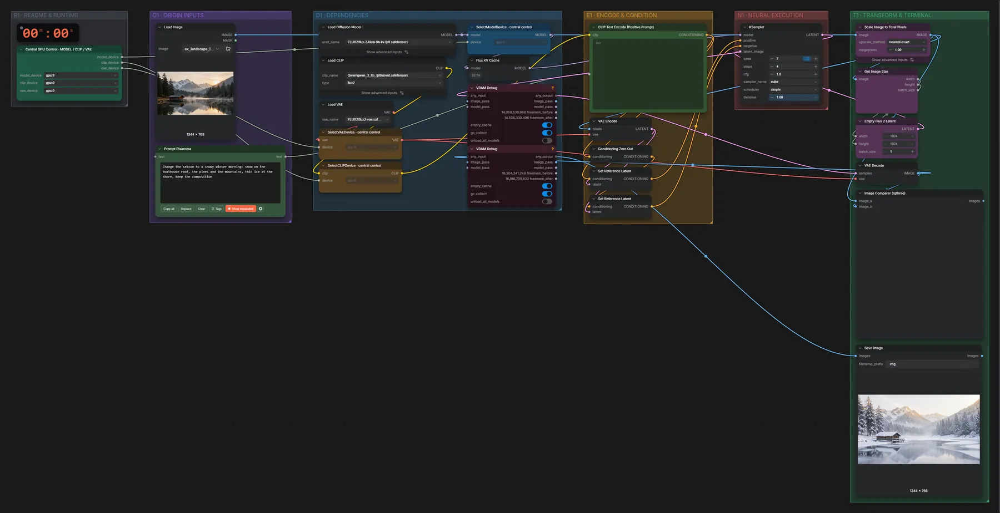

# FLUX.2 Klein 9B · Bild bearbeiten

**Workflow-Datei:** [`workflows/Image Editing/FLUX2_Klein_9B_KV_FP8-Image-Edit.json`](../../../workflows/Image%20Editing/FLUX2_Klein_9B_KV_FP8-Image-Edit.json)  
**Kategorie:** Image Editing · **Eingabe → Ausgabe:** Bild + Text → Bild · **Quant:** FP8

Bis v1.3.0 hieß der Workflow `FLUX2_Klein_9B_KV-One-Image-Edit-Same-Ratio.json`.

Ein Bild plus Anweisung, Format wie das Eingabebild. Schnell (4 Schritte) und sehr treu bei Details.

Interaktiv mit Zoom, Vergleichen und Kopier-Buttons: <https://dawasteh.github.io/DaWastehs-ComfyUI-Bundle/#/w/flux2-klein-9b-kv-fp8-image-edit>

## Modelle

| Rolle | Datei | Quant | Größe |
|---|---|---|---:|
| VAE | `flux2-vae.safetensors` | FP32 | 0,3 GiB |
| Text-Encoder / LLM | `qwen_3_8b_fp8mixed.safetensors` | FP8 mixed | 8,1 GiB |
| Diffusionsmodell | `flux-2-klein-9b-kv-fp8.safetensors` | FP8 | 9,1 GiB |

## Workflow in ComfyUI

Screenshot nach dem Hauptbeispiel (Eingaben und Ergebnis im Workflow, Erklärungstafeln ausgeblendet):

[](workflow.webp)

## Beispiele

### Jahreszeit ändern

Prompt:

```text
Change the season to a snowy winter morning: snow on the boathouse roof, the pines and the mountains, thin ice at the shore, keep the composition
```

| Einstellung | Wert |
|---|---|
| seed | 7 |
| steps | 4 |
| cfg | 1 |
| sampler_name | euler |
| scheduler | simple |
| denoise | 1 |
| Dauer (Ausführung) | 36 s |
| VRAM R9700 (belegt / PyTorch-Spitze) | 30,0 GiB / 21,1 GiB |
| RAM (ComfyUI-Prozess) | 10,4 GiB |

Eingabe · ex_landscape_lake.png:  ([Datei](input_ex_landscape_lake.webp))  
Ausgabe · Ausgabe: [](winter.webp) · [Volle Auflösung (1344×768, WebP mit Workflow – per Drag & Drop in ComfyUI ladbar)](winter.webp)  

### Tag → Nacht

Prompt:

```text
Turn the scene into a clear night: dark blue sky with stars, a warm light in the boathouse window, moonlight on the water, keep the composition
```

| Einstellung | Wert |
|---|---|
| seed | 7 |
| steps | 4 |
| cfg | 1 |
| sampler_name | euler |
| scheduler | simple |
| denoise | 1 |
| Dauer (Ausführung) | 10 s |
| VRAM R9700 (belegt / PyTorch-Spitze) | 25,3 GiB / 21,1 GiB |
| RAM (ComfyUI-Prozess) | 3,6 GiB |

Eingabe · ex_landscape_lake.png:  ([Datei](input_ex_landscape_lake.webp))  
Ausgabe · Ausgabe: [](night.webp)
