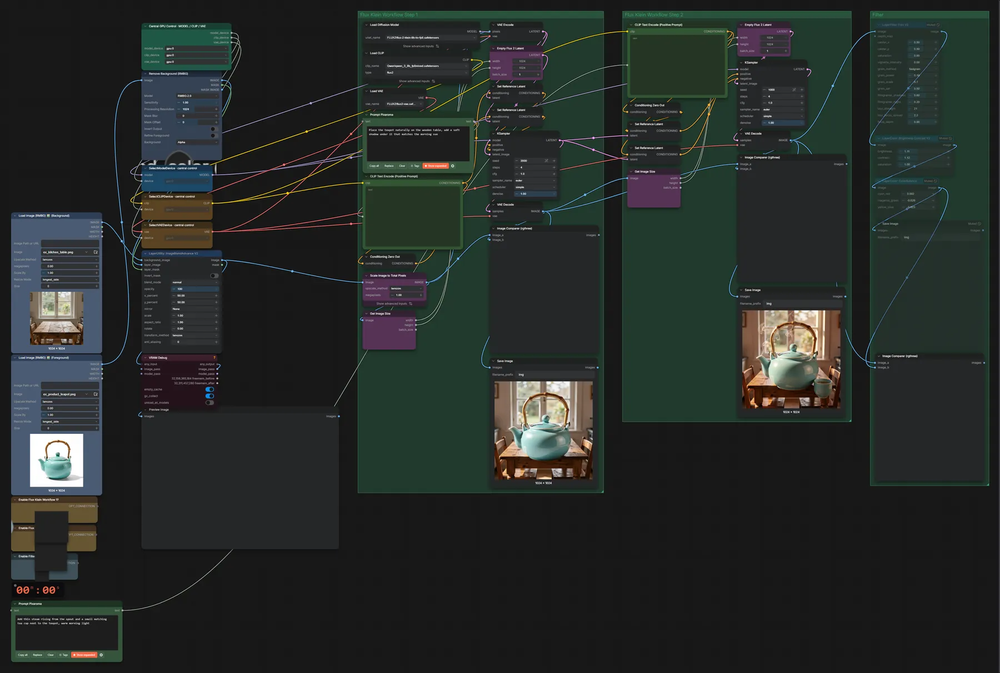
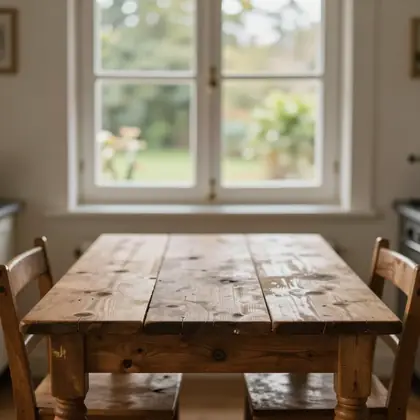
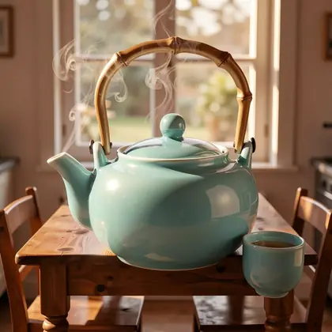
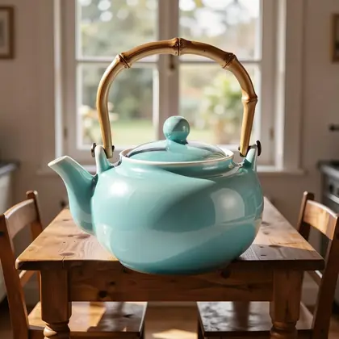

# FLUX.2 Klein 9B · mehrstufige Bearbeitung

**Workflow-Datei:** [`workflows/Image Editing/FLUX2_Klein_9B_KV_FP8-Multi-Step-Image-Edit.json`](../../../workflows/Image%20Editing/FLUX2_Klein_9B_KV_FP8-Multi-Step-Image-Edit.json)  
**Kategorie:** Image Editing · **Eingabe → Ausgabe:** Bild + Text → Bild · **Quant:** FP8

Bis v1.3.0 hieß der Workflow `FLUX2_Klein_9B-Multi-Step-Edit.json`.

Objekt freistellen (RMBG), auf einen Hintergrund setzen und in zwei Klein-9B-Durchgängen nacheinander bearbeiten; optional ein Film-Filter. Die Stufen werden per Fast Groups Muter ein- und ausgeschaltet.

Interaktiv mit Zoom, Vergleichen und Kopier-Buttons: <https://dawasteh.github.io/DaWastehs-ComfyUI-Bundle/#/w/flux2-klein-9b-kv-fp8-multi-step-image-edit>

## Workflow in ComfyUI

Screenshot nach dem Hauptbeispiel (Eingaben und Ergebnis im Workflow, Erklärungstafeln ausgeblendet):

[](workflow.webp)

## Beispiele

### Freistellen, einsetzen, zweimal bearbeiten

Prompt:

```text
Place the teapot naturally on the wooden table, add a soft shadow under it that matches the morning sun
```

| Einstellung | Wert |
|---|---|
| Dauer (Ausführung) | 54 s |
| VRAM R9700 (belegt / PyTorch-Spitze) | 27,3 GiB / 20,4 GiB |
| RAM (ComfyUI-Prozess) | 10,3 GiB |

Beide Klein-9B-Gruppen eingeschaltet (im ausgelieferten Workflow per „Fast Groups Muter“ aus); der Filter-Schritt bleibt aus.

Eingabe · ex_kitchen_table.png:  ([Datei](input_ex_kitchen_table.webp))  
Eingabe · ex_product_teapot.png:  ([Datei](input_ex_product_teapot.webp))  
Ausgabe · Final: [](teapot-scene__n241.webp) · [Volle Auflösung (1024×1024, WebP mit Workflow – per Drag & Drop in ComfyUI ladbar)](teapot-scene__n241.webp)  
Ausgabe · Pass 1: [](teapot-scene__n203.webp)
