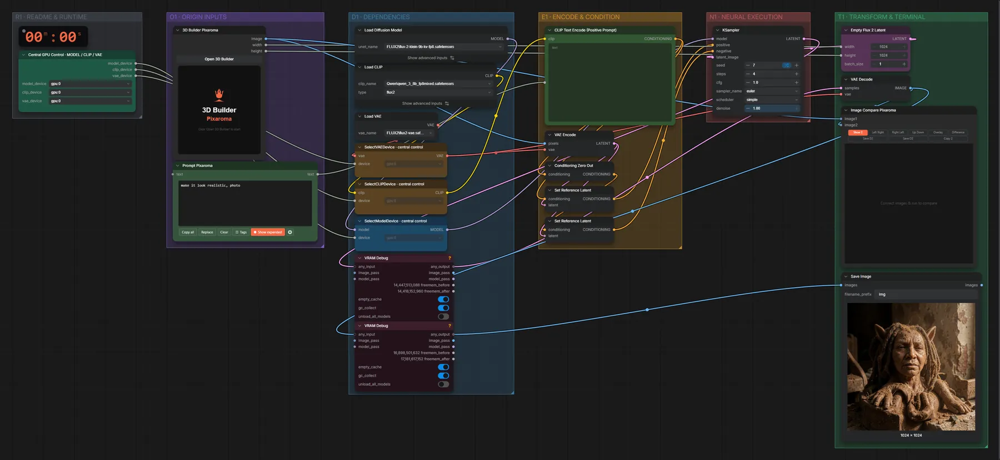

# FLUX.2 Klein 9B · 3D-Szene → Bild

**Workflow-Datei:** [`workflows/Image Editing/FLUX2_Klein_9B_KV_FP8-Pixaroma-3D-Scene-to-Image.json`](../../../workflows/Image%20Editing/FLUX2_Klein_9B_KV_FP8-Pixaroma-3D-Scene-to-Image.json)  
**Kategorie:** Image Editing · **Eingabe → Ausgabe:** 3D-Szene + Text → Bild · **Quant:** FP8

Bis v1.3.0 hieß der Workflow `FLUX2_Klein_9B-Pixaroma-3D-Builder-Edit.json`.

Mit dem Pixaroma-3D-Builder grob eine Szene aus Grundkörpern bauen, Klein 9B macht daraus ein fertiges Bild.

Interaktiv mit Zoom, Vergleichen und Kopier-Buttons: <https://dawasteh.github.io/DaWastehs-ComfyUI-Bundle/#/w/flux2-klein-9b-kv-fp8-pixaroma-3d-scene-to-image>

## Modelle

| Rolle | Datei | Quant | Größe |
|---|---|---|---:|
| VAE | `flux2-vae.safetensors` | FP32 | 0,3 GiB |
| Text-Encoder / LLM | `qwen_3_8b_fp8mixed.safetensors` | FP8 mixed | 8,1 GiB |
| Diffusionsmodell | `flux-2-klein-9b-kv-fp8.safetensors` | FP8 | 9,1 GiB |

## Workflow in ComfyUI

Screenshot nach dem Hauptbeispiel (Eingaben und Ergebnis im Workflow, Erklärungstafeln ausgeblendet):

## Beispiele

### Mitgelieferte Szene

| Einstellung | Wert |
|---|---|
| seed | 7 |
| steps | 4 |
| cfg | 1 |
| sampler_name | euler |
| scheduler | simple |
| denoise | 1 |
| Dauer (Ausführung) | 34 s |
| VRAM R9700 (belegt / PyTorch-Spitze) | 20,6 GiB / 20,8 GiB |
| RAM (ComfyUI-Prozess) | 9,7 GiB |

Unverändert mit der im Workflow gespeicherten Pixaroma-Szene; eigene Szenen baust du im Editor-Knoten.

Ausgabe · Ausgabe:  · [Volle Auflösung (1024×1024, WebP mit Workflow – per Drag & Drop in ComfyUI ladbar)](default.webp)
