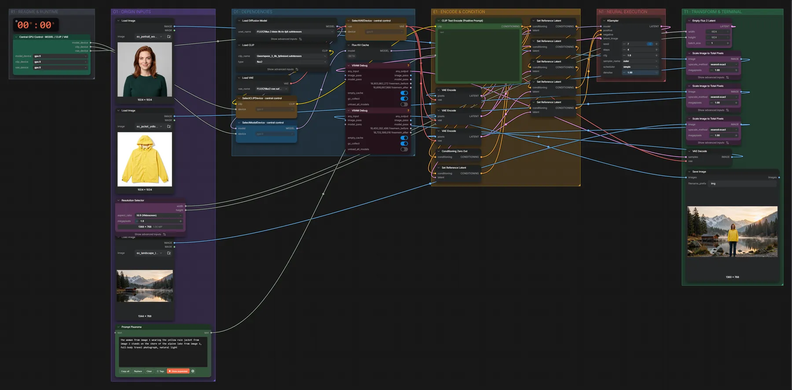
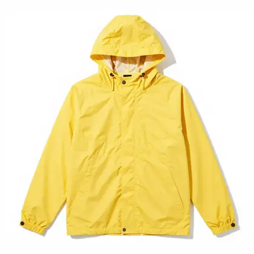
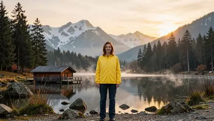

# FLUX.2 Klein 9B · drei Bilder kombinieren

**Workflow-Datei:** [`workflows/Image Editing/FLUX2_Klein_9B_KV_FP8-Three-Image-Edit.json`](../../../workflows/Image%20Editing/FLUX2_Klein_9B_KV_FP8-Three-Image-Edit.json)  
**Kategorie:** Image Editing · **Eingabe → Ausgabe:** Bild + Text → Bild · **Quant:** FP8

Bis v1.3.0 hieß der Workflow `FLUX2_Klein_9B_KV-Three-Image-Edit.json`.

Person, Kleidungsstück und Ort aus drei Bildern in einem neuen Bild.

Interaktiv mit Zoom, Vergleichen und Kopier-Buttons: <https://dawasteh.github.io/DaWastehs-ComfyUI-Bundle/#/w/flux2-klein-9b-kv-fp8-three-image-edit>

## Modelle

| Rolle | Datei | Quant | Größe |
|---|---|---|---:|
| Text-Encoder / LLM | `qwen_3_8b_fp8mixed.safetensors` | FP8 mixed | 8,1 GiB |
| Diffusionsmodell | `flux-2-klein-9b-kv-fp8.safetensors` | FP8 | 9,1 GiB |
| VAE | `flux2-vae.safetensors` | FP32 | 0,3 GiB |

## Workflow in ComfyUI

Screenshot nach dem Hauptbeispiel (Eingaben und Ergebnis im Workflow, Erklärungstafeln ausgeblendet):

[](workflow.webp)

## Beispiele

### Person + Jacke + Ort

Prompt:

```text
The woman from image 1 wearing the yellow rain jacket from image 2 stands on the shore of the alpine lake from image 3, full-body travel photograph, natural light
```

| Einstellung | Wert |
|---|---|
| seed | 7 |
| steps | 4 |
| cfg | 1 |
| sampler_name | euler |
| scheduler | simple |
| denoise | 1 |
| Dauer (Ausführung) | 41 s |
| VRAM R9700 (belegt / PyTorch-Spitze) | 27,5 GiB / 22,2 GiB |
| RAM (ComfyUI-Prozess) | 14,3 GiB |

Eingabe · ex_portrait_woman.png:  ([Datei](input_ex_portrait_woman.webp))  
Eingabe · ex_jacket_yellow.png:  ([Datei](input_ex_jacket_yellow.webp))  
Eingabe · ex_landscape_lake.png:  ([Datei](input_ex_landscape_lake.webp))  
Ausgabe · Ausgabe: [](lake-trip.webp) · [Volle Auflösung (1360×768, WebP mit Workflow – per Drag & Drop in ComfyUI ladbar)](lake-trip.webp)
