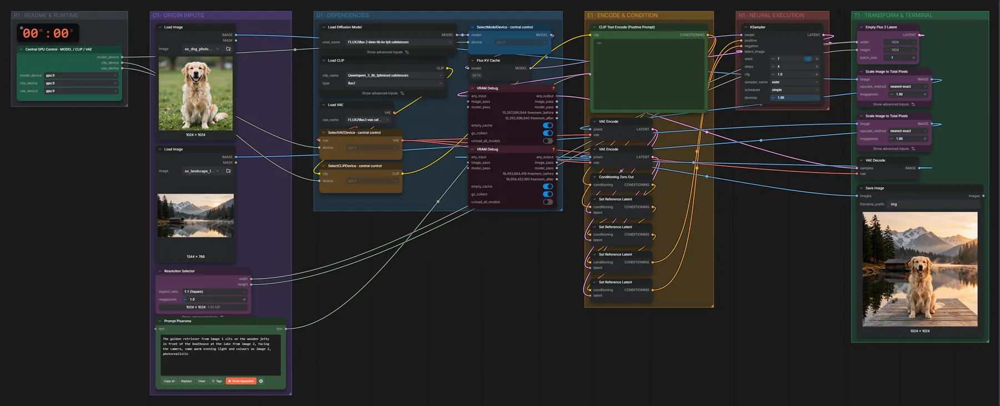
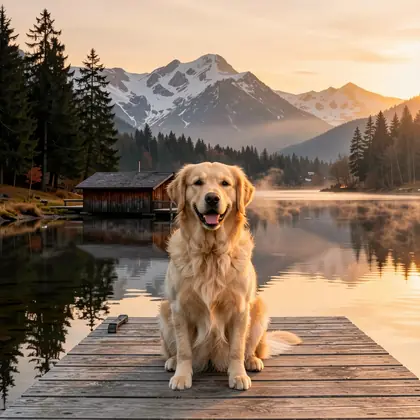

# FLUX.2 Klein 9B · zwei Bilder kombinieren

**Workflow-Datei:** [`workflows/Image Editing/FLUX2_Klein_9B_KV_FP8-Two-Image-Edit.json`](../../../workflows/Image%20Editing/FLUX2_Klein_9B_KV_FP8-Two-Image-Edit.json)  
**Kategorie:** Image Editing · **Eingabe → Ausgabe:** Bild + Text → Bild · **Quant:** FP8

Bis v1.3.0 hieß der Workflow `FLUX2_Klein_9B_KV-Two-Image-Edit.json`.

Motiv aus Bild 1, Element aus Bild 2 – etwa ein Kleidungsstück, ein Muster oder ein Gegenstand.

Interaktiv mit Zoom, Vergleichen und Kopier-Buttons: <https://dawasteh.github.io/DaWastehs-ComfyUI-Bundle/#/w/flux2-klein-9b-kv-fp8-two-image-edit>

## Modelle

| Rolle | Datei | Quant | Größe |
|---|---|---|---:|
| VAE | `flux2-vae.safetensors` | FP32 | 0,3 GiB |
| Text-Encoder / LLM | `qwen_3_8b_fp8mixed.safetensors` | FP8 mixed | 8,1 GiB |
| Diffusionsmodell | `flux-2-klein-9b-kv-fp8.safetensors` | FP8 | 9,1 GiB |

## Workflow in ComfyUI

Screenshot nach dem Hauptbeispiel (Eingaben und Ergebnis im Workflow, Erklärungstafeln ausgeblendet):

[](workflow.webp)

## Beispiele

### Motiv aus Bild 1 in die Szene aus Bild 2

Prompt:

```text
The golden retriever from image 1 sits on the wooden jetty in front of the boathouse at the lake from image 2, facing the camera, same warm evening light and colours as image 2, photorealistic
```

| Einstellung | Wert |
|---|---|
| seed | 7 |
| steps | 4 |
| cfg | 1 |
| sampler_name | euler |
| scheduler | simple |
| denoise | 1 |
| Dauer (Ausführung) | 39 s |
| VRAM R9700 (belegt / PyTorch-Spitze) | 26,8 GiB / 22,7 GiB |
| RAM (ComfyUI-Prozess) | 10,8 GiB |

Eingabe · ex_dog_photo.png:  ([Datei](input_ex_dog_photo.webp))  
Eingabe · ex_landscape_lake.png:  ([Datei](input_ex_landscape_lake.webp))  
Ausgabe · Ausgabe: [](dog-lake.webp) · [Volle Auflösung (1024×1024, WebP mit Workflow – per Drag & Drop in ComfyUI ladbar)](dog-lake.webp)
