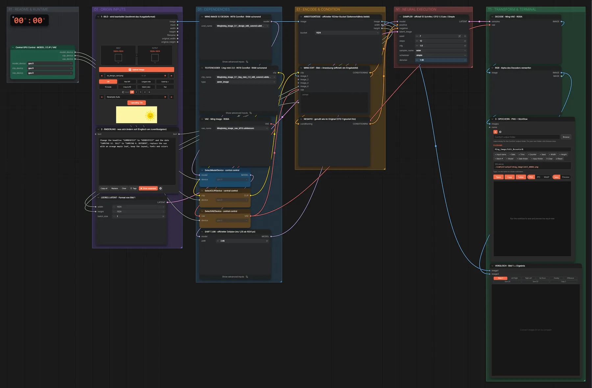

# Ming Image 0.1 Design · Design bearbeiten

**Workflow-Datei:** [`workflows/Image Editing/Ming_Image_0_1_Design_INT8-Image-Edit.json`](../../../workflows/Image%20Editing/Ming_Image_0_1_Design_INT8-Image-Edit.json)  
**Kategorie:** Image Editing · **Eingabe → Ausgabe:** Bild + Text → Bild · **Quant:** INT8

Texte, Farben oder Motive in einem fertigen Design (Karte, Poster, Folie) ändern, Layout und Schrift bleiben.

Interaktiv mit Zoom, Vergleichen und Kopier-Buttons: <https://dawasteh.github.io/DaWastehs-ComfyUI-Bundle/#/w/ming-image-0-1-design-int8-image-edit>

## Modelle

| Rolle | Datei | Quant | Größe |
|---|---|---|---:|
| Diffusionsmodell | `ming_image_0.1_design_int8_convrot.safetensors` | INT8 | 5,8 GiB |
| Text-Encoder | `ming_image_0.1_ling_mini_2.0_int8_convrot.safetensors` | INT8 | 18,2 GiB |
| VAE | `ming_image_vae_bf16.safetensors` | BF16 | 0,2 GiB |

## Workflow in ComfyUI

Screenshot nach dem Hauptbeispiel (Eingaben und Ergebnis im Workflow, Erklärungstafeln ausgeblendet):

[](workflow.webp)

## Beispiele

### Texte und Motiv im Design ändern

Prompt:

```text
Change the headline "SOMMERFEST" to "HERBSTFEST" and the date "SAMSTAG 12. JULI" to "SAMSTAG 4. OKTOBER", replace the sun with an orange maple leaf, keep the layout, fonts and colors
```

| Einstellung | Wert |
|---|---|
| seed | 7 |
| shift | 3.86 |
| steps | 12 |
| cfg | 1.0 |
| sampler_name | euler |
| scheduler | simple |
| denoise | 1.0 |
| Dauer (Ausführung) | 48 s |
| VRAM R9700 (belegt / PyTorch-Spitze) | 30,8 GiB / 26,5 GiB |
| RAM (ComfyUI-Prozess) | 26,4 GiB |

Eingabe · ex_design_card.png:  ([Datei](input_ex_design_card.webp))  
Ausgabe · 3 · SPEICHERN · PNG + Workflow: [](herbstfest.webp) · [Volle Auflösung (1024×1024, WebP mit Workflow – per Drag & Drop in ComfyUI ladbar)](herbstfest.webp)
