# Qwen Image 2.1 + AnyAngle · vier Kamerawinkel aus einem Bild

**Workflow-Datei:** [`workflows/Image Editing/Qwen_Image_2_1_BF16+AnyAngle_LoRA+TripoSplat-Image-to-4-Camera-Angles.json`](../../../workflows/Image%20Editing/Qwen_Image_2_1_BF16%2BAnyAngle_LoRA%2BTripoSplat-Image-to-4-Camera-Angles.json)  
**Kategorie:** Image Editing · **Eingabe → Ausgabe:** Bild → Bilder · **Quant:** BF16

TripoSplat baut aus dem freigestellten Motiv ein 3D-Splat, ComfyUI rendert es grob aus vier neuen Kameras, und Qwen Image 2.1 mit der AnyAngle-LoRA überträgt Stil und Details des Originals auf jede Ansicht. Ohne Editor, ein Klick; als Vorbereitung für Video-Workflows, die mehrere Ansichten derselben Figur brauchen.

Interaktiv mit Zoom, Vergleichen und Kopier-Buttons: <https://dawasteh.github.io/DaWastehs-ComfyUI-Bundle/#/w/qwen-image-2-1-bf16-anyangle-lora-triposplat-image-to-4-camera-angles>

## Modelle

| Rolle | Datei | Quant | Größe |
|---|---|---|---:|
| Diffusionsmodell | `qwen_image_2.1_bf16.safetensors` | BF16 | 13,2 GiB |
| LoRA | `QI2.1_AnyAngle.safetensors` | BF16 | 0,1 GiB |
| Text-Encoder / LLM | `qwen3vl_8b_int8_convrot.safetensors` | INT8 | 8,7 GiB |
| VAE | `qwen_image_2.1_vae_bf16.safetensors` | BF16 | 0,6 GiB |
| Freisteller | `birefnet.safetensors` | FP16 | 0,4 GiB |
| Vision-Encoder | `dino_v3_vit_h.safetensors` | BF16 | 1,6 GiB |
| VAE | `flux2-vae.safetensors` | FP32 | 0,3 GiB |
| Diffusionsmodell | `triposplat_fp16.safetensors` | FP16 | 0,7 GiB |
| VAE | `triposplat_vae_decoder_fp16.safetensors` | FP16 | 0,5 GiB |

## Workflow in ComfyUI

Screenshot nach dem Hauptbeispiel (Eingaben und Ergebnis im Workflow, Erklärungstafeln ausgeblendet):

[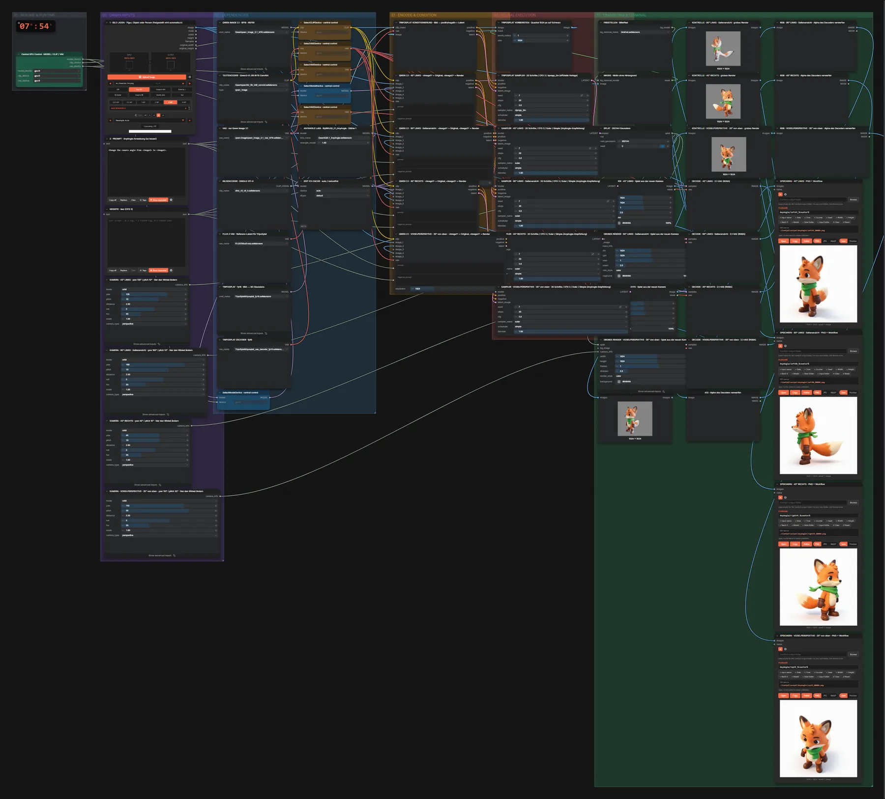](workflow.webp)

## Beispiele

### Figur: vier Kamerawinkel

| Einstellung | Wert |
|---|---|
| seed | 7 |
| steps | 20 |
| cfg | 3.0 |
| scheduler | simple |
| denoise | 1.0 |
| Dauer (Ausführung) | 7 min 54 s |
| VRAM R9700 (belegt / PyTorch-Spitze) | 29,6 GiB / 25,5 GiB |
| RAM (ComfyUI-Prozess) | 28,6 GiB |

Eingabe ist die Fuchs-Figur; Prompt und die vier Kameras stehen fest im Workflow.

Eingabe · ex_character_fox.png:  ([Datei](input_ex_character_fox.webp))  
Ausgabe · 45° links: [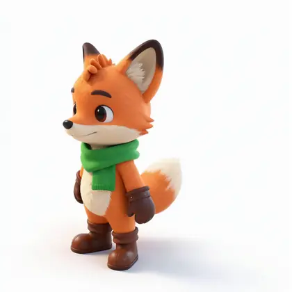](fox__n26.webp) · [Volle Auflösung (1024×1024, WebP mit Workflow – per Drag & Drop in ComfyUI ladbar)](fox__n26.webp)  
Ausgabe · 90° links (Seitenansicht): [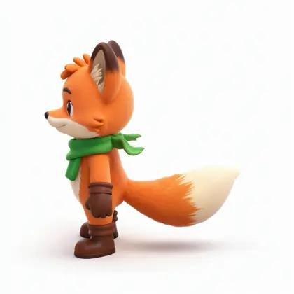](fox__n34.webp)  
Ausgabe · 45° rechts: [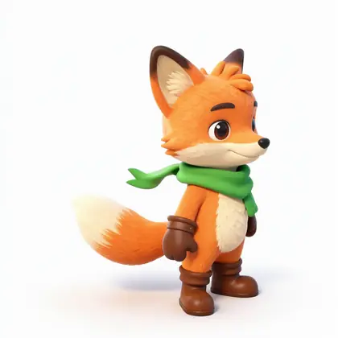](fox__n42.webp)  
Ausgabe · Vogelperspektive: [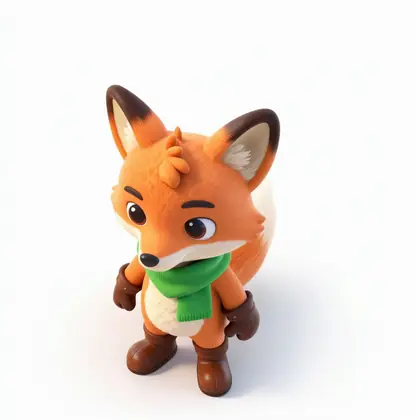](fox__n50.webp)  
Ausgabe · Grobes Render · 45° links: [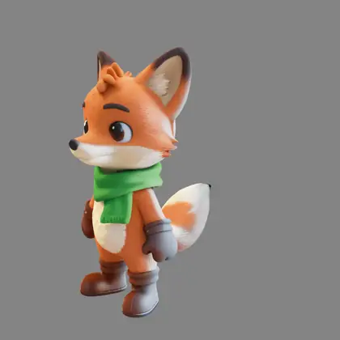](fox__n21.webp)  
Ausgabe · Grobes Render · 90° links: [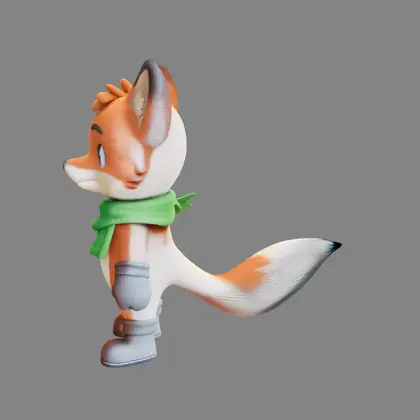](fox__n29.webp)  
Ausgabe · Grobes Render · 45° rechts: [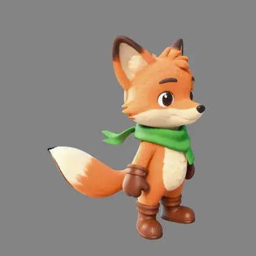](fox__n37.webp)  
Ausgabe · Grobes Render · Vogelperspektive: [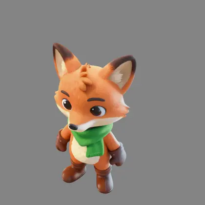](fox__n45.webp)  

### Person: vier Kamerawinkel

| Einstellung | Wert |
|---|---|
| seed | 7 |
| steps | 20 |
| cfg | 3.0 |
| scheduler | simple |
| denoise | 1.0 |
| Dauer (Ausführung) | 8 min 33 s |
| VRAM R9700 (belegt / PyTorch-Spitze) | 29,9 GiB / 26,0 GiB |
| RAM (ComfyUI-Prozess) | 28,6 GiB |

Eingabe ist ein Ganzkörperfoto; Prompt und die vier Kameras stehen fest im Workflow.

Eingabe · ex_fullbody_woman.png:  ([Datei](input_ex_fullbody_woman.webp))  
Ausgabe · 45° links: [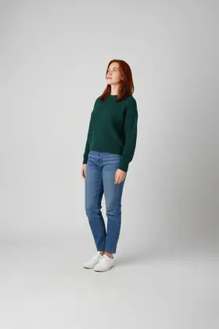](woman__n26.webp)  
Ausgabe · 90° links (Seitenansicht): [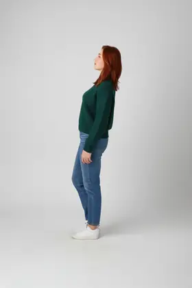](woman__n34.webp)  
Ausgabe · 45° rechts: [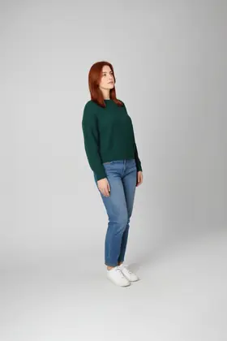](woman__n42.webp)  
Ausgabe · Vogelperspektive: [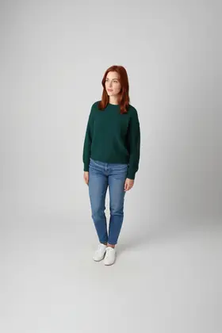](woman__n50.webp)  
Ausgabe · Grobes Render · 45° links: [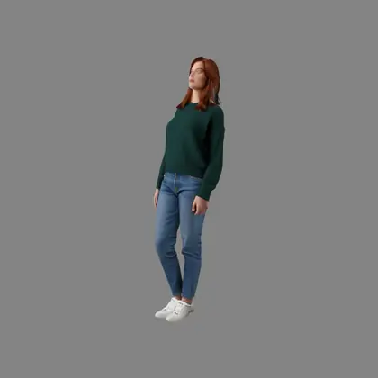](woman__n21.webp)  
Ausgabe · Grobes Render · 90° links: [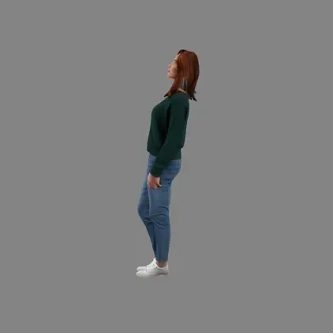](woman__n29.webp)  
Ausgabe · Grobes Render · 45° rechts: [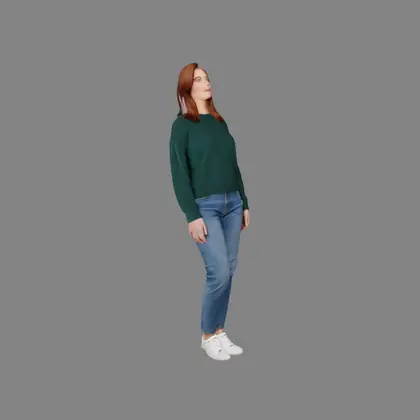](woman__n37.webp)  
Ausgabe · Grobes Render · Vogelperspektive: [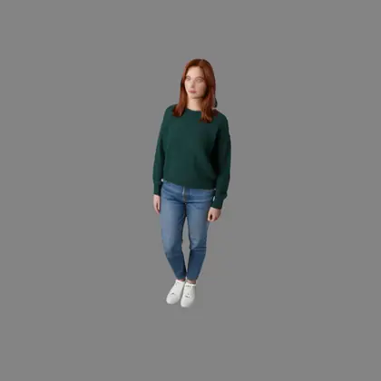](woman__n45.webp)  

### Produkt: vier Kamerawinkel

| Einstellung | Wert |
|---|---|
| seed | 7 |
| steps | 20 |
| cfg | 3.0 |
| scheduler | simple |
| denoise | 1.0 |
| Dauer (Ausführung) | 9 min 49 s |
| VRAM R9700 (belegt / PyTorch-Spitze) | 29,7 GiB / 26,0 GiB |
| RAM (ComfyUI-Prozess) | 28,7 GiB |

Eingabe ist ein Produktfoto; Prompt und die vier Kameras stehen fest im Workflow.

Eingabe · ex_product_teapot.png:  ([Datei](input_ex_product_teapot.webp))  
Ausgabe · 45° links: [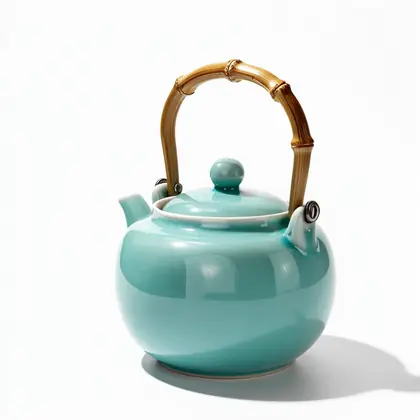](teapot__n26.webp)  
Ausgabe · 90° links (Seitenansicht): [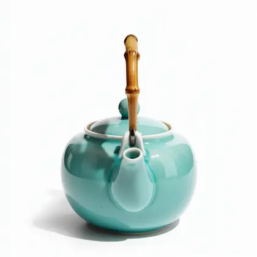](teapot__n34.webp)  
Ausgabe · 45° rechts: [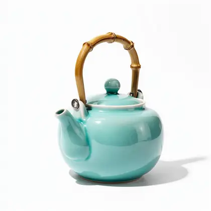](teapot__n42.webp)  
Ausgabe · Vogelperspektive: [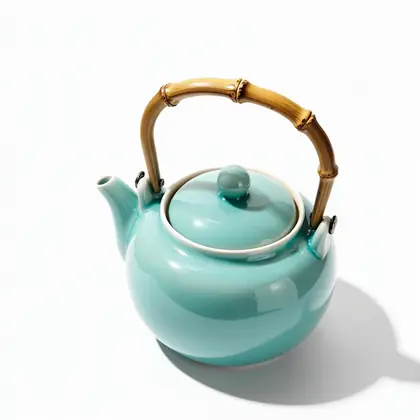](teapot__n50.webp)  
Ausgabe · Grobes Render · 45° links: [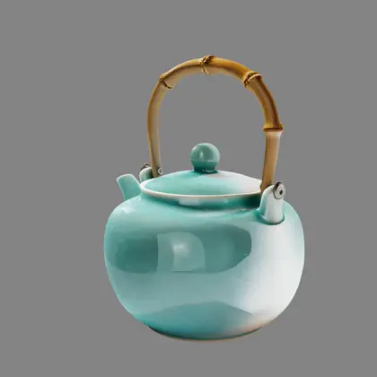](teapot__n21.webp)  
Ausgabe · Grobes Render · 90° links: [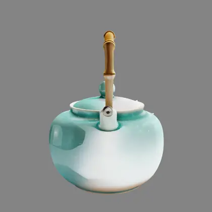](teapot__n29.webp)  
Ausgabe · Grobes Render · 45° rechts: [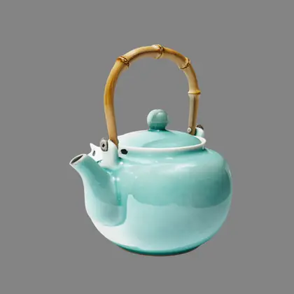](teapot__n37.webp)  
Ausgabe · Grobes Render · Vogelperspektive: [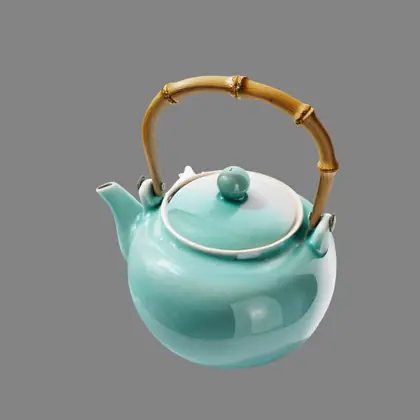](teapot__n45.webp)
