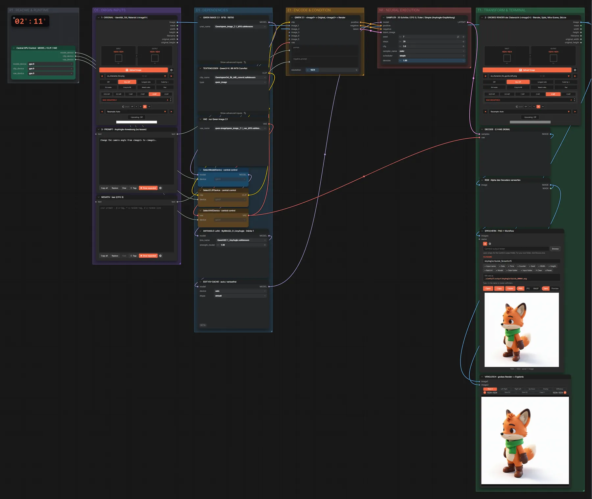

# Qwen Image 2.1 + AnyAngle · eigenes Render → neue Kameraansicht

**Workflow-Datei:** [`workflows/Image Editing/Qwen_Image_2_1_BF16+AnyAngle_LoRA-Image+Guide-to-Camera-Angle.json`](../../../workflows/Image%20Editing/Qwen_Image_2_1_BF16%2BAnyAngle_LoRA-Image%2BGuide-to-Camera-Angle.json)  
**Kategorie:** Image Editing · **Eingabe → Ausgabe:** Bild + Render → Bild · **Quant:** BF16

Original plus ein grobes Render der Zielansicht (Splat, Blender, 3D-Szene): die AnyAngle-LoRA bringt das Original in genau diesen Kamerawinkel.

Interaktiv mit Zoom, Vergleichen und Kopier-Buttons: <https://dawasteh.github.io/DaWastehs-ComfyUI-Bundle/#/w/qwen-image-2-1-bf16-anyangle-lora-image-guide-to-camera-angle>

## Modelle

| Rolle | Datei | Quant | Größe |
|---|---|---|---:|
| Diffusionsmodell | `qwen_image_2.1_bf16.safetensors` | BF16 | 13,2 GiB |
| LoRA | `QI2.1_AnyAngle.safetensors` | BF16 | 0,1 GiB |
| Text-Encoder / LLM | `qwen3vl_8b_int8_convrot.safetensors` | INT8 | 8,7 GiB |
| VAE | `qwen_image_2.1_vae_bf16.safetensors` | BF16 | 0,6 GiB |

## Workflow in ComfyUI

Screenshot nach dem Hauptbeispiel (Eingaben und Ergebnis im Workflow, Erklärungstafeln ausgeblendet):

## Beispiele

### Eigenes Render → neue Ansicht

| Einstellung | Wert |
|---|---|
| seed | 7 |
| steps | 20 |
| cfg | 3.0 |
| sampler_name | euler |
| scheduler | simple |
| denoise | 1.0 |
| Dauer (Ausführung) | 2 min 11 s |
| VRAM R9700 (belegt / PyTorch-Spitze) | 29,2 GiB / 25,5 GiB |
| RAM (ComfyUI-Prozess) | 28,8 GiB |

Das grobe Render stammt aus dem TripoSplat-Workflow (KONTROLLE · 45° LINKS).

Eingabe · Original (<image1>):  ([Datei](input_ex_character_fox.webp))  
Eingabe · Grobes Render (<image2>):  ([Datei](input_ex_character_fox_guide_left.webp))  
Ausgabe · SPEICHERN · PNG + Workflow:  · [Volle Auflösung (1024×1024, WebP mit Workflow – per Drag & Drop in ComfyUI ladbar)](fox-left.webp)
