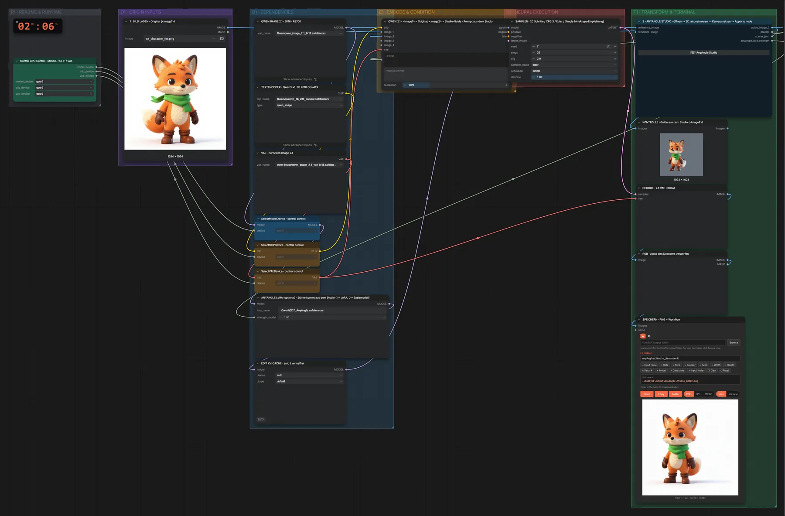
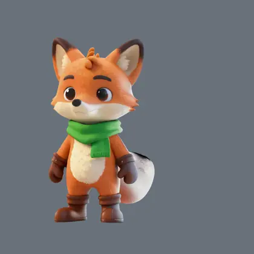

# Qwen Image 2.1 + AnyAngle Studio T8 · interaktive 3D-Kamera

**Workflow-Datei:** [`workflows/Image Editing/Qwen_Image_2_1_BF16+AnyAngle_Studio_T8-Image-to-Camera-Angle.json`](../../../workflows/Image%20Editing/Qwen_Image_2_1_BF16%2BAnyAngle_Studio_T8-Image-to-Camera-Angle.json)  
**Kategorie:** Image Editing · **Eingabe → Ausgabe:** Bild → Bild · **Quant:** BF16

3D-Werkbank im Browser: Motiv per TripoSplat rekonstruieren, Kamera frei drehen, Render mit einem Klick übergeben; auch GLB-Modelle, Posen-Figur und Batch-Winkel.

Interaktiv mit Zoom, Vergleichen und Kopier-Buttons: <https://dawasteh.github.io/DaWastehs-ComfyUI-Bundle/#/w/qwen-image-2-1-bf16-anyangle-studio-t8-image-to-camera-angle>

> Der Workflow startet erst, wenn im Studio eine Kamera gesetzt und mit „Apply to node“ übergeben wurde. Für das Beispiel wurde der Editor im Browser bedient (rekonstruieren, 45° / 10°, anwenden).

## Modelle

| Rolle | Datei | Quant | Größe |
|---|---|---|---:|
| Diffusionsmodell | `qwen_image_2.1_bf16.safetensors` | BF16 | 13,2 GiB |
| Modell | `QI2.1_AnyAngle.safetensors` | BF16 | 0,1 GiB |
| Text-Encoder / LLM | `qwen3vl_8b_int8_convrot.safetensors` | INT8 | 8,7 GiB |
| VAE | `qwen_image_2.1_vae_bf16.safetensors` | BF16 | 0,6 GiB |

## Workflow in ComfyUI

Screenshot nach dem Hauptbeispiel (Eingaben und Ergebnis im Workflow, Erklärungstafeln ausgeblendet):

## Beispiele

### Kamera im Studio gesetzt (45° / 10°)

| Einstellung | Wert |
|---|---|
| seed | 7 |
| steps | 20 |
| cfg | 3.0 |
| sampler_name | euler |
| scheduler | simple |
| denoise | 1.0 |
| Dauer (Ausführung) | 2 min 7 s |
| VRAM R9700 (belegt / PyTorch-Spitze) | 30,4 GiB / 25,5 GiB |
| RAM (ComfyUI-Prozess) | 28,7 GiB |

Im AnyAngle Studio: 3D aus dem Foto rekonstruiert, Azimut 45°, Elevation 10°, „Apply to node“.

Eingabe · ex_character_fox.png:  ([Datei](input_ex_character_fox.webp))  
Ausgabe · Ergebnis:  · [Volle Auflösung (1024×1024, WebP mit Workflow – per Drag & Drop in ComfyUI ladbar)](fox-studio__n13.webp)  
Ausgabe · Guide aus dem Studio: 
