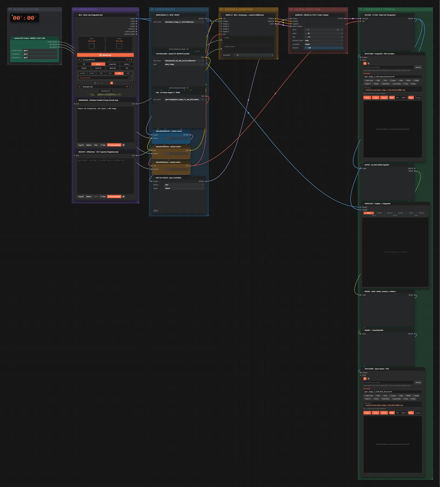
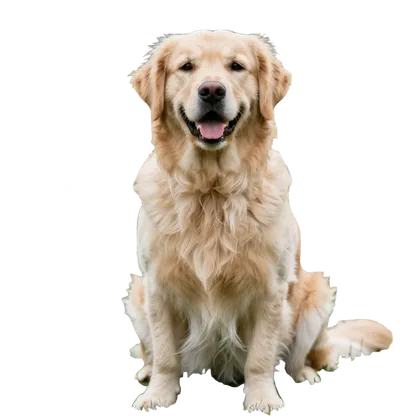
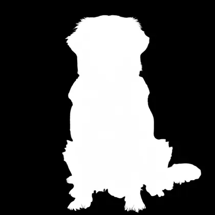

# Qwen Image 2.1 · Hintergrund entfernen

**Workflow-Datei:** [`workflows/Image Editing/Qwen_Image_2_1_BF16-Background-Remover.json`](../../../workflows/Image%20Editing/Qwen_Image_2_1_BF16-Background-Remover.json)  
**Kategorie:** Image Editing · **Eingabe → Ausgabe:** Bild → Bild (RGBA) · **Quant:** BF16

Offizieller Freistell-Prompt von Qwen Image 2.1: Ergebnis als PNG mit Alphakanal plus separate Maske.

Interaktiv mit Zoom, Vergleichen und Kopier-Buttons: <https://dawasteh.github.io/DaWastehs-ComfyUI-Bundle/#/w/qwen-image-2-1-bf16-background-remover>

## Modelle

| Rolle | Datei | Quant | Größe |
|---|---|---|---:|
| Diffusionsmodell | `qwen_image_2.1_bf16.safetensors` | BF16 | 13,2 GiB |
| Text-Encoder / LLM | `qwen3vl_8b_int8_convrot.safetensors` | INT8 | 8,7 GiB |
| VAE | `qwen_image_2.1_vae_bf16.safetensors` | BF16 | 0,6 GiB |

## Workflow in ComfyUI

Screenshot nach dem Hauptbeispiel (Eingaben und Ergebnis im Workflow, Erklärungstafeln ausgeblendet):

## Beispiele

### Hund freistellen

| Einstellung | Wert |
|---|---|
| seed | 7 |
| steps | 25 |
| cfg | 1.0 |
| sampler_name | euler |
| scheduler | simple |
| denoise | 1.0 |
| Dauer (Ausführung) | 1 min 26 s |
| VRAM R9700 (belegt / PyTorch-Spitze) | 28,4 GiB / 25,5 GiB |
| RAM (ComfyUI-Prozess) | 26,5 GiB |

Eingabe · ex_dog_photo.png:  ([Datei](input_ex_dog_photo.webp))  
Ausgabe · SPEICHERN · freigestellt · PNG mit Alpha:  · [Volle Auflösung (1024×1024, WebP mit Workflow – per Drag & Drop in ComfyUI ladbar)](dog__n11.webp)  
Ausgabe · SPEICHERN · Alpha-Maske · PNG: 
