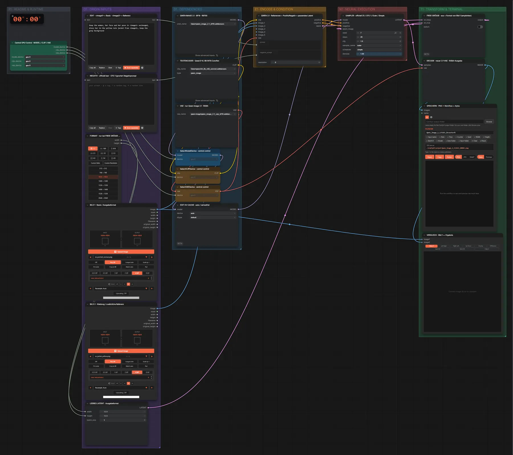
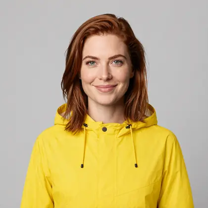

# Qwen Image 2.1 · mehrere Bilder bearbeiten

**Workflow-Datei:** [`workflows/Image Editing/Qwen_Image_2_1_BF16-Multi-Image-Edit.json`](../../../workflows/Image%20Editing/Qwen_Image_2_1_BF16-Multi-Image-Edit.json)  
**Kategorie:** Image Editing · **Eingabe → Ausgabe:** Bild + Text → Bild · **Quant:** BF16

Bild 1 ist die Basis, Bild 2 liefert z. B. Kleidung oder ein Objekt; Referenzen im Prompt als <image1>/<image2>.

Interaktiv mit Zoom, Vergleichen und Kopier-Buttons: <https://dawasteh.github.io/DaWastehs-ComfyUI-Bundle/#/w/qwen-image-2-1-bf16-multi-image-edit>

## Modelle

| Rolle | Datei | Quant | Größe |
|---|---|---|---:|
| Diffusionsmodell | `qwen_image_2.1_bf16.safetensors` | BF16 | 13,2 GiB |
| Text-Encoder / LLM | `qwen3vl_8b_int8_convrot.safetensors` | INT8 | 8,7 GiB |
| VAE | `qwen_image_2.1_vae_bf16.safetensors` | BF16 | 0,6 GiB |

## Workflow in ComfyUI

Screenshot nach dem Hauptbeispiel (Eingaben und Ergebnis im Workflow, Erklärungstafeln ausgeblendet):

[](workflow.webp)

## Beispiele

### Kleidung aus Bild 2

Prompt:

```text
Keep the woman, her face and her pose in <image1> unchanged, dress her in the yellow rain jacket from <image2>, keep the grey background
```

| Einstellung | Wert |
|---|---|
| seed | 7 |
| steps | 25 |
| cfg | 1.0 |
| sampler_name | euler |
| scheduler | simple |
| denoise | 1.0 |
| Dauer (Ausführung) | 1 min 59 s |
| VRAM R9700 (belegt / PyTorch-Spitze) | 28,3 GiB / 25,5 GiB |
| RAM (ComfyUI-Prozess) | 27,3 GiB |

Eingabe · ex_portrait_woman.png:  ([Datei](input_ex_portrait_woman.webp))  
Eingabe · ex_jacket_yellow.png:  ([Datei](input_ex_jacket_yellow.webp))  
Ausgabe · SPEICHERN · PNG + Workflow + Alpha: [](jacket.webp) · [Volle Auflösung (1024×1024, WebP mit Workflow – per Drag & Drop in ComfyUI ladbar)](jacket.webp)
