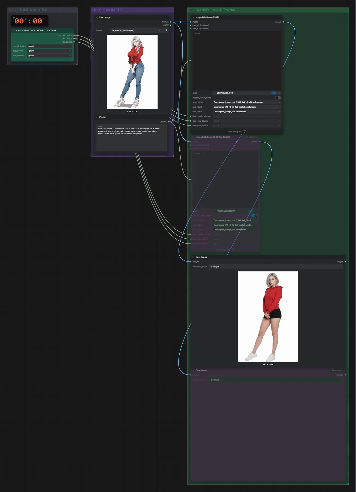
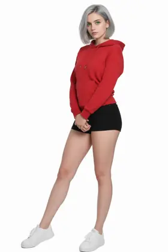

# Qwen Image Edit 2509 (FP8) · Bild bearbeiten

**Workflow-Datei:** [`workflows/Image Editing/Qwen_Image_Edit_2509_FP8-Image-Edit.json`](../../../workflows/Image%20Editing/Qwen_Image_Edit_2509_FP8-Image-Edit.json)  
**Kategorie:** Image Editing · **Eingabe → Ausgabe:** Bild + Text → Bild · **Quant:** FP8

Bis v1.3.0 hieß der Workflow `Qwen_Image_Edit_2509-Image-Edit.json`.

Qwen Image Edit 2509 mit Lightning-LoRA; stark bei Stilwechseln, z. B. Anime → Foto.

Interaktiv mit Zoom, Vergleichen und Kopier-Buttons: <https://dawasteh.github.io/DaWastehs-ComfyUI-Bundle/#/w/qwen-image-edit-2509-fp8-image-edit>

## Modelle

| Rolle | Datei | Quant | Größe |
|---|---|---|---:|
| Modell | `qwen_image_edit_2509_fp8_e4m3fn.safetensors` | FP8 | 19,0 GiB |
| Modell | `qwen_2.5_vl_7b_fp8_scaled.safetensors` | FP8 | 8,7 GiB |
| Modell | `qwen_image_vae.safetensors` | BF16 | 0,2 GiB |
| LoRA | `Qwen-Image-Edit-2509-Lightning-4steps-V1.0-bf16.safetensors` | BF16 | 0,8 GiB |

## Workflow in ComfyUI

Screenshot nach dem Hauptbeispiel (Eingaben und Ergebnis im Workflow, Erklärungstafeln ausgeblendet):

[](workflow.webp)

## Beispiele

### Anime → Foto

Prompt:

```text
Turn this anime illustration into a realistic photograph of a young woman with short silver hair, green eyes, a red hoodie and black shorts, same pose, plain white studio background
```

| Einstellung | Wert |
|---|---|
| seed | 7 |
| Dauer (Ausführung) | 2 min 14 s |
| VRAM R9700 (belegt / PyTorch-Spitze) | 30,9 GiB / 26,3 GiB |
| RAM (ComfyUI-Prozess) | 33,4 GiB |

Eingabe · ex_anime_woman.png:  ([Datei](input_ex_anime_woman.webp))  
Ausgabe · Ausgabe: [](anime-to-photo.webp) · [Volle Auflösung (832×1248, WebP mit Workflow – per Drag & Drop in ComfyUI ladbar)](anime-to-photo.webp)
