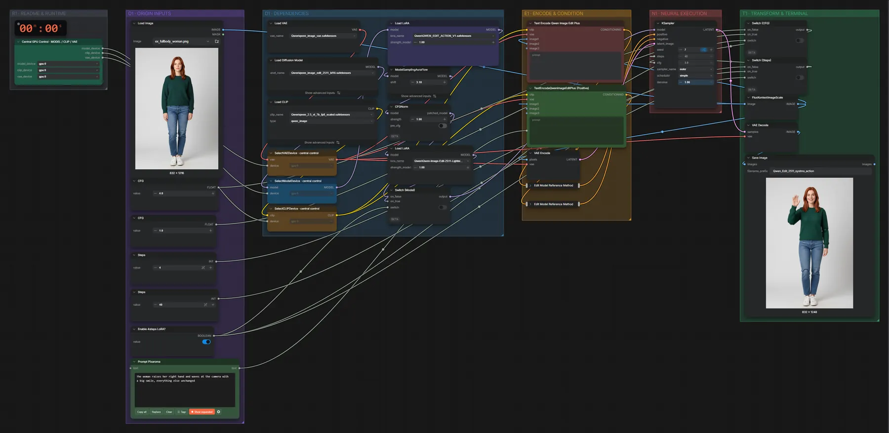

# Qwen Image Edit 2511 + Action-LoRA · Pose ändern

**Workflow-Datei:** [`workflows/Image Editing/Qwen_Image_Edit_2511_BF16+Action_LoRA-Image-Edit.json`](../../../workflows/Image%20Editing/Qwen_Image_Edit_2511_BF16%2BAction_LoRA-Image-Edit.json)  
**Kategorie:** Image Editing · **Eingabe → Ausgabe:** Bild + Text → Bild · **Quant:** BF16

Bis v1.3.0 hieß der Workflow `Qwen_Image_Edit_2511_Action-LoRA-Image-Edit.json`.

Qwen Image Edit 2511 (BF16) mit Lightning- und Action-LoRA: Posen und Handlungen einer Person gezielt ändern.

Interaktiv mit Zoom, Vergleichen und Kopier-Buttons: <https://dawasteh.github.io/DaWastehs-ComfyUI-Bundle/#/w/qwen-image-edit-2511-bf16-action-lora-image-edit>

## Modelle

| Rolle | Datei | Quant | Größe |
|---|---|---|---:|
| VAE | `qwen_image_vae.safetensors` | BF16 | 0,2 GiB |
| LoRA | `Qwen-Image-Edit-2511-Lightning-4steps-V1.0-bf16.safetensors` | BF16 | 0,8 GiB |
| Diffusionsmodell | `qwen_image_edit_2511_bf16.safetensors` | BF16 | 38,0 GiB |
| Text-Encoder / LLM | `qwen_2.5_vl_7b_fp8_scaled.safetensors` | FP8 | 8,7 GiB |
| LoRA | `QWEN_EDIT_ACTION_V1.safetensors` | BF16 | 0,3 GiB |

## Workflow in ComfyUI

Screenshot nach dem Hauptbeispiel (Eingaben und Ergebnis im Workflow, Erklärungstafeln ausgeblendet):

[](workflow.webp)

## Beispiele

### Pose ändern

Prompt:

```text
The woman raises her right hand and waves at the camera with a big smile, everything else unchanged
```

| Einstellung | Wert |
|---|---|
| seed | 7 |
| shift | 3.1 |
| steps | 40 |
| cfg | 3 |
| sampler_name | euler |
| scheduler | simple |
| denoise | 1 |
| Dauer (Ausführung) | 3 min 20 s |
| VRAM R9700 (belegt / PyTorch-Spitze) | 30,5 GiB / 26,3 GiB |
| RAM (ComfyUI-Prozess) | 36,8 GiB |

Eingabe · ex_fullbody_woman.png:  ([Datei](input_ex_fullbody_woman.webp))  
Ausgabe · Ausgabe: [](wave.webp) · [Volle Auflösung (832×1248, WebP mit Workflow – per Drag & Drop in ComfyUI ladbar)](wave.webp)
