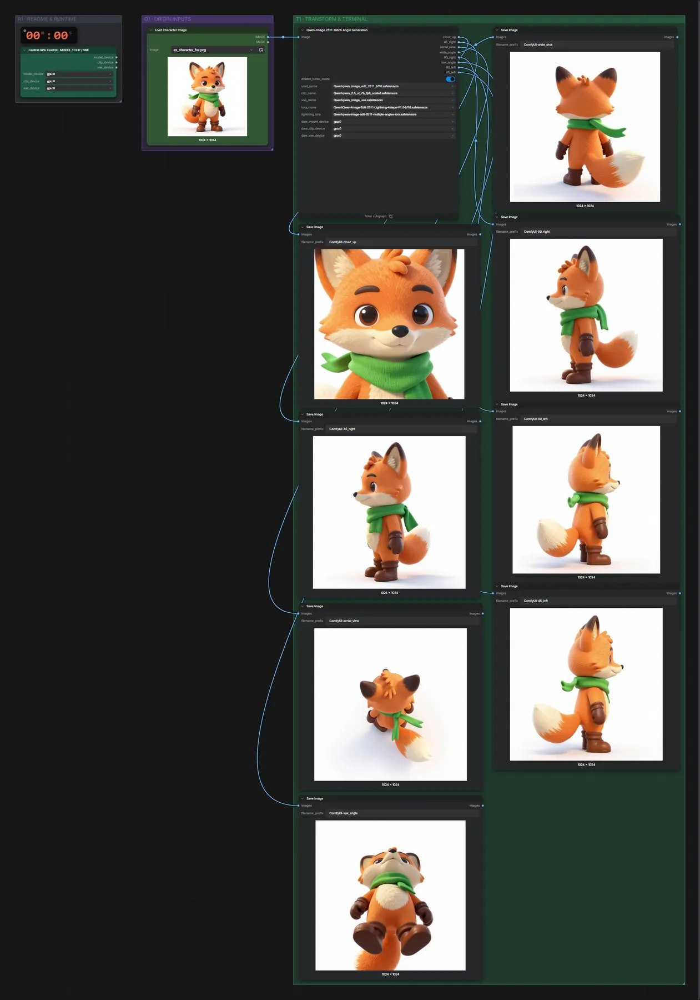

# Qwen Image Edit 2511 · acht Kamerawinkel

**Workflow-Datei:** [`workflows/Image Editing/Qwen_Image_Edit_2511_BF16-Image-to-8-Camera-Angles.json`](../../../workflows/Image%20Editing/Qwen_Image_Edit_2511_BF16-Image-to-8-Camera-Angles.json)  
**Kategorie:** Image Editing · **Eingabe → Ausgabe:** Bild → Bilder · **Quant:** BF16

Bis v1.3.0 hieß der Workflow `Multi-Character-Angles-One-Click.json`.

Aus einem Bild einer Figur entstehen acht Ansichten (nah, 45°/90° links/rechts, Vogel-/Froschperspektive, Weitwinkel) mit der Multiple-Angles-LoRA.

Interaktiv mit Zoom, Vergleichen und Kopier-Buttons: <https://dawasteh.github.io/DaWastehs-ComfyUI-Bundle/#/w/qwen-image-edit-2511-bf16-image-to-8-camera-angles>

## Modelle

| Rolle | Datei | Quant | Größe |
|---|---|---|---:|
| Modell | `qwen_image_edit_2511_bf16.safetensors` | BF16 | 38,0 GiB |
| Modell | `qwen_2.5_vl_7b_fp8_scaled.safetensors` | FP8 | 8,7 GiB |
| Modell | `qwen_image_vae.safetensors` | BF16 | 0,2 GiB |
| Modell | `Qwen-Image-Edit-2511-Lightning-4steps-V1.0-bf16.safetensors` | BF16 | 0,8 GiB |
| Modell | `qwen-image-edit-2511-multiple-angles-lora.safetensors` | BF16 | 0,3 GiB |

## Workflow in ComfyUI

Screenshot nach dem Hauptbeispiel (Eingaben und Ergebnis im Workflow, Erklärungstafeln ausgeblendet):

## Beispiele

### Acht Kamerawinkel · BF16

| Einstellung | Wert |
|---|---|
| seed | 7 |
| Dauer (Ausführung) | 9 min 46 s |
| VRAM R9700 (belegt / PyTorch-Spitze) | 31,0 GiB / 26,9 GiB |
| RAM (ComfyUI-Prozess) | 35,3 GiB |

Eingabe ist die Fuchs-Figur; die acht Kamera-Anweisungen stehen fest im Workflow.

Eingabe · ex_character_fox.png:  ([Datei](input_ex_character_fox.webp))  
Ausgabe · Bild 1:  · [Volle Auflösung (1024×1024, WebP mit Workflow – per Drag & Drop in ComfyUI ladbar)](fox__n373.webp)  
Ausgabe · Bild 2:   
Ausgabe · Bild 3:   
Ausgabe · Bild 4:   
Ausgabe · Bild 5:   
Ausgabe · Bild 6:   
Ausgabe · Bild 7:   
Ausgabe · Bild 8:   

### Acht Kamerawinkel · INT8 ConvRot

| Einstellung | Wert |
|---|---|
| seed | 7 |
| Dauer (Ausführung) | 2 min 9 s |
| VRAM R9700 (belegt / PyTorch-Spitze) | 30,6 GiB / 26,3 GiB |
| RAM (ComfyUI-Prozess) | 29,5 GiB |

Wie BF16, aber mit qwen_image_edit_2511_int8_convrot (20,5 GB) im Feld unet_name.

Eingabe · ex_character_fox.png:  ([Datei](input_ex_character_fox.webp))  
Ausgabe · Bild 1:   
Ausgabe · Bild 2:   
Ausgabe · Bild 3:   
Ausgabe · Bild 4:   
Ausgabe · Bild 5:   
Ausgabe · Bild 6:   
Ausgabe · Bild 7:   
Ausgabe · Bild 8: 
