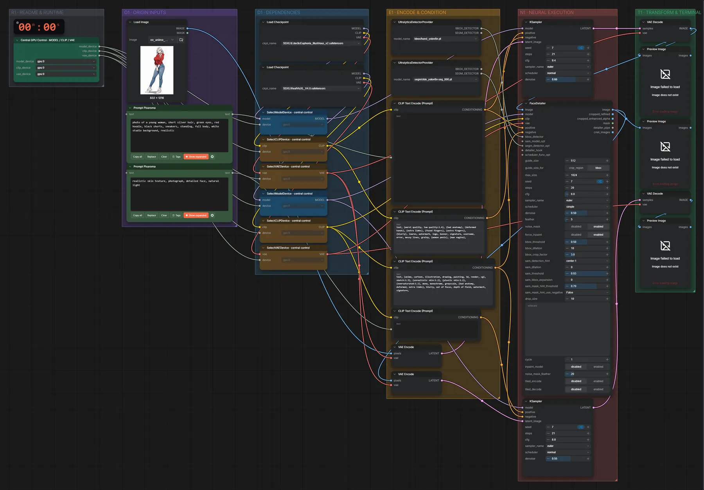

# SDXL Illustrious → RealVisXL · Anime → realistisch

**Workflow-Datei:** [`workflows/Image Editing/SDXL_Illustrious+RealVisXL_FP16-Image-to-Realistic-Image.json`](../../../workflows/Image%20Editing/SDXL_Illustrious%2BRealVisXL_FP16-Image-to-Realistic-Image.json)  
**Kategorie:** Image Editing · **Eingabe → Ausgabe:** Bild + Text → Bild · **Quant:** FP16

Bis v1.3.0 hieß der Workflow `SDXL_Illustrious-to-RealVis-Detailer-Chain.json`.

Illustrious-Durchgang und danach RealVisXL mit Gesichts-Detailer: aus einer Anime-Figur wird ein realistisches Foto.

Interaktiv mit Zoom, Vergleichen und Kopier-Buttons: <https://dawasteh.github.io/DaWastehs-ComfyUI-Bundle/#/w/sdxl-illustrious-realvisxl-fp16-image-to-realistic-image>

## Modelle

| Rolle | Datei | Quant | Größe |
|---|---|---|---:|
| Modell | `EclecticEuphoria_Illustrious_v2.safetensors` | FP16 | 6,5 GiB |
| Modell | `RealVisXL_V4.0.safetensors` | FP16 | 6,5 GiB |
| Detektor | `hand_yolov8n.pt` | – | 0,0 GiB |
| Detektor | `skin_yolov8n-seg_800.pt` | – | 0,0 GiB |

## Workflow in ComfyUI

Screenshot nach dem Hauptbeispiel (Eingaben und Ergebnis im Workflow, Erklärungstafeln ausgeblendet):

[](workflow.webp)

## Beispiele

### Anime → realistisch (Kette)

Prompt:

```text
photo of a young woman, short silver hair, green eyes, red hoodie, black shorts, sneakers, standing, full body, white studio background, realistic
```

| Einstellung | Wert |
|---|---|
| seed | 7 |
| steps | 21 |
| sampler_name | euler |
| scheduler | normal |
| Dauer (Ausführung) | 26 s |
| VRAM R9700 (belegt / PyTorch-Spitze) | 25,7 GiB / 18,7 GiB |
| RAM (ComfyUI-Prozess) | 12,2 GiB |

Eingabe · ex_anime_woman.png:  ([Datei](input_ex_anime_woman.webp))  
Ausgabe · Final: [](anime-to-real__n13.webp) · [Volle Auflösung (832×1216, WebP mit Workflow – per Drag & Drop in ComfyUI ladbar)](anime-to-real__n13.webp)  
Ausgabe · Pass 2: [](anime-to-real__n55.webp)  
Ausgabe · Pass 1: [](anime-to-real__n10.webp)
