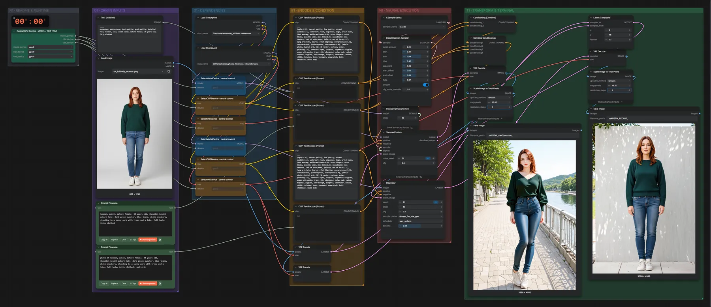
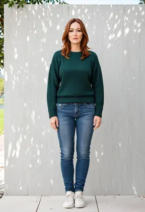

# SDXL Illustrious · Bild → großes Komposit

**Workflow-Datei:** [`workflows/Image Editing/SDXL_Illustrious_FP16-Image-to-Image-Composite.json`](../../../workflows/Image%20Editing/SDXL_Illustrious_FP16-Image-to-Image-Composite.json)  
**Kategorie:** Image Editing · **Eingabe → Ausgabe:** Bild + Text → Bild · **Quant:** FP16

Bis v1.3.0 hieß der Workflow `SDXL_Illustrious-Super-Composite.json`.

Mehrstufige Illustrious-Kette mit Hochskalierung auf bis zu 16 MP.

Interaktiv mit Zoom, Vergleichen und Kopier-Buttons: <https://dawasteh.github.io/DaWastehs-ComfyUI-Bundle/#/w/sdxl-illustrious-fp16-image-to-image-composite>

## Modelle

| Rolle | Datei | Quant | Größe |
|---|---|---|---:|
| Modell | `oneObsession_v20Bold.safetensors` | FP16 | 6,5 GiB |
| Modell | `EclecticEuphoria_Illustrious_v2.safetensors` | FP16 | 6,5 GiB |

## Workflow in ComfyUI

Screenshot nach dem Hauptbeispiel (Eingaben und Ergebnis im Workflow, Erklärungstafeln ausgeblendet):

[](workflow.webp)

## Beispiele

### Bild in neue Szene komponieren (16 MP)

Prompt:

```text
1woman, adult, mature female, 30 years old, shoulder-length auburn hair, dark green sweater, blue jeans, white sneakers, standing in a sunny park with trees and a lake, full body, fully clothed
```

| Einstellung | Wert |
|---|---|
| steps | 50 |
| cfg | 2.5 |
| scheduler | sgm_uniform |
| denoise | 0.5 |
| Dauer (Ausführung) | 1 min 3 s |
| VRAM R9700 (belegt / PyTorch-Spitze) | 23,2 GiB / 18,7 GiB |
| RAM (ComfyUI-Prozess) | 12,7 GiB |

Jugendfreies Beispiel: der fest verdrahtete Basis-Prompt (Node 47) ist ersetzt, die Person bleibt bekleidet.

Eingabe · ex_fullbody_woman.png:  ([Datei](input_ex_fullbody_woman.webp))  
Ausgabe · Final: [](park__n90.webp) · [Volle Auflösung (3388×4949, WebP mit Workflow – per Drag & Drop in ComfyUI ladbar)](park__n90.webp)  
Ausgabe · Pass 1: [](park__n42.webp)
