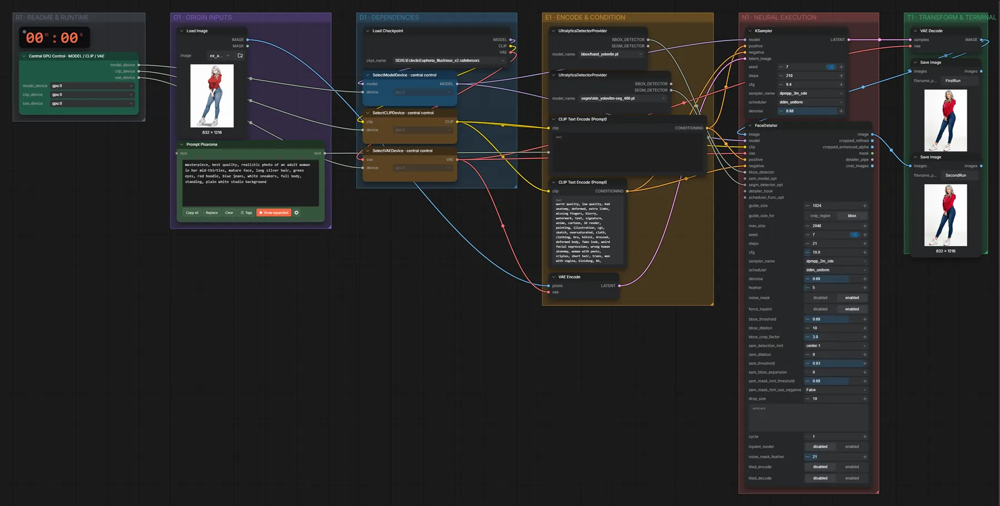
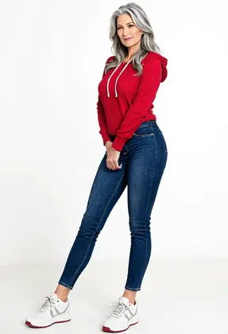

# SDXL Illustrious · Bild → Bild

**Workflow-Datei:** [`workflows/Image Editing/SDXL_Illustrious_V2_FP16-Image-to-Image.json`](../../../workflows/Image%20Editing/SDXL_Illustrious_V2_FP16-Image-to-Image.json)  
**Kategorie:** Image Editing · **Eingabe → Ausgabe:** Bild + Text → Bild · **Quant:** FP16

Bis v1.3.0 hieß der Workflow `SDXL_Illustrious-Simple-Image-to-Image.json`.

Klassisches Img2Img mit Illustrious (Denoise 0,88) plus Gesichts-Detailer – Stil oder Details eines Bildes ändern.

Interaktiv mit Zoom, Vergleichen und Kopier-Buttons: <https://dawasteh.github.io/DaWastehs-ComfyUI-Bundle/#/w/sdxl-illustrious-v2-fp16-image-to-image>

## Modelle

| Rolle | Datei | Quant | Größe |
|---|---|---|---:|
| Modell | `EclecticEuphoria_Illustrious_v2.safetensors` | FP16 | 6,5 GiB |
| Detektor | `skin_yolov8m-seg_400.pt` | – | 0,1 GiB |
| Detektor | `hand_yolov8n.pt` | – | 0,0 GiB |

## Workflow in ComfyUI

Screenshot nach dem Hauptbeispiel (Eingaben und Ergebnis im Workflow, Erklärungstafeln ausgeblendet):

[](workflow.webp)

## Beispiele

### Anime → Foto

Prompt:

```text
masterpiece, best quality, realistic photo of an adult woman in her mid-thirties, mature face, long silver hair, green eyes, red hoodie, blue jeans, white sneakers, full body, standing, plain white studio background
```

| Einstellung | Wert |
|---|---|
| seed | 7 |
| steps | 210 |
| cfg | 9.4 |
| sampler_name | dpmpp_3m_sde |
| scheduler | ddim_uniform |
| denoise | 0.88 |
| Dauer (Ausführung) | 1 min 31 s |
| VRAM R9700 (belegt / PyTorch-Spitze) | 28,9 GiB / 16,2 GiB |
| RAM (ComfyUI-Prozess) | 12,1 GiB |

Eingabe · ex_anime_woman.png:  ([Datei](input_ex_anime_woman.webp))  
Ausgabe · Final: [](photo__n30.webp) · [Volle Auflösung (832×1216, WebP mit Workflow – per Drag & Drop in ComfyUI ladbar)](photo__n30.webp)  
Ausgabe · Pass 1: [](photo__n29.webp)
