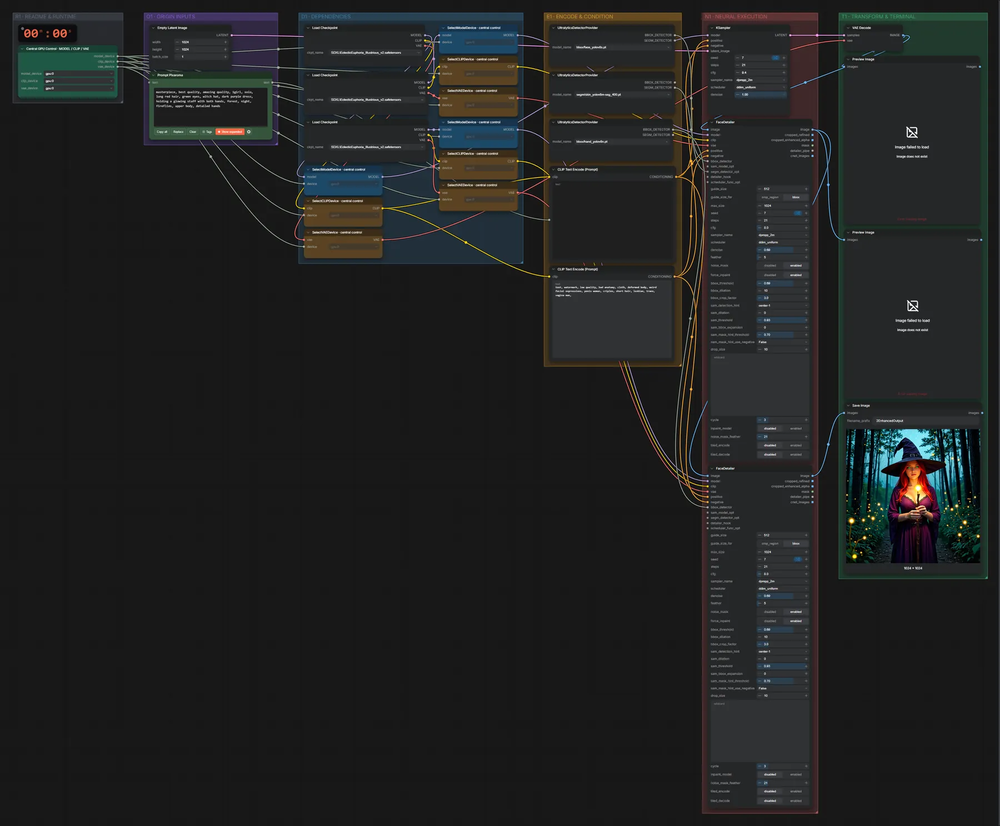

# SDXL Illustrious · Text → Bild mit Gesichts-/Hand-Detailer

**Workflow-Datei:** [`workflows/Image Editing/SDXL_Illustrious_V2_FP16-Text-to-Image-Face+Hand-Detailer.json`](../../../workflows/Image%20Editing/SDXL_Illustrious_V2_FP16-Text-to-Image-Face%2BHand-Detailer.json)  
**Kategorie:** Image Editing · **Eingabe → Ausgabe:** Text → Bild · **Quant:** FP16

Bis v1.3.0 hieß der Workflow `SDXL_Illustrious-Face-and-Hand-Detailer.json`.

Anime-Bild aus Tags, danach bessern zwei FaceDetailer-Durchgänge Gesicht und Hände automatisch nach. (Der alte Name klang nach Bildbearbeitung; der Workflow startet aus Text.)

Interaktiv mit Zoom, Vergleichen und Kopier-Buttons: <https://dawasteh.github.io/DaWastehs-ComfyUI-Bundle/#/w/sdxl-illustrious-v2-fp16-text-to-image-face-hand-detailer>

## Modelle

| Rolle | Datei | Quant | Größe |
|---|---|---|---:|
| Modell | `EclecticEuphoria_Illustrious_v2.safetensors` | FP16 | 6,5 GiB |
| Detektor | `face_yolov8s.pt` | – | 0,0 GiB |
| Detektor | `skin_yolov8m-seg_400.pt` | – | 0,1 GiB |
| Detektor | `hand_yolov8n.pt` | – | 0,0 GiB |

## Workflow in ComfyUI

Screenshot nach dem Hauptbeispiel (Eingaben und Ergebnis im Workflow, Erklärungstafeln ausgeblendet):

[](workflow.webp)

## Beispiele

### Text → Bild mit Gesichts-/Hand-Detailer

Prompt:

```text
masterpiece, best quality, amazing quality, 1girl, solo, long red hair, green eyes, witch hat, dark purple dress, holding a glowing staff with both hands, forest, night, fireflies, upper body, detailed hands
```

| Einstellung | Wert |
|---|---|
| seed | 7 |
| steps | 21 |
| cfg | 9.4 |
| sampler_name | dpmpp_2m |
| scheduler | ddim_uniform |
| denoise | 1 |
| Dauer (Ausführung) | 37 s |
| VRAM R9700 (belegt / PyTorch-Spitze) | 20,1 GiB / 12,4 GiB |
| RAM (ComfyUI-Prozess) | 12,1 GiB |

Ausgabe · Ausgabe: [](witch.webp) · [Volle Auflösung (1024×1024, WebP mit Workflow – per Drag & Drop in ComfyUI ladbar)](witch.webp)
