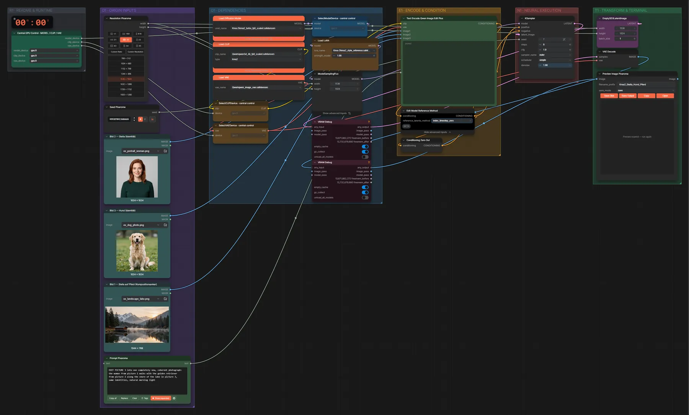

# Krea 2 Turbo · drei Referenzen verschmelzen

**Workflow-Datei:** [`workflows/Image Fusion/Krea2_Turbo_FP8-Three-Images-to-Image-Fusion.json`](../../../workflows/Image%20Fusion/Krea2_Turbo_FP8-Three-Images-to-Image-Fusion.json)  
**Kategorie:** Image Fusion · **Eingabe → Ausgabe:** Bild + Text → Bild · **Quant:** FP8

Bis v1.3.0 hieß der Workflow `Krea2_INT8_3-Reference_Fusion.json`.

Drei Bilder (zwei Identitäten + ein Kompositionsanker) werden mit Krea 2 Turbo (FP8) und Style-Reference-LoRA zu einem neuen Foto. Der alte Name sagte INT8, das Modell ist FP8.

Interaktiv mit Zoom, Vergleichen und Kopier-Buttons: <https://dawasteh.github.io/DaWastehs-ComfyUI-Bundle/#/w/krea2-turbo-fp8-three-images-to-image-fusion>

## Modelle

| Rolle | Datei | Quant | Größe |
|---|---|---|---:|
| Text-Encoder / LLM | `qwen3vl_4b_fp8_scaled.safetensors` | FP8 | 4,9 GiB |
| VAE | `qwen_image_vae.safetensors` | BF16 | 0,2 GiB |
| LoRA | `krea2_style_reference.safetensors` | BF16 | 0,4 GiB |
| Diffusionsmodell | `krea2_turbo_fp8_scaled.safetensors` | FP8 | 12,2 GiB |

## Workflow in ComfyUI

Screenshot nach dem Hauptbeispiel (Eingaben und Ergebnis im Workflow, Erklärungstafeln ausgeblendet):

[](workflow.webp)

## Beispiele

### Drei Referenzen verschmelzen

Prompt:

```text
EDIT PICTURE 3 into one completely new, coherent photograph: the woman from picture 1 walks with the golden retriever from picture 2 along the shore of the lake in picture 3, same identities, natural morning light
```

| Einstellung | Wert |
|---|---|
| seed | 7 |
| steps | 8 |
| cfg | 1 |
| sampler_name | euler |
| scheduler | simple |
| denoise | 1 |
| Dauer (Ausführung) | 1 min 45 s |
| VRAM R9700 (belegt / PyTorch-Spitze) | 30,5 GiB / 23,6 GiB |
| RAM (ComfyUI-Prozess) | 16,4 GiB |

Eingabe · Bild 2 · Person:  ([Datei](input_ex_portrait_woman.webp))  
Eingabe · Bild 3 · Hund:  ([Datei](input_ex_dog_photo.webp))  
Eingabe · Bild 1 · Komposition:  ([Datei](input_ex_landscape_lake.webp))  
Ausgabe · Ausgabe: [](lake-walk.webp) · [Volle Auflösung (1536×1024, WebP mit Workflow – per Drag & Drop in ComfyUI ladbar)](lake-walk.webp)
