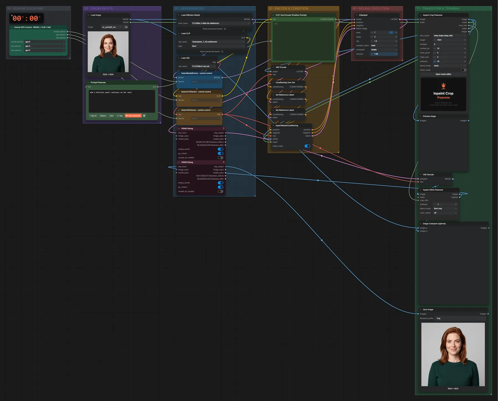

# FLUX.2 Klein 4B · Inpainting mit Maske

**Workflow-Datei:** [`workflows/Image Inpainting/FLUX2_Klein_4B_BF16-Image+Mask-Inpaint.json`](../../../workflows/Image%20Inpainting/FLUX2_Klein_4B_BF16-Image%2BMask-Inpaint.json)  
**Kategorie:** Image Inpainting · **Eingabe → Ausgabe:** Bild + Maske + Text → Bild · **Quant:** BF16

Bis v1.3.0 hieß der Workflow `FLUX2_Klein_4B-Inpaint.json`.

Maskierten Bereich neu malen (Maske im Masken-Editor oder als Alphakanal); Pixaroma schneidet den Bereich aus und setzt ihn nahtlos zurück.

Interaktiv mit Zoom, Vergleichen und Kopier-Buttons: <https://dawasteh.github.io/DaWastehs-ComfyUI-Bundle/#/w/flux2-klein-4b-bf16-image-mask-inpaint>

## Modelle

| Rolle | Datei | Quant | Größe |
|---|---|---|---:|
| Diffusionsmodell | `flux-2-klein-4b.safetensors` | BF16 | 7,2 GiB |
| Text-Encoder / LLM | `qwen_3_4b.safetensors` | BF16 | 7,5 GiB |
| VAE | `flux2-vae.safetensors` | FP32 | 0,3 GiB |

## Workflow in ComfyUI

Screenshot nach dem Hauptbeispiel (Eingaben und Ergebnis im Workflow, Erklärungstafeln ausgeblendet):

[](workflow.webp)

## Beispiele

### Maske: Halskette ergänzen

Prompt:

```text
add a delicate pearl necklace on her neck
```

| Einstellung | Wert |
|---|---|
| seed | 7 |
| steps | 4 |
| cfg | 1 |
| sampler_name | euler |
| scheduler | simple |
| denoise | 1 |
| Dauer (Ausführung) | 26 s |
| VRAM R9700 (belegt / PyTorch-Spitze) | 20,3 GiB / 19,6 GiB |
| RAM (ComfyUI-Prozess) | 14,2 GiB |

Eingabe · Bild mit Maske (Alphakanal):  ([Datei](input_ex_portrait_woman_mask_neck.webp))  
Ausgabe · Ausgabe: [](necklace.webp) · [Volle Auflösung (1024×1024, WebP mit Workflow – per Drag & Drop in ComfyUI ladbar)](necklace.webp)  

### Maske: Haarfarbe

Prompt:

```text
change her hair to platinum blonde, same haircut
```

| Einstellung | Wert |
|---|---|
| seed | 7 |
| steps | 4 |
| cfg | 1 |
| sampler_name | euler |
| scheduler | simple |
| denoise | 1 |
| Dauer (Ausführung) | 23 s |
| VRAM R9700 (belegt / PyTorch-Spitze) | 20,2 GiB / 19,7 GiB |
| RAM (ComfyUI-Prozess) | 14,2 GiB |

Eingabe · Bild mit Maske (Alphakanal):  ([Datei](input_ex_portrait_woman_mask_hair.webp))  
Ausgabe · Ausgabe: [](hair.webp)
