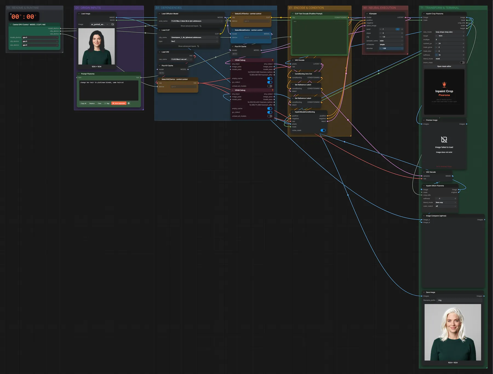

# FLUX.2 Klein 9B · Inpainting mit Maske

**Workflow-Datei:** [`workflows/Image Inpainting/FLUX2_Klein_9B_KV_FP8-Image+Mask-Inpaint.json`](../../../workflows/Image%20Inpainting/FLUX2_Klein_9B_KV_FP8-Image%2BMask-Inpaint.json)  
**Kategorie:** Image Inpainting · **Eingabe → Ausgabe:** Bild + Maske + Text → Bild · **Quant:** FP8

Bis v1.3.0 hieß der Workflow `FLUX2_Klein_9B_KV-Inpaint.json`.

Klein 9B KV (FP8) malt den maskierten Bereich neu, der Rest bleibt pixelgenau.

Interaktiv mit Zoom, Vergleichen und Kopier-Buttons: <https://dawasteh.github.io/DaWastehs-ComfyUI-Bundle/#/w/flux2-klein-9b-kv-fp8-image-mask-inpaint>

## Modelle

| Rolle | Datei | Quant | Größe |
|---|---|---|---:|
| VAE | `flux2-vae.safetensors` | FP32 | 0,3 GiB |
| Text-Encoder / LLM | `qwen_3_8b_fp8mixed.safetensors` | FP8 mixed | 8,1 GiB |
| Diffusionsmodell | `flux-2-klein-9b-kv-fp8.safetensors` | FP8 | 9,1 GiB |

## Workflow in ComfyUI

Screenshot nach dem Hauptbeispiel (Eingaben und Ergebnis im Workflow, Erklärungstafeln ausgeblendet):

[](workflow.webp)

## Beispiele

### Maske: Haarfarbe

Prompt:

```text
change her hair to platinum blonde, same haircut
```

| Einstellung | Wert |
|---|---|
| seed | 7 |
| steps | 4 |
| cfg | 1 |
| sampler_name | euler |
| scheduler | simple |
| denoise | 1 |
| Dauer (Ausführung) | 20 s |
| VRAM R9700 (belegt / PyTorch-Spitze) | 22,3 GiB / 21,6 GiB |
| RAM (ComfyUI-Prozess) | 9,6 GiB |

Eingabe · Bild mit Maske (Alphakanal):  ([Datei](input_ex_portrait_woman_mask_hair.webp))  
Ausgabe · Ausgabe: [](hair.webp) · [Volle Auflösung (1024×1024, WebP mit Workflow – per Drag & Drop in ComfyUI ladbar)](hair.webp)
