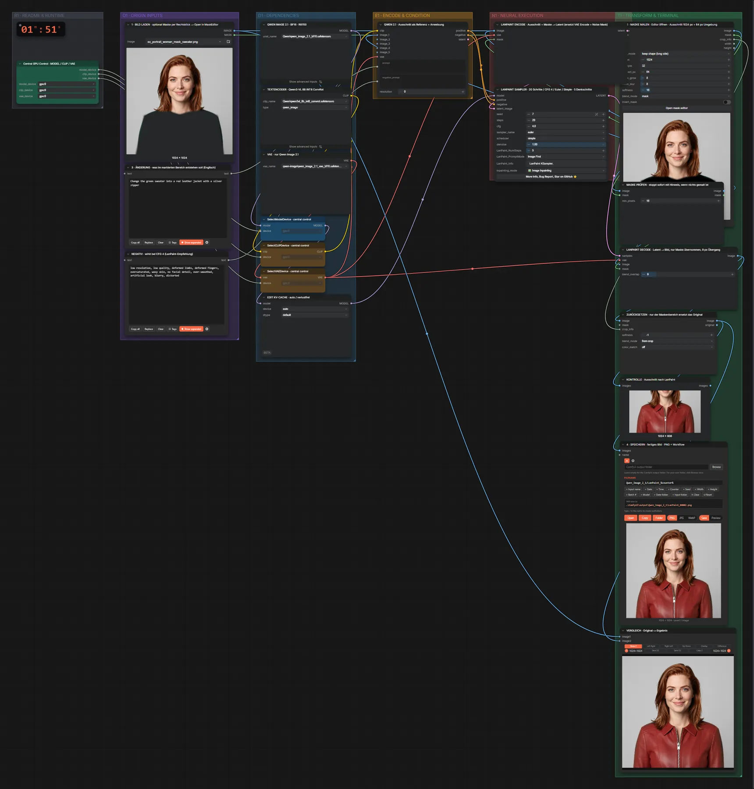
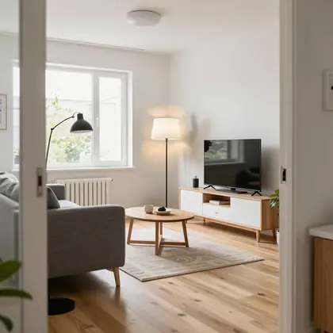

# Qwen Image 2.1 + LanPaint · Inpainting mit Maske

**Workflow-Datei:** [`workflows/Image Inpainting/Qwen_Image_2_1_BF16+LanPaint-Image+Mask-Inpaint.json`](../../../workflows/Image%20Inpainting/Qwen_Image_2_1_BF16%2BLanPaint-Image%2BMask-Inpaint.json)  
**Kategorie:** Image Inpainting · **Eingabe → Ausgabe:** Bild + Maske + Text → Bild · **Quant:** BF16

Wie das Qwen-2.1-Masken-Inpainting, aber mit dem LanPaint-Sampler (2.2): trainingsfreies Inpainting, das je Schritt mehrfach „nachdenkt“, damit der neue Inhalt nahtlos zur Umgebung passt. Zum direkten Vergleich dieselben Masken.

Interaktiv mit Zoom, Vergleichen und Kopier-Buttons: <https://dawasteh.github.io/DaWastehs-ComfyUI-Bundle/#/w/qwen-image-2-1-bf16-lanpaint-image-mask-inpaint>

## Modelle

| Rolle | Datei | Quant | Größe |
|---|---|---|---:|
| Diffusionsmodell | `qwen_image_2.1_bf16.safetensors` | BF16 | 13,2 GiB |
| Text-Encoder / LLM | `qwen3vl_8b_int8_convrot.safetensors` | INT8 | 8,7 GiB |
| VAE | `qwen_image_2.1_vae_bf16.safetensors` | BF16 | 0,6 GiB |

## Workflow in ComfyUI

Screenshot nach dem Hauptbeispiel (Eingaben und Ergebnis im Workflow, Erklärungstafeln ausgeblendet):

[](workflow.webp)

## Beispiele

### Maske: Kleidung tauschen · CFG 4

Prompt:

```text
Change the green sweater into a red leather jacket with a silver zipper
```

Negativ:

```text
low resolution, low quality, deformed limbs, deformed fingers, oversaturated, waxy skin, no facial detail, over-smoothed, artificial look, blurry, distorted
```

| Einstellung | Wert |
|---|---|
| seed | 7 |
| Dauer (Ausführung) | 1 min 51 s |
| VRAM R9700 (belegt / PyTorch-Spitze) | 29,4 GiB / 25,4 GiB |
| RAM (ComfyUI-Prozess) | 27,6 GiB |

Eingabe · Bild mit Maske (Alphakanal):  ([Datei](input_ex_portrait_woman_mask_sweater.webp))  
Ausgabe · 4 · SPEICHERN · fertiges Bild · PNG + Workflow: [](jacket.webp) · [Volle Auflösung (1024×1024, WebP mit Workflow – per Drag & Drop in ComfyUI ladbar)](jacket.webp)  

### Maske: Kleidung tauschen · CFG 1

Prompt:

```text
Change the green sweater into a red leather jacket with a silver zipper
```

Negativ:

```text
low resolution, low quality, deformed limbs, deformed fingers, oversaturated, waxy skin, no facial detail, over-smoothed, artificial look, blurry, distorted
```

| Einstellung | Wert |
|---|---|
| seed | 7 |
| Dauer (Ausführung) | 39 s |
| VRAM R9700 (belegt / PyTorch-Spitze) | 29,3 GiB / 24,4 GiB |
| RAM (ComfyUI-Prozess) | 1,8 GiB |

cfg = 1 am LanPaint-Sampler (offizielle Qwen-Werte, Negativprompt wirkt nicht, halbe Rechenzeit).

Eingabe · Bild mit Maske (Alphakanal):  ([Datei](input_ex_portrait_woman_mask_sweater.webp))  
Ausgabe · 4 · SPEICHERN · fertiges Bild · PNG + Workflow: [](jacket-cfg1.webp)  

### Maske: Haarfarbe

Prompt:

```text
Change her hair to platinum blonde, same haircut
```

Negativ:

```text
low resolution, low quality, deformed limbs, deformed fingers, oversaturated, waxy skin, no facial detail, over-smoothed, artificial look, blurry, distorted
```

| Einstellung | Wert |
|---|---|
| seed | 7 |
| Dauer (Ausführung) | 2 min 27 s |
| VRAM R9700 (belegt / PyTorch-Spitze) | 30,6 GiB / 26,5 GiB |
| RAM (ComfyUI-Prozess) | 4,7 GiB |

Eingabe · Bild mit Maske (Alphakanal):  ([Datei](input_ex_portrait_woman_mask_hair.webp))  
Ausgabe · 4 · SPEICHERN · fertiges Bild · PNG + Workflow: [](hair.webp)  

### Maske: Objekt ersetzen

Prompt:

```text
Replace the plant with a tall floor lamp with a white fabric shade, switched on
```

Negativ:

```text
low resolution, low quality, deformed limbs, deformed fingers, oversaturated, waxy skin, no facial detail, over-smoothed, artificial look, blurry, distorted
```

| Einstellung | Wert |
|---|---|
| seed | 7 |
| Dauer (Ausführung) | 1 min 43 s |
| VRAM R9700 (belegt / PyTorch-Spitze) | 30,9 GiB / 25,6 GiB |
| RAM (ComfyUI-Prozess) | 4,0 GiB |

Eingabe · Bild mit Maske (Alphakanal):  ([Datei](input_ex_living_room_mask_plant.webp))  
Ausgabe · 4 · SPEICHERN · fertiges Bild · PNG + Workflow: [](plant.webp)
