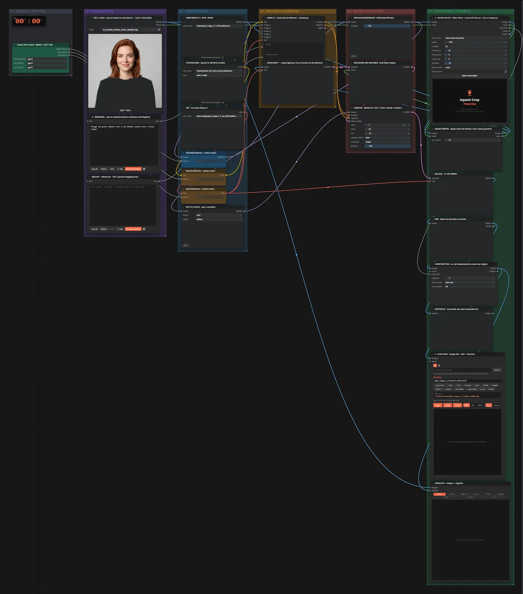

# Qwen Image 2.1 · Inpainting mit Maske

**Workflow-Datei:** [`workflows/Image Inpainting/Qwen_Image_2_1_BF16-Image+Mask-Inpaint.json`](../../../workflows/Image%20Inpainting/Qwen_Image_2_1_BF16-Image%2BMask-Inpaint.json)  
**Kategorie:** Image Inpainting · **Eingabe → Ausgabe:** Bild + Maske + Text → Bild · **Quant:** BF16

Bis v1.3.0 hieß der Workflow `Qwen_Image_2_1_BF16-Mask-Inpaint.json`.

Qwen Image 2.1 bearbeitet nur den maskierten 1024-px-Ausschnitt (plus 64 px Umgebung) und setzt ihn wieder ein.

Interaktiv mit Zoom, Vergleichen und Kopier-Buttons: <https://dawasteh.github.io/DaWastehs-ComfyUI-Bundle/#/w/qwen-image-2-1-bf16-image-mask-inpaint>

## Modelle

| Rolle | Datei | Quant | Größe |
|---|---|---|---:|
| Diffusionsmodell | `qwen_image_2.1_bf16.safetensors` | BF16 | 13,2 GiB |
| Text-Encoder / LLM | `qwen3vl_8b_int8_convrot.safetensors` | INT8 | 8,7 GiB |
| VAE | `qwen_image_2.1_vae_bf16.safetensors` | BF16 | 0,6 GiB |

## Workflow in ComfyUI

Screenshot nach dem Hauptbeispiel (Eingaben und Ergebnis im Workflow, Erklärungstafeln ausgeblendet):

[](workflow.webp)

## Beispiele

### Maske: Kleidung tauschen

Prompt:

```text
Change the green sweater into a red leather jacket with a silver zipper
```

| Einstellung | Wert |
|---|---|
| seed | 7 |
| steps | 25 |
| cfg | 1.0 |
| sampler_name | euler |
| scheduler | simple |
| denoise | 1.0 |
| Dauer (Ausführung) | 1 min 1 s |
| VRAM R9700 (belegt / PyTorch-Spitze) | 29,7 GiB / 24,4 GiB |
| RAM (ComfyUI-Prozess) | 26,9 GiB |

Eingabe · Bild mit Maske (Alphakanal):  ([Datei](input_ex_portrait_woman_mask_sweater.webp))  
Ausgabe · 4 · SPEICHERN · fertiges Bild · PNG + Workflow: [](jacket.webp) · [Volle Auflösung (1024×1024, WebP mit Workflow – per Drag & Drop in ComfyUI ladbar)](jacket.webp)
