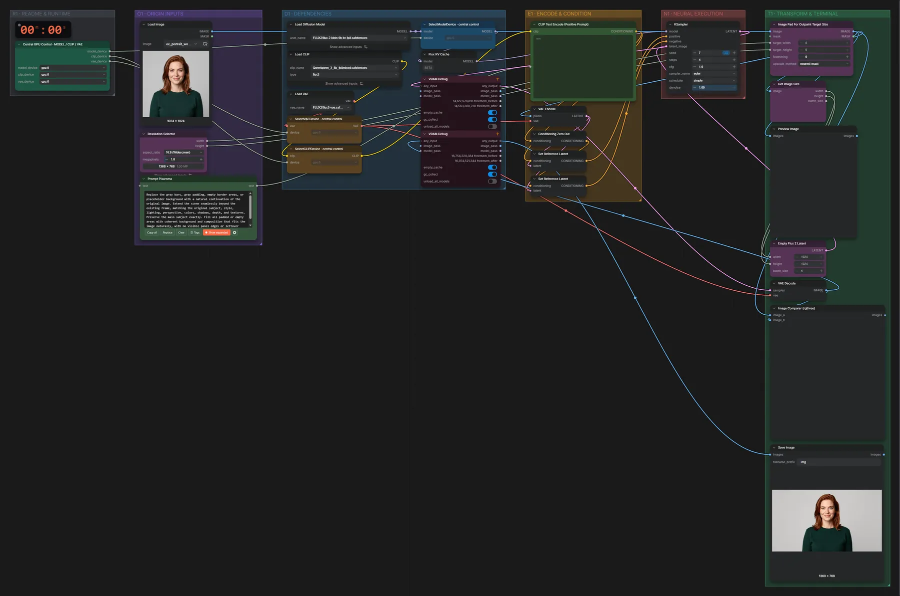

# FLUX.2 Klein 9B · Bild erweitern (Outpainting)

**Workflow-Datei:** [`workflows/Image Outpainting/FLUX2_Klein_9B_KV_FP8-Image-Outpaint-Custom-Ratio.json`](../../../workflows/Image%20Outpainting/FLUX2_Klein_9B_KV_FP8-Image-Outpaint-Custom-Ratio.json)  
**Kategorie:** Image Outpainting · **Eingabe → Ausgabe:** Bild → Bild · **Quant:** FP8

Bis v1.3.0 hieß der Workflow `FLUX2_Klein_9B_KV-Outpaint-Custom-Ratio.json`.

Das Bild wird auf ein neues Seitenverhältnis (z. B. 16:9) gepolstert und Klein 9B füllt die Ränder passend auf.

Interaktiv mit Zoom, Vergleichen und Kopier-Buttons: <https://dawasteh.github.io/DaWastehs-ComfyUI-Bundle/#/w/flux2-klein-9b-kv-fp8-image-outpaint-custom-ratio>

## Modelle

| Rolle | Datei | Quant | Größe |
|---|---|---|---:|
| VAE | `flux2-vae.safetensors` | FP32 | 0,3 GiB |
| Text-Encoder / LLM | `qwen_3_8b_fp8mixed.safetensors` | FP8 mixed | 8,1 GiB |
| Diffusionsmodell | `flux-2-klein-9b-kv-fp8.safetensors` | FP8 | 9,1 GiB |

## Workflow in ComfyUI

Screenshot nach dem Hauptbeispiel (Eingaben und Ergebnis im Workflow, Erklärungstafeln ausgeblendet):

## Beispiele

### Quadrat → 16:9

| Einstellung | Wert |
|---|---|
| seed | 7 |
| steps | 4 |
| cfg | 1 |
| sampler_name | euler |
| scheduler | simple |
| denoise | 1 |
| Dauer (Ausführung) | 36 s |
| VRAM R9700 (belegt / PyTorch-Spitze) | 25,3 GiB / 21,1 GiB |
| RAM (ComfyUI-Prozess) | 23,3 GiB |

Eingabe · ex_portrait_woman.png:  ([Datei](input_ex_portrait_woman.webp))  
Ausgabe · Ausgabe:  · [Volle Auflösung (1360×768, WebP mit Workflow – per Drag & Drop in ComfyUI ladbar)](wide.webp)  

### Querformat → 9:16

| Einstellung | Wert |
|---|---|
| seed | 7 |
| steps | 4 |
| cfg | 1 |
| sampler_name | euler |
| scheduler | simple |
| denoise | 1 |
| Dauer (Ausführung) | 24 s |
| VRAM R9700 (belegt / PyTorch-Spitze) | 27,8 GiB / 21,1 GiB |
| RAM (ComfyUI-Prozess) | 9,7 GiB |

Eingabe · ex_landscape_lake.png:  ([Datei](input_ex_landscape_lake.webp))  
Ausgabe · Ausgabe: 
