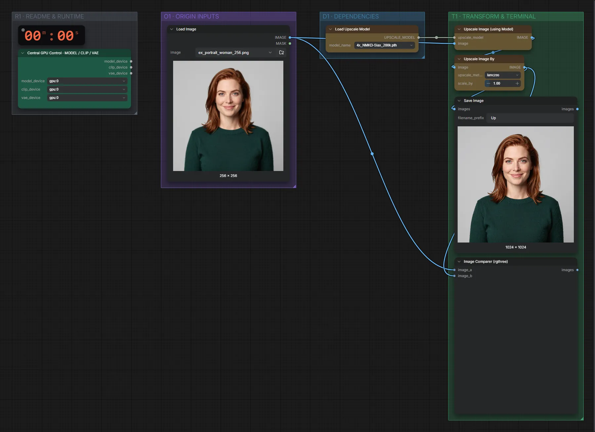

# NMKD Siax 4× · Bild hochskalieren

**Workflow-Datei:** [`workflows/Image Upscaling/NMKD_Siax_4x-Image-Upscale.json`](../../../workflows/Image%20Upscaling/NMKD_Siax_4x-Image-Upscale.json)  
**Kategorie:** Image Upscaling · **Eingabe → Ausgabe:** Bild → Bild

Bis v1.3.0 hieß der Workflow `Image-4x_NMKD_Siax-Model-Upscale.json`.

Klassischer ESRGAN-Upscaler (4×) ohne Diffusion – schnell, bleibt nah am Original.

Interaktiv mit Zoom, Vergleichen und Kopier-Buttons: <https://dawasteh.github.io/DaWastehs-ComfyUI-Bundle/#/w/nmkd-siax-4x-image-upscale>

## Modelle

| Rolle | Datei | Quant | Größe |
|---|---|---|---:|
| Upscaler | `4x_NMKD-Siax_200k.pth` | – | 0,1 GiB |

## Workflow in ComfyUI

Screenshot nach dem Hauptbeispiel (Eingaben und Ergebnis im Workflow, Erklärungstafeln ausgeblendet):

## Beispiele

### 256 px → 1024 px

| Einstellung | Wert |
|---|---|
| Dauer (Ausführung) | 1 s |
| VRAM R9700 (belegt / PyTorch-Spitze) | 8,3 GiB / 2,9 GiB |
| RAM (ComfyUI-Prozess) | 18,2 GiB |

Eingabe · ex_portrait_woman_256.png:  ([Datei](input_ex_portrait_woman_256.webp))  
Ausgabe · Ausgabe:  · [Volle Auflösung (1024×1024, WebP mit Workflow – per Drag & Drop in ComfyUI ladbar)](portrait.webp)
