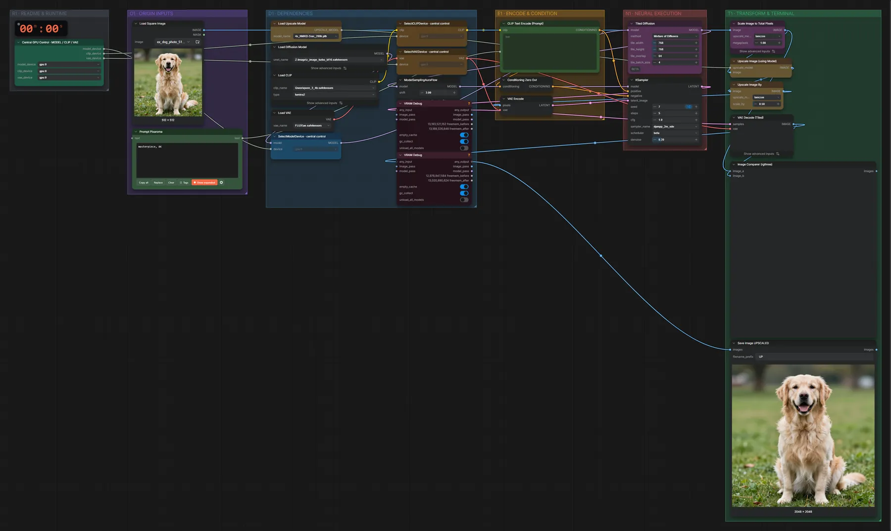
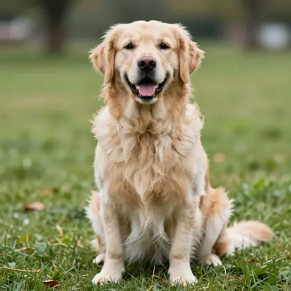

# Z-Image Turbo · Kachel-Upscale

**Workflow-Datei:** [`workflows/Image Upscaling/ZImage_Turbo_BF16+NMKD_Siax-Image-Tiled-Upscale.json`](../../../workflows/Image%20Upscaling/ZImage_Turbo_BF16%2BNMKD_Siax-Image-Tiled-Upscale.json)  
**Kategorie:** Image Upscaling · **Eingabe → Ausgabe:** Bild → Bild · **Quant:** BF16

Bis v1.3.0 hieß der Workflow `ZImage_Turbo-Tiled-Upscale.json`.

NMKD 4× vergrößert, danach verfeinert Z-Image Turbo in Kacheln (Mixture of Diffusers, Denoise 0,2) und ergänzt Details.

Interaktiv mit Zoom, Vergleichen und Kopier-Buttons: <https://dawasteh.github.io/DaWastehs-ComfyUI-Bundle/#/w/zimage-turbo-bf16-nmkd-siax-image-tiled-upscale>

## Modelle

| Rolle | Datei | Quant | Größe |
|---|---|---|---:|
| Upscaler | `4x_NMKD-Siax_200k.pth` | – | 0,1 GiB |
| Diffusionsmodell | `z_image_turbo_bf16.safetensors` | BF16 | 11,5 GiB |
| Text-Encoder / LLM | `qwen_3_4b.safetensors` | BF16 | 7,5 GiB |
| VAE | `ae.safetensors` | FP32 | 0,3 GiB |

## Workflow in ComfyUI

Screenshot nach dem Hauptbeispiel (Eingaben und Ergebnis im Workflow, Erklärungstafeln ausgeblendet):

## Beispiele

### Kachel-Upscale mit Z-Image (512 → 2048 px)

| Einstellung | Wert |
|---|---|
| seed | 7 |
| steps | 5 |
| cfg | 1 |
| sampler_name | dpmpp_2m_sde |
| scheduler | beta |
| denoise | 0.2 |
| shift | 3 |
| Dauer (Ausführung) | 53 s |
| VRAM R9700 (belegt / PyTorch-Spitze) | 25,3 GiB / 19,7 GiB |
| RAM (ComfyUI-Prozess) | 22,6 GiB |

Eingabe · ex_dog_photo_512.png:  ([Datei](input_ex_dog_photo_512.webp))  
Ausgabe · Save Image UPSCALED:  · [Volle Auflösung (2048×2048, WebP mit Workflow – per Drag & Drop in ComfyUI ladbar)](dog.webp)
