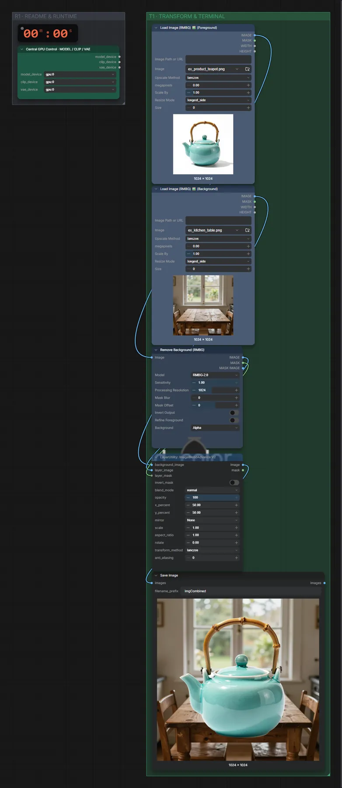
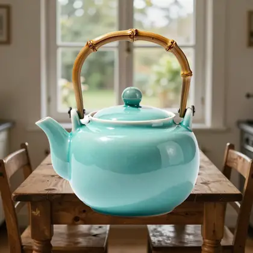

# Bilder überblenden

**Workflow-Datei:** [`workflows/Image Utilities/Image-Blend.json`](../../../workflows/Image%20Utilities/Image-Blend.json)  
**Kategorie:** Image Utilities · **Eingabe → Ausgabe:** Bild → Bild

Vordergrund freistellen und auf einen Hintergrund setzen (ohne KI-Bearbeitung).

Interaktiv mit Zoom, Vergleichen und Kopier-Buttons: <https://dawasteh.github.io/DaWastehs-ComfyUI-Bundle/#/w/image-blend>

## Workflow in ComfyUI

Screenshot nach dem Hauptbeispiel (Eingaben und Ergebnis im Workflow, Erklärungstafeln ausgeblendet):

## Beispiele

### Vordergrund auf Hintergrund

| Einstellung | Wert |
|---|---|
| Dauer (Ausführung) | 3 s |
| VRAM R9700 (belegt / PyTorch-Spitze) | 9,1 GiB / 4,8 GiB |
| RAM (ComfyUI-Prozess) | 2,2 GiB |

Eingabe · ex_kitchen_table.png:  ([Datei](input_ex_kitchen_table.webp))  
Eingabe · ex_product_teapot.png:  ([Datei](input_ex_product_teapot.webp))  
Ausgabe · Ausgabe:  · [Volle Auflösung (1024×1024, WebP mit Workflow – per Drag & Drop in ComfyUI ladbar)](teapot.webp)
